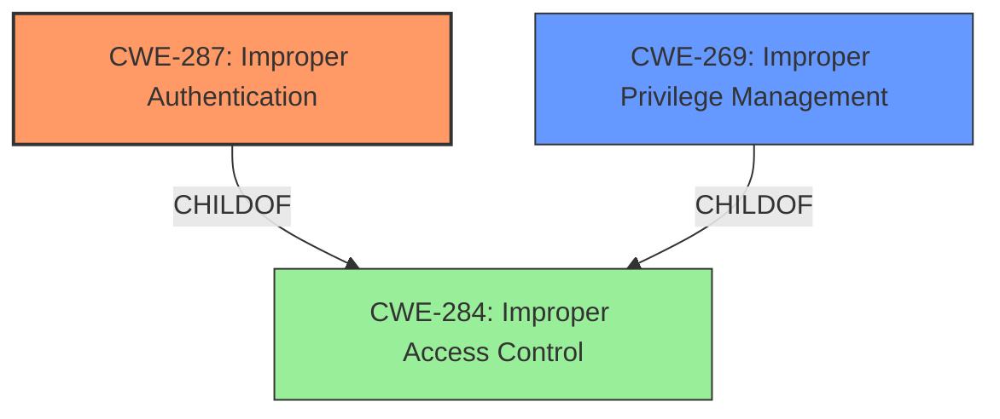

# Raw Analyzer Response for CVE-2022-27874

# Summary
| CWE ID | CWE Name | Confidence | CWE Abstraction Level | CWE Vulnerability Mapping Label | CWE-Vulnerability Mapping Notes |
|---|---|---|---|---|---|
| CWE-287 | Improper Authentication | 0.8 | Class | Primary | Allowed-with-Review |
| CWE-269 | Improper Privilege Management | 0.6 | Class | Secondary | Discouraged |

## Evidence and Confidence

*   **Confidence Score:** 0.8
*   **Evidence Strength:** HIGH

## Relationship Analysis
The primary CWE, CWE-287 [Improper Authentication], is a Class-level weakness that falls under the broader category of CWE-284 [Improper Access Control]. While CWE-287 [Improper Authentication] itself doesn't have direct child CWEs listed, its parent, CWE-284 [Improper Access Control], has numerous specific children related to authentication and authorization failures. The secondary CWE, CWE-269 [Improper Privilege Management], is also a Class-level weakness and a child of CWE-284 [Improper Access Control]. The vulnerability description indicates an authentication issue leading to potential privilege escalation, so both CWEs are relevant but CWE-287 [Improper Authentication] more directly addresses the **improper authentication** **rootcause**.

## Vulnerability Chain
The vulnerability chain begins with **improper authentication** (CWE-287 [Improper Authentication]), which then leads to the potential for **escalation of privilege**. The escalation of privilege can be categorized as CWE-269 [Improper Privilege Management]. The attack vector is physical access, and the attacker is a privileged user.

## Summary of Analysis
The initial analysis identified **improper authentication** as the **root cause**, leading to the potential for **escalation of privilege**.

The primary CWE selected is CWE-287 [Improper Authentication], which directly matches the **root cause** described in the vulnerability: "**Improper authentication** in some Intel(R) XMM(TM) 7560 Modem software...may allow a privileged user to potentially enable escalation of privilege via physical access." The retriever identified CWE-287 [Improper Authentication] as well. While CWE-287 [Improper Authentication] is a Class, a more specific Base CWE isn't apparent from the provided information. Therefore, using the Class CWE is appropriate. The usage for CWE-287 [Improper Authentication] is Discouraged with the suggestion to use CWE-1390 [Weak Authentication] or CWE-306 [Missing Authentication for Critical Function]; however, the current description doesn't provide enough information to choose between those.

The secondary CWE is CWE-269 [Improper Privilege Management], as the impact of exploiting the **improper authentication** is privilege escalation. The vulnerability description states that the **improper authentication** "may allow a privileged user to potentially enable escalation of privilege." This aligns with the description of CWE-269 [Improper Privilege Management]: "The product does not properly assign, modify, track, or check privileges for an actor, creating an unintended sphere of control for that actor."

CWE-119 [Improper Restriction of Operations within the Bounds of a Memory Buffer] was listed as one of the top CWEs for similar CVE descriptions, but it doesn't fit the current vulnerability because it does not describe a memory corruption issue.

Relevant CWE Information:

# Enhanced Context (25 CWEs)
The following CWEs were identified as potentially relevant to this vulnerability:

## CWE-653: Improper Isolation or Compartmentalization
**Abstraction Level**: Class
**Similarity Score**: 0.75
**Source**: dense

**Description**:
The product does not properly compartmentalize or isolate functionality, processes, or resources that require different privilege levels, rights, or permissions.

**Mapping Guidance**:
- Usage: Allowed
- Rationale: This CWE entry is at the Base level of abstraction, which is a preferred level of abstraction for mapping to the root causes of vulnerabilities.

## CWE-274: Improper Handling of Insufficient Privileges
**Abstraction Level**: Base
**Similarity Score**: 0.75
**Source**: dense

**Description**:
The product does not handle or incorrectly handles when it has insufficient privileges to perform an operation, leading to resultant weaknesses.

**Mapping Guidance**:
- Usage: Discouraged
- Rationale: This CWE entry could be deprecated in a future version of CWE.

## CWE-691: Insufficient Control Flow Management
**Abstraction Level**: Pillar
**Similarity Score**: 0.74
**Source**: dense

**Description**:
The code does not sufficiently manage its control flow during execution, creating conditions in which the control flow can be modified in unexpected ways.

**Mapping Guidance**:
- Usage: Discouraged
- Rationale: This CWE entry is extremely high-level, a Pillar. However, classification research is limited for weaknesses of this type, so there can be gaps or organizational difficulties within CWE that force use of this weakness, even at such a high level of abstraction.

## CWE-664: Improper Control of a Resource Through its Lifetime
**Abstraction Level**: Pillar
**Similarity Score**: 0.74
**Source**: dense

**Description**:
The product does not maintain or incorrectly maintains control over a resource throughout its lifetime of creation, use, and release.

**Mapping Guidance**:
- Usage: Discouraged
- Rationale: This CWE entry is high-level when lower-level children are available.

## CWE-280: Improper Handling of Insufficient Permissions or Privileges 
**Abstraction Level**: Base
**Similarity Score**: 0.73
**Source**: dense

**Description**:
The product does not handle or incorrectly handles when it has insufficient privileges to access resources or functionality as specified by their permissions. This may cause it to follow unexpected code paths that may leave the product in an invalid state.

**Mapping Guidance**:
- Usage: Allowed
- Rationale: This CWE entry is at the Base level of abstraction, which is a preferred level of abstraction for mapping to the root causes of vulnerabilities.

## CWE-693: Protection Mechanism Failure
**Abstraction Level**: Pillar
**Similarity Score**: 0.73
**Source**: dense

**Description**:
The product does not use or incorrectly uses a protection mechanism that provides sufficient defense against directed attacks against the product.

**Mapping Guidance**:
- Usage: Discouraged
- Rationale: This CWE entry is extremely high-level, a Pillar.

## CWE-1220: Insufficient Granularity of Access Control
**Abstraction Level**: Base
**Similarity Score**: 0.73
**Source**: dense

**Description**:
The product implements access controls via a policy or other feature with the intention to disable or restrict accesses (reads and/or writes) to assets in a system from untrusted agents. However, implemented access controls lack required granularity, which renders the control policy too broad because it allows accesses from unauthorized agents to the security-sensitive assets.

**Mapping Guidance**:
- Usage: Allowed
- Rationale: This CWE entry is at the Base level of abstraction, which is a preferred level of abstraction for mapping to the root causes of vulnerabilities.

## CWE-667: Improper Locking
**Abstraction Level**: Class
**Similarity Score**: 0.73
**Source**: dense

**Description**:
The product does not properly acquire or release a lock on a resource, leading to unexpected resource state changes and behaviors.

**Mapping Guidance**:
- Usage: Allowed-with-Review
- Rationale: This CWE entry is a Class and might have Base-level children that would be more appropriate

## CWE-281: Improper Preservation of Permissions
**Abstraction Level**: Base
**Similarity Score**: 0.72
**Source**: dense

**Description**:
The product does not preserve permissions or incorrectly preserves permissions when copying, restoring, or sharing objects, which can cause them to have less restrictive permissions than intended.

**Mapping Guidance**:
- Usage: Allowed
- Rationale: This CWE entry is at the Base level of abstraction, which is a preferred level of abstraction for mapping to the root causes of vulnerabilities.

## CWE-668: Exposure of Resource to Wrong Sphere
**Abstraction Level**: Class
**Similarity Score**: 0.72
**Source**: dense

**Description**:
The product exposes a resource to the wrong control sphere, providing unintended actors with inappropriate access to the resource.

**Mapping Guidance**:
- Usage: Discouraged
- Rationale: CWE-668 is high-level and is often misused as a catch-all when lower-level