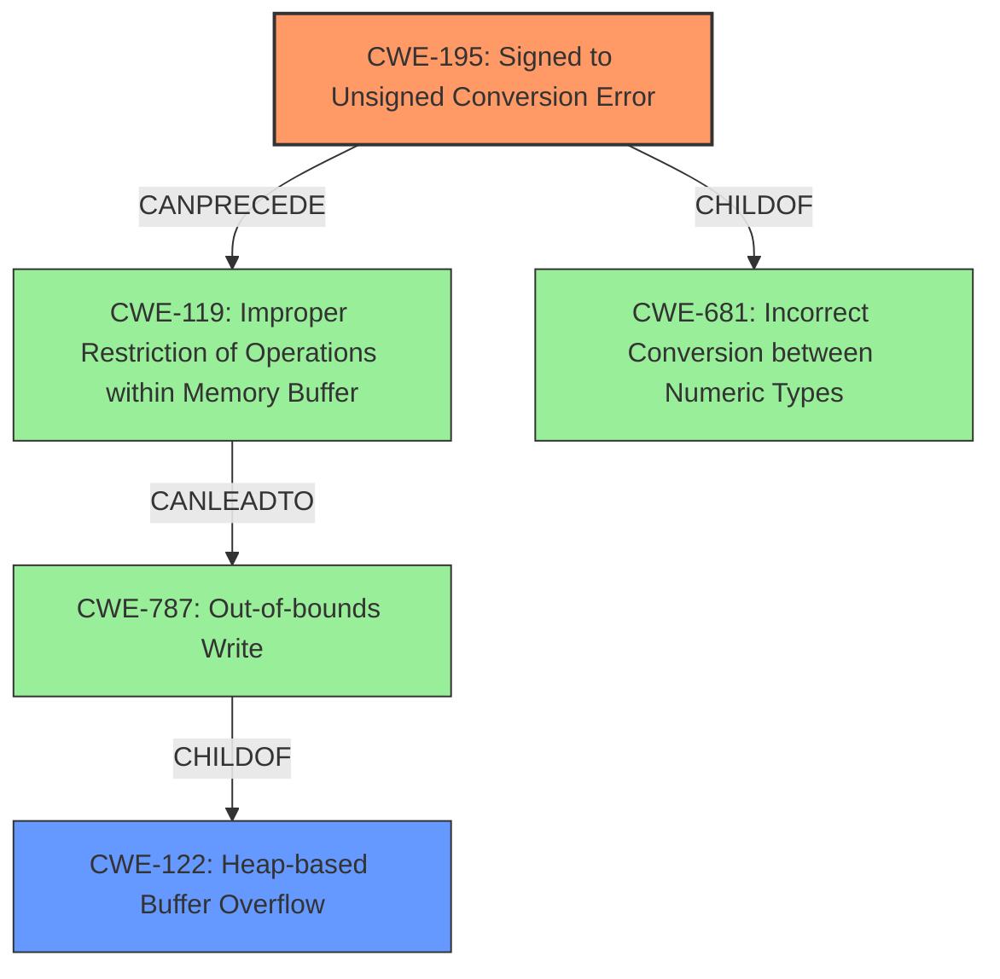

# Analysis for CVE-2022-27882

# Summary
| CWE ID | CWE Name | Confidence | CWE Abstraction Level | CWE Vulnerability Mapping Label | CWE-Vulnerability Mapping Notes |
|---|---|---|---|---|---|
| **CWE-195** | **Signed to Unsigned Conversion Error** | 0.9 | Variant | Primary | Allowed |
| CWE-122 | Heap-based Buffer Overflow | 0.8 | Variant | Secondary | Allowed |

## Evidence and Confidence

*   **Confidence Score:** 0.9
*   **Evidence Strength:** HIGH

## Relationship Analysis
The primary relationship is that CWE-195 can precede CWE-119 (Improper Restriction of Operations within Memory Buffer), which can then lead to CWE-787 (Out-of-bounds Write) and specifically CWE-122 (Heap-based Buffer Overflow). CWE-681 is a parent of CWE-195.

## Vulnerability Chain
The vulnerability chain starts with a signedness error:
1.  **Root Cause:** **CWE-195: Signed to Unsigned Conversion Error**: Mishandling of signed integer leads to conversion to unsigned.
2.  **Resultant Weakness:** **CWE-122: Heap-based Buffer Overflow**: The converted value is used as a size, leading to a heap overflow.

## Summary of Analysis
The primary weakness is **CWE-195: Signed to Unsigned Conversion Error**, due to the **integer signedness error** described in the vulnerability. The crafted IPv6 router advertisement leads to a negative length being used in `memcpy`, which causes a heap buffer overflow.

The description states: "slaacd in OpenBSD 6.9 and 7.0 before 2022-03-22 has an **integer signedness error** and resultant heap-based buffer overflow triggerable by a crafted IPv6 router advertisement."

The CVE Reference Links Content Summary confirms this, stating: "The core weakness is the use of a signed integer (`int len`) to read the length field of a domain label. This allows for a crafted negative length, which bypasses checks in the parsing logic...A crafted negative length value bypasses sanity checks and is then used in `memcpy`, leading to a heap buffer overflow because the `memcpy` interprets the negative length as a very large unsigned value."

CWE-195 is a Variant level CWE, which is the preferred level of abstraction. The mapping guidance for CWE-195 allows its usage.

CWE-122: Heap-based Buffer Overflow is a consequence of the signed to unsigned conversion error, and the description confirms that a heap overflow occurs. CWE-122 is a Variant level CWE, which is the preferred level of abstraction. The mapping guidance for CWE-122 allows its usage.

The selection of CWE-195 and CWE-122 is based on the evidence provided in the vulnerability description and CVE reference, and the hierarchical relationships between CWEs support this classification.

Other CWEs Considered but Not Used:
*   CWE-191: Integer Underflow (Wrap or Wraparound) - While related to integer issues, the core problem is the conversion between signed and unsigned, not a simple underflow.
*   CWE-190: Integer Overflow or Wraparound - Similar to CWE-191, the conversion is the main issue.
*   CWE-681: Incorrect Conversion between Numeric Types - This is a parent of CWE-195, and CWE-195 is a more specific description of the error.
*   CWE-121: Stack-based Buffer Overflow - The overflow is heap-based, not stack-based.
*   CWE-787: Out-of-bounds Write - This is a more general case of the buffer overflow.