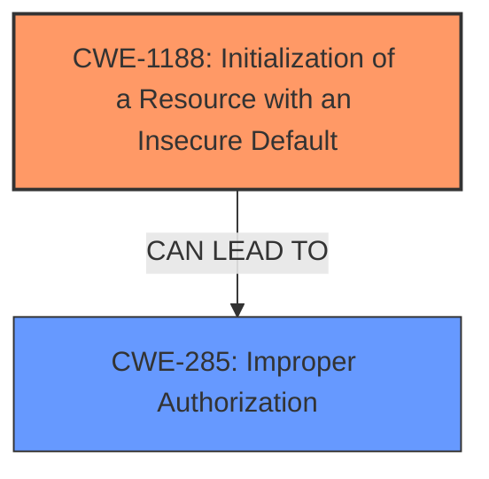

# Analysis for CVE-2022-27919

# Summary
| CWE ID | CWE Name | Confidence | CWE Abstraction Level | CWE Vulnerability Mapping Label | CWE-Vulnerability Mapping Notes |
|---|---|---|---|---|---|
| CWE-1188 | Initialization of a Resource with an Insecure Default | 0.9 | Base | Allowed | Primary CWE |
| CWE-285 | Improper Authorization | 0.6 | Class | Discouraged | Secondary CWE |

## Evidence and Confidence

*   **Confidence Score:** 0.75
*   **Evidence Strength:** HIGH

## Relationship Analysis
The primary CWE is CWE-1188, a Base level CWE which focuses on the root cause of initializing a resource with an insecure default. CWE-285, Improper Authorization, is a Class-level CWE that represents a potential consequence of the insecure default. There is no direct relationship between CWE-1188 and CWE-285 in the CWE database, but CWE-1188 can lead to authorization issues if the insecure default affects access control mechanisms. The abstraction levels influenced the selection by preferring the more specific Base level CWE-1188 over the broader Class level CWE-285.

## Vulnerability Chain
The vulnerability chain begins with the **improper initial configuration** of Gradle Enterprise, which results in **initialization of a resource with an insecure default (CWE-1188)**. This insecure default leads to **improper authorization (CWE-285)**, specifically allowing anonymous access to administrative functions and the API. The final impact is the potential for remote code execution (RCE) by an attacker who leverages this unauthorized access to modify build cache settings.

## Summary of Analysis
The initial assessment identified several potential CWEs, including CWE-276, CWE-306, CWE-732, and CWE-668. However, after a thorough review of the vulnerability description and the provided CWE specifications, it was determined that CWE-1188 best captures the root cause of the vulnerability: the **initialization of a resource with an insecure default**. The evidence for this decision comes from the "CVE Reference Links Content Summary," which states that "the default access control settings in Gradle Enterprise installations created without a specific configuration file incorrectly allowed anonymous access." This clearly indicates that the default configuration was insecure.

CWE-285, **Improper Authorization**, was considered as a secondary CWE because the insecure default directly leads to authorization issues. The vulnerability description states that the **improper initial configuration** allows "anonymous access to administration and API access." This access should not be allowed by default, indicating a failure in authorization. However, because the root cause is the insecure default configuration, CWE-1188 is the primary CWE, and CWE-285 is a consequence of this weakness.

The graph relationships influenced the final selection by highlighting the potential connections between CWEs. While there is no direct relationship between CWE-1188 and CWE-285, the analysis revealed that CWE-1188 can logically lead to CWE-285 in this specific vulnerability.

The selected CWEs are at the optimal level of specificity because CWE-1188 is a Base level CWE that directly addresses the root cause of the vulnerability, and CWE-285 is a Class level CWE that describes the immediate consequence of the insecure default. Choosing more generic CWEs would not accurately reflect the specific nature of the vulnerability.

Other CWEs considered but not used:

*   CWE-276 (Incorrect Default Permissions): While related to default configurations, this CWE focuses specifically on file permissions, which is not the primary issue in this vulnerability.
*   CWE-306 (Missing Authentication for Critical Function): This CWE is relevant to the lack of authentication, but the root cause is the insecure default configuration, not simply the absence of authentication.
*   CWE-732 (Incorrect Permission Assignment for Critical Resource): This CWE is similar to CWE-276, focusing on permission assignments for resources. However, the core issue is the overall configuration allowing anonymous access, not specific file permissions.
*   CWE-668 (Exposure of Resource to Wrong Sphere): This CWE is too high-level and does not capture the specific nature of the vulnerability.
*   CWE-863 (Incorrect Authorization): Similar to CWE-285, but less directly related to the root cause of the insecure default configuration.
*   CWE-502 (Deserialization of Untrusted Data): This CWE is not relevant to the vulnerability description.
*   CWE-74 (Improper Neutralization of Special Elements in Output Used by a Downstream Component ('Injection')): This CWE is not relevant to the vulnerability description.
*   CWE-79 (Improper Neutralization of Input During Web Page Generation ('Cross-site Scripting')): This CWE is not relevant to the vulnerability description.
*   CWE-434 (Unrestricted Upload of File with Dangerous Type): This CWE is not relevant to the vulnerability description.
*   CWE-494 (Download of Code Without Integrity Check): This CWE is not relevant to the vulnerability description.
*   CWE-41 (Improper Resolution of Path Equivalence): This CWE is not relevant to the vulnerability description.
*   CWE-350 (Reliance on Reverse DNS Resolution for a Security-Critical Action): This CWE is not relevant to the vulnerability description.
*   CWE-178 (Improper Handling of Case Sensitivity): This CWE is not relevant to the vulnerability description.
*   CWE-183 (Permissive List of Allowed Inputs): This CWE is not relevant to the vulnerability description.
*   CWE-322 (Key Exchange without Entity Authentication): This CWE is not relevant to the vulnerability description.
*   CWE-289 (Authentication Bypass by Alternate Name): This CWE is not relevant to the vulnerability description.
*   CWE-942 (Permissive Cross-domain Policy with Untrusted Domains): This CWE is not relevant to the vulnerability description.