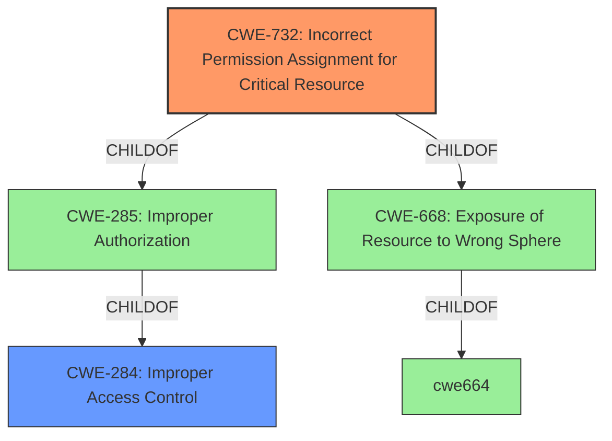

# Analysis for CVE-2022-2792

# Summary
| CWE ID | CWE Name | Confidence | CWE Abstraction Level | CWE Vulnerability Mapping Label | CWE-Vulnerability Mapping Notes |
|---|---|---|---|---|---|
| CWE-732 | Incorrect Permission Assignment for Critical Resource | 0.9 | Class | Allowed-with-Review | Primary CWE. The product specifies permissions for a security-critical resource in a way that allows that resource to be read or modified by unintended actors. |
| CWE-284 | Improper Access Control | 0.6 | Pillar | Discouraged | Secondary Candidate. The product does not restrict or incorrectly restricts access to a resource from an unauthorized actor. This is a high-level CWE. |

## Evidence and Confidence

*   **Confidence Score:** 0.9
*   **Evidence Strength:** HIGH

## Relationship Analysis
The primary CWE is CWE-732 (Incorrect Permission Assignment for Critical Resource), which is a child of CWE-285 (Improper Authorization) and CWE-668 (Exposure of Resource to Wrong Sphere). CWE-284 (Improper Access Control) is a parent of CWE-285. Selecting CWE-732 provides a more specific classification than the high-level CWE-284.

## Vulnerability Chain
The vulnerability chain involves an **improper permission assignment** on a directory where project data is stored (CWE-732). This leads to unauthorized access and modification of project data, potentially causing unexpected behavior in the PLC and allowing for the execution of malicious code.

## Summary of Analysis
The initial assessment identified **CWE-284 Improper Access Control** as the root cause based on the **Vulnerability Description Key Phrases**. However, a deeper analysis considering the retriever results and complete CWE specifications indicates that **CWE-732 Incorrect Permission Assignment for Critical Resource** is a more appropriate and specific classification. The evidence "Proficy Machine Edition stores project data in a directory with improper access control lists" suggests that the permissions assigned to the directory are incorrect, leading to the vulnerability.

The graph relationships show that CWE-732 is a child of CWE-285 and CWE-668, making it a more specific classification than CWE-284, which is a parent of CWE-285. The MITRE mapping guidance for CWE-284 discourages its use due to its high-level nature and suggests considering more specific descendants. The MITRE mapping guidance for CWE-732 suggests it can be misused when permissions are not checked, which is an authorization weakness, but in this case, the description explicitly mentions "improper access control lists" which is synonymous with incorrect permission assignment.

The selection of CWE-732 is at the optimal level of specificity because it directly addresses the root cause of the vulnerability: the **incorrect assignment of permissions** to the directory containing project data.

Relevant CWE Information:
# Enhanced Context (25 CWEs)

## CWE-274: Improper Handling of Insufficient Privileges
CWE-274 was considered but not selected as the vulnerability is not directly related to the handling of insufficient privileges. The issue is with the permissions assigned to the project data directory, not with the handling of insufficient privileges by the application.

## CWE-280: Improper Handling of Insufficient Permissions or Privileges 
CWE-280 was considered but not selected. The root cause isn't about the software's handling of insufficient privileges; it's about the incorrectly assigned permissions on the directory where project data is stored.

## CWE-668: Exposure of Resource to Wrong Sphere
CWE-668 was considered but not selected as it is a high-level class. While the vulnerability does expose a resource to the wrong sphere, CWE-732 provides a more specific description of the weakness.

## CWE-807: Reliance on Untrusted Inputs in a Security Decision
CWE-807 was considered but is not relevant as the vulnerability is not related to the reliance on untrusted inputs in a security decision.

## CWE-303: Incorrect Implementation of Authentication Algorithm
CWE-303 was considered but is not relevant as the vulnerability is not related to the implementation of an authentication algorithm.

## CWE-653: Improper Isolation or Compartmentalization
CWE-653 was considered but is not relevant as the vulnerability is not related to improper isolation or compartmentalization.

## CWE-345: Insufficient Verification of Data Authenticity
CWE-345 was considered but is not relevant as the vulnerability is not related to insufficient verification of data authenticity.

## CWE-639: Authorization Bypass Through User-Controlled Key
CWE-639 was considered but is not relevant as the vulnerability is not related to authorization bypass through a user-controlled key.

## CWE-1220: Insufficient Granularity of Access Control
CWE-1220 was considered but is not relevant as the vulnerability is not related to insufficient granularity of access control.

## CWE-799: Improper Control of Interaction Frequency
CWE-799 was considered but is not relevant as the vulnerability is not related to the control of interaction frequency.

## CWE-863: Incorrect Authorization
CWE-863 was considered but it is less specific than CWE-732.

## CWE-285: Improper Authorization
CWE-285 was considered but is less specific than CWE-732. CWE-732 is a child of CWE-285.

## CWE-354: Improper Validation of Integrity Check Value
CWE-354 was considered but it is not relevant. The vulnerability is not related to integrity check values.

## CWE-353: Missing Support for Integrity Check
CWE-353 was considered but it is not relevant. The vulnerability is not related to integrity checks.

## CWE-322: Key Exchange without Entity Authentication
CWE-322 was considered but it is not relevant. The vulnerability is not related to key exchange.

## CWE-942: Permissive Cross-domain Policy with Untrusted Domains
CWE-942 was considered but it is not relevant. The vulnerability is not related to cross-domain policies.

## CWE-350: Reliance on Reverse DNS Resolution for a Security-Critical Action
CWE-350 was considered but it is not relevant. The vulnerability is not related to reverse DNS resolution.

## CWE-312: Cleartext Storage of Sensitive Information
CWE-312 was considered but it is not relevant. The vulnerability is not related to cleartext storage.

## CWE-306: Missing Authentication for Critical Function
CWE-306 was considered but it is not relevant. The vulnerability is not related to missing authentication.

## CWE-347: Improper Verification of Cryptographic Signature
CWE-347 was considered but it is not relevant. The vulnerability is not related to cryptographic signature verification.

## CWE-29: Path Traversal: '\..\filename'
CWE-29 was considered but is not relevant. The issue is not related to path traversal.

## CWE-311: Missing Encryption of Sensitive Data
CWE-311 was considered but is not relevant. The issue is not related to missing encryption.