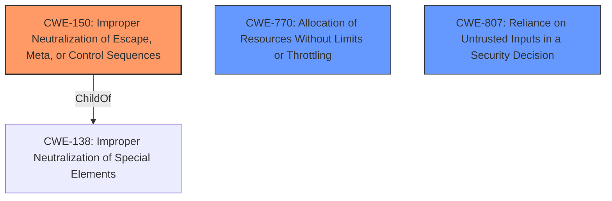

# Enhanced Analysis for CVE-2022-27924

# Summary
| CWE ID | CWE Name | Confidence | CWE Abstraction Level | CWE Vulnerability Mapping Label | CWE-Vulnerability Mapping Notes |
|---|---|---|---|---|---|
| CWE-150 | Improper Neutralization of Escape, Meta, or Control Sequences | 0.8 | Variant | Allowed | Primary CWE |
| CWE-770 | Allocation of Resources Without Limits or Throttling | 0.6 | Base | Allowed | Secondary Candidate |
| CWE-807 | Reliance on Untrusted Inputs in a Security Decision | 0.6 | Base | Allowed | Secondary Candidate |

## Evidence and Confidence

*   **Confidence Score:** 0.8
*   **Evidence Strength:** HIGH

## Relationship Analysis
The primary CWE selected is CWE-150, which is a Variant of CWE-138. CWE-138 is a Class, making CWE-150 more specific. This choice reflects the specific nature of the vulnerability involving the **improper neutralization of escape, meta, or control sequences**. Other relationships considered were those involving injection flaws, but CWE-150 best fits the specific weakness.



## Vulnerability Chain
The vulnerability chain starts with a lack of authentication (or **reliance on untrusted inputs**) for the memcached service, followed by the **improper neutralization of escape sequences** leading to the injection of arbitrary memcache commands, and potentially resulting in **uncontrolled resource allocation** due to the injected commands.

## Summary of Analysis
The analysis focused on identifying the root cause of the vulnerability, which is the **improper input escaping** that allows an attacker to inject arbitrary memcache commands. The selection of CWE-150 is strongly supported by the vulnerability description, which explicitly mentions this aspect.

>   Vulnerability Description Key Phrases
>   - **rootcause:** **improper input escaping**
>   - **impact:** inject arbitrary memcache commands

The CVE Reference Links Content Summary also indicates that the memcached service **lacks proper protection, allowing unauthenticated requests**, which enables the injection of malicious data.

CWE-150 (Improper Neutralization of Escape, Meta, or Control Sequences) was chosen as the primary CWE because it directly addresses the **improper neutralization of special elements** that enables the memcache command injection. Its Variant level provides the necessary specificity.

CWE-770 (Allocation of Resources Without Limits or Throttling) was considered as a secondary CWE because the injected commands could potentially lead to uncontrolled resource allocation, such as excessive memory usage or CPU consumption. This aspect is more of a potential impact rather than the direct cause.

CWE-807 (Reliance on Untrusted Inputs in a Security Decision) was also considered as a secondary CWE because the lack of authentication on the memcached service can be viewed as a reliance on untrusted inputs for security decisions. However, the **improper neutralization** is the more direct cause of the vulnerability.

Other CWEs considered but not used:

*   CWE-93 (Improper Neutralization of CRLF Sequences ('CRLF Injection')): While injection is involved, the vulnerability is not specifically about CRLF sequences.
*   CWE-22 (Improper Limitation of a Pathname to a Restricted Directory ('Path Traversal')): This CWE is not relevant to the described vulnerability.
*   CWE-116 (Improper Encoding or Escaping of Output): While related to neutralization, CWE-150 is more specific to escape, meta, or control sequences.
*   CWE-138 (Improper Neutralization of Special Elements): CWE-150 is a more specific variant of this class.
*   CWE-20 (Improper Input Validation): While input validation is a broad category, the specific issue is the **improper neutralization of escape sequences**.
*   CWE-73 (External Control of File Name or Path): This CWE is not relevant to the described vulnerability.
*   CWE-23 (Relative Path Traversal): This CWE is not relevant to the described vulnerability.
*   CWE-94 (Improper Control of Generation of Code ('Code Injection')): This CWE is not relevant to the described vulnerability.
*   CWE-78 (Improper Neutralization of Special Elements used in an OS Command ('OS Command Injection')): This CWE is not relevant to the described vulnerability.

Relevant CWE Information:

# Enhanced Context (25 CWEs)

## CWE-74: Improper Neutralization of Special Elements in Output Used by a Downstream Component ('Injection')
**Abstraction Level**: Class
**Similarity Score**: 0.75

**Description**:
The product constructs all or part of a command, data structure, or record using externally-influenced input from an upstream component, but it does not neutralize or incorrectly neutralizes special elements that could modify how it is parsed or interpreted when it is sent to a downstream component.

**Mapping Guidance**:
- Usage: Discouraged
- Rationale: CWE-74 is high-level and often misused when lower-level weaknesses are more appropriate.

## CWE-73: External Control of File Name or Path
**Abstraction Level**: Base
**Similarity Score**: 0.74

**Description**:
The product allows user input to control or influence paths or file names that are used in filesystem operations.

**Mapping Guidance**:
- Usage: Allowed
- Rationale: This CWE entry is at the Base level of abstraction, which is a preferred level of abstraction for mapping to the root causes of vulnerabilities.

## CWE-184: Incomplete List of Disallowed Inputs
**Abstraction Level**: Base
**Similarity Score**: 0.73

**Description**:
The product implements a protection mechanism that relies on a list of inputs (or properties of inputs) that are not allowed by policy or otherwise require other action to neutralize before additional processing takes place, but the list is incomplete.

**Mapping Guidance**:
- Usage: Allowed
- Rationale: This CWE entry is at the Base level of abstraction, which is a preferred level of abstraction for mapping to the root causes of vulnerabilities.

## CWE-1289: Improper Validation of Unsafe Equivalence in Input
**Abstraction Level**: Base
**Similarity Score**: 0.73

**Description**:
The product receives an input value that is used as a resource identifier or other type of reference, but it does not validate or incorrectly validates that the input is equivalent to a potentially-unsafe value.

**Mapping Guidance**:
- Usage: Allowed
- Rationale: This CWE entry is at the Base level of abstraction, which is a preferred level of abstraction for mapping to the root causes of vulnerabilities.

## CWE-138: Improper Neutralization of Special Elements
**Abstraction Level**: Class
**Similarity Score**: 0.72

**Description**:
The product receives input from an upstream component, but it does not neutralize or incorrectly neutralizes special elements that could be interpreted as control elements or syntactic markers when they are sent to a downstream component.

**Mapping Guidance**:
- Usage: Discouraged
- Rationale: This CWE entry is a level-1 Class (i.e., a child of a Pillar). It might have lower-level children that would be more appropriate

## CWE-150: Improper Neutralization of Escape, Meta, or Control Sequences
**Abstraction Level**: Variant
**Similarity Score**: 0.72

**Description**:
The product receives input from an upstream component, but it does not neutralize or incorrectly neutralizes special elements that could be interpreted as escape, meta, or control character sequences when they are sent to a downstream component.

**Mapping Guidance**:
- Usage: Allowed
- Rationale: This CWE entry is at the Variant level of abstraction, which is a preferred level of abstraction for mapping to the root causes of vulnerabilities.

## CWE-99: Improper Control of Resource Identifiers ('Resource Injection')
**Abstraction Level**: Class
**Similarity Score**: 0.72

**Description**:
The product receives input from an upstream component, but it does not restrict or incorrectly restricts the input before it is used as an identifier for a resource that may be outside the intended sphere of control.

**Mapping Guidance**:
- Usage: Allowed-with-Review
- Rationale: This CWE entry is a Class and might have Base-level children that would be more appropriate

## CWE-41: Improper Resolution of Path Equivalence
**Abstraction Level**: Base
**Similarity Score**: 0.72

**Description**:
The product is vulnerable to file system contents disclosure through path equivalence. Path equivalence involves the use of special characters in file and directory names. The associated manipulations are


## CWE Relationship Analysis

Current CWEs represent these abstraction levels: .


### Vulnerability Chain Analysis

**Chain starting from CWE-150:**
- 150 (Improper Neutralization of Escape, Meta, or Control Sequences) - ROOT


**Chain starting from CWE-41:**
- 41 (Improper Resolution of Path Equivalence) - ROOT


### CWE Relationship Diagram

```mermaid
graph TD
    classDef primary fill:#f96,stroke:#333,stroke-width:2px
    classDef secondary fill:#69f,stroke:#333
    classDef tertiary fill:#9e9,stroke:#333
```