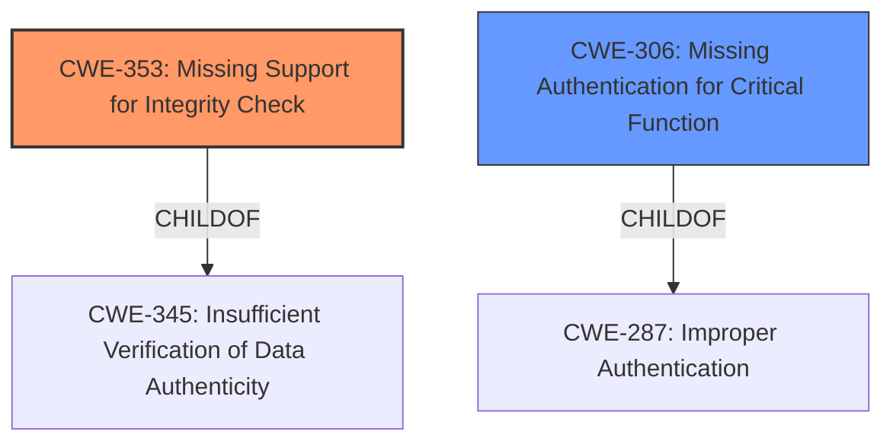

# Enhanced Analysis for CVE-2022-2793

# Summary
| CWE ID | CWE Name | Confidence | CWE Abstraction Level | CWE Vulnerability Mapping Label | CWE-Vulnerability Mapping Notes |
|---|---|---|---|---|---|
| CWE-353 | Missing Support for Integrity Check | 1.0 | Base | Allowed | Primary CWE |
| CWE-306 | Missing Authentication for Critical Function | 0.7 | Base | Allowed | Secondary CWE |

## Evidence and Confidence

*   **Confidence Score:** 0.9
*   **Evidence Strength:** HIGH

## Relationship Analysis
The primary relationship influencing the decision is the direct match of the vulnerability description to CWE-353, which is further supported by the retriever results. CWE-353 is a base-level CWE, providing a specific description of the **missing support for integrity check**, aligning perfectly with the vulnerability. CWE-306 is included as a secondary weakness because the **lack of authentication or authorization** can be seen as a **missing authentication** component for the data packets. However, since the main focus is on the integrity check, CWE-353 is the primary concern.



## Vulnerability Chain
The vulnerability chain starts with the **missing support for integrity check** (CWE-353) and **missing authentication/authorization** (CWE-306) in the SRTP protocol. Because of these **missing** components, an attacker can inject manipulated data packets, potentially leading to remote code execution.

## Summary of Analysis
The initial analysis focused on identifying the root cause of the vulnerability based on the description. The key phrase "**missing support for integrity check**" directly corresponds to CWE-353. The additional detail about "**no authentication or authorization of data packets**" suggests a secondary weakness related to authentication.

The final decision is based on the strong evidence from the vulnerability description and the CVE reference, which explicitly states "**Root Cause of Vulnerability: Missing support for integrity check**". The retriever results also strongly support CWE-353 as the primary mapping.

CWE-354 (Improper Validation of Integrity Check Value) was considered but not selected as the primary CWE, because the vulnerability description explicitly states that integrity checks are **missing**, not improperly validated.
CWE-306 (Missing Authentication for Critical Function) was considered and selected as a secondary weakness as the vulnerability also describes a **lack of authentication/authorization**.

Relevant CWE Information:

# Enhanced Context (25 CWEs)

## CWE-353: Missing Support for Integrity Check
**Abstraction:** Base
**Status:** Draft

### Description
The product uses a transmission protocol that **does not include a mechanism for verifying the integrity of the data** during transmission, such as a checksum.

### Extended Description
If integrity check values or "checksums" are omitted from a protocol, there is no way of determining if data has been corrupted in transmission. The lack of checksum functionality in a protocol removes the first application-level check of data that can be used. The end-to-end philosophy of checks states that integrity checks should be performed at the lowest level that they can be completely implemented. Excluding further sanity checks and input validation performed by applications, the protocol's checksum is the most important level of checksum, since it can be performed more completely than at any previous level and takes into account entire messages, as opposed to single packets.

### Alternative Terms
None

### Relationships
ChildOf -> CWE-345
PeerOf -> CWE-354

### Mapping Guidance
**Usage:** Allowed
**Rationale:** This CWE entry is at the Base level of abstraction, which is a preferred level of abstraction for mapping to the root causes of vulnerabilities.
**Comments:** Carefully read both the name and description to ensure that this mapping is an appropriate fit. Do not try to 'force' a mapping to a lower-level Base/Variant simply to comply with this preferred level of abstraction.
**Reasons:**
- Acceptable-Use

## CWE-306: Missing Authentication for Critical Function
**Abstraction:** Base
**Status:** Draft

### Description
The product **does not perform any authentication** for functionality that requires a provable user identity or consumes a significant amount of resources.

### Extended Description
Not provided

### Alternative Terms
None

### Relationships
ChildOf -> CWE-287
ChildOf -> CWE-287

### Mapping Guidance
**Usage:** Allowed
**Rationale:** This CWE entry is at the Base level of abstraction, which is a preferred level of abstraction for mapping to the root causes of vulnerabilities.
**Comments:** Carefully read both the name and description to ensure that this mapping is an appropriate fit. Do not try to 'force' a mapping to a lower-level Base/Variant simply to comply with this preferred level of abstraction.
**Reasons:**
- Acceptable-Use


## CWE Relationship Analysis

Current CWEs represent these abstraction levels: .


### Vulnerability Chain Analysis

**Chain starting from CWE-353:**
- 353 (Missing Support for Integrity Check) - ROOT


**Chain starting from CWE-345:**
- 345 (Insufficient Verification of Data Authenticity) - ROOT


### CWE Relationship Diagram

```mermaid
graph TD
    classDef primary fill:#f96,stroke:#333,stroke-width:2px
    classDef secondary fill:#69f,stroke:#333
    classDef tertiary fill:#9e9,stroke:#333
```