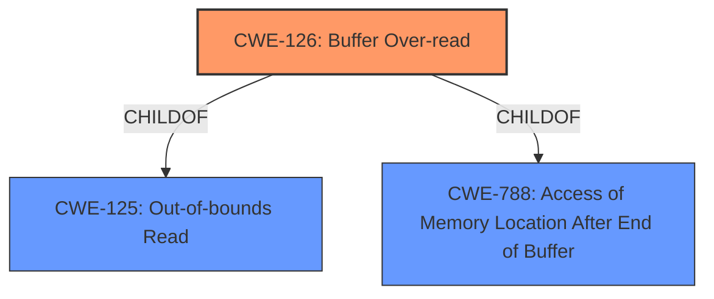

# Analysis Report for CVE-2022-27941

# Vulnerability Analysis Report: CVE-2022-27941

## Description


## Analysis (with Relationship Data)

# Summary

| CWE ID | CWE Name | Confidence | CWE Abstraction Level | CWE Vulnerability Mapping Label | CWE-Vulnerability Mapping Notes |
|---|---|---|---|---|---|
| CWE-126 | Buffer Over-read | 1.0 | Variant | Allowed | Primary CWE |

## Evidence and Confidence

*   **Confidence Score:** 1.0
*   **Evidence Strength:** HIGH

## Relationship Analysis
The primary relationship that influenced my decision was the ChildOf relationship where CWE-126 (Buffer Over-read) is a child of CWE-125 (Out-of-bounds Read) and CWE-788 (Access of Memory Location After End of Buffer).



## Vulnerability Chain
The vulnerability chain starts with the **heap-based buffer over-read** in the `get_l2len_protocol` function. The root cause is the improper handling of buffer boundaries during a read operation, leading to the read operation accessing memory outside the allocated buffer. The final impact is a denial of service (DoS).

## Summary of Analysis
The vulnerability is a **heap-based buffer over-read** in the `get_l2len_protocol` function within `common/get.c` in Tcpreplay 4.4.1. This occurs during a read operation, where the code reads past the end of the allocated buffer on the heap. The vulnerability can be triggered by crafted network packets processed by tcprewrite utilities. The impact is a denial of service.

The vulnerability description clearly states "**heap-based buffer over-read**" and the CVE Reference Links Content Summary confirms the root cause as a "Heap-based buffer over-read".

The retriever results list CWE-126 (Buffer Over-read) as the top candidate. CWE-126 is a Variant of CWE-125 (Out-of-bounds Read), which is a more general class of error. Since the description specifies an over-read, CWE-126 is the more specific and appropriate choice.

CWE-122 (Heap-based Buffer Overflow) was considered, but the vulnerability is specifically described as an over-read, not an overflow. An over-read involves reading beyond the bounds of a buffer, whereas an overflow involves writing beyond the bounds. Therefore, CWE-122 is not the correct choice.

CWE-193 (Off-by-one Error) was also considered. While an off-by-one error could contribute to a buffer over-read, the description does not explicitly mention an off-by-one error as the root cause. Thus, CWE-126 is more appropriate.

CWE-170 (Improper Null Termination) and CWE-190 (Integer Overflow or Wraparound) were considered but are not directly related to the described vulnerability.

CWE-805 (Buffer Access with Incorrect Length Value) was considered, but the primary issue is that it is reading past the end of the buffer, which is better described by CWE-126.

Based on the evidence and the CWE descriptions, CWE-126 (Buffer Over-read) is the most accurate and specific CWE for this vulnerability. It is at the Variant level of abstraction, which is preferred. The confidence level is high (1.0) due to the clear description of the vulnerability and the matching CWE definition.


## CWE Relationship Analysis

Current CWEs represent these abstraction levels: .


### Vulnerability Chain Analysis

**Chain starting from CWE-190:**
- 190 (Integer Overflow or Wraparound) - ROOT


**Chain starting from CWE-170:**
- 170 (Improper Null Termination) - ROOT


### CWE Relationship Diagram

```mermaid
graph TD
    classDef primary fill:#f96,stroke:#333,stroke-width:2px
    classDef secondary fill:#69f,stroke:#333
    classDef tertiary fill:#9e9,stroke:#333
```


*Report generated on 2025-03-31 11:58:06*
