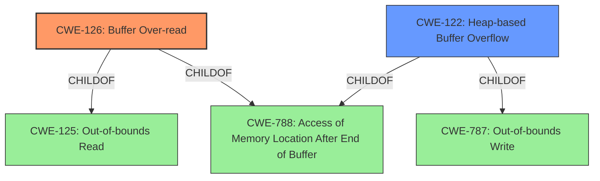

# Enhanced Analysis for CVE-2022-27942

# Summary
| CWE ID | CWE Name | Confidence | CWE Abstraction Level | CWE Vulnerability Mapping Label | CWE-Vulnerability Mapping Notes |
|---|---|---|---|---|---|
| CWE-126 | Buffer Over-read | 1.0 | Variant | Allowed | Primary CWE |
| CWE-122 | Heap-based Buffer Overflow | 0.8 | Variant | Allowed | Secondary Candidate |

## Evidence and Confidence

*   **Confidence Score:** 0.9
*   **Evidence Strength:** HIGH

## Relationship Analysis
The primary CWE is CWE-126 **(Buffer Over-read)**, a Variant of CWE-125 **(Out-of-bounds Read)** and CWE-788 **(Access of Memory Location After End of Buffer)**. CWE-122 **(Heap-based Buffer Overflow)** is considered as a secondary candidate, a Variant of CWE-787 **(Out-of-bounds Write)** and CWE-788 **(Access of Memory Location After End of Buffer)**. Both CWE-126 and CWE-122 are related to accessing memory outside the intended buffer, but the vulnerability description specifically mentions a "heap-based buffer over-read", indicating the action is a read rather than a write. Thus, the graph shows that CWE-126 and CWE-122 are both children of CWE-788.



## Vulnerability Chain
The vulnerability chain starts with the **heap-based buffer over-read** in the `parse_mpls` function. This leads to potential exposure of sensitive information or a crash. The root cause is the **improper** handling of MPLS headers, leading to a read beyond the allocated buffer.

## Summary of Analysis
The initial assessment focused on identifying the **weakness** described in the vulnerability. The description clearly states "**heap-based buffer over-read**" which aligns with CWE-126 **(Buffer Over-read)**.

The evidence from the "Vulnerability Description Key Phrases" and "CVE Reference Links Content Summary" confirms this:
- "**weakness:** **heap-based buffer over-read**"
- "Root Cause of Vulnerability: Heap-based buffer overflow in the `parse_mpls` function"
- "The primary vulnerability is a heap-based buffer overflow. This indicates a flaw in memory management where the function writes beyond the allocated buffer."

CWE-126 **(Buffer Over-read)** is a Variant-level CWE, providing a specific description of the vulnerability which involves reading data past the end of the intended buffer.

CWE-122 **(Heap-based Buffer Overflow)** was also considered, but it describes a write operation beyond the allocated buffer, whereas the description specifies an over-read. Though the root cause mentions "heap-based buffer overflow", the explicit "**over-read**" points more directly to CWE-126.

The retriever results also support this with CWE-126 having the highest score.

Other CWEs were considered but deemed less relevant. For example, CWE-190 **(Integer Overflow or Wraparound)** and CWE-193 **(Off-by-one Error)** were considered due to their potential role in buffer overflows/over-reads, but there is no direct evidence in the description to support these. CWE-170 **(Improper Null Termination)** is not applicable as the vulnerability is an over-read, not related to string termination.

The final decision to select CWE-126 is based on the explicit mention of "**heap-based buffer over-read**", the retriever results, and the evidence from the vulnerability description. This provides the most accurate and specific representation of the vulnerability.

Relevant CWE Information:


## CWE Relationship Analysis

Current CWEs represent these abstraction levels: .


### Vulnerability Chain Analysis

**Chain starting from CWE-190:**
- 190 (Integer Overflow or Wraparound) - ROOT


**Chain starting from CWE-170:**
- 170 (Improper Null Termination) - ROOT


### CWE Relationship Diagram

```mermaid
graph TD
    classDef primary fill:#f96,stroke:#333,stroke-width:2px
    classDef secondary fill:#69f,stroke:#333
    classDef tertiary fill:#9e9,stroke:#333
```