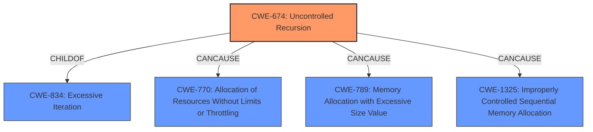

# Enhanced Analysis for CVE-2022-27943

# Summary
| CWE ID  | CWE Name | Confidence | CWE Abstraction Level | CWE Vulnerability Mapping Label | CWE-Vulnerability Mapping Notes |
|-----------------|---------------------------------------------------|-------------------|--------------------------|-----------------------------------|--------------------------------------------------------------------------------------------------|
| **CWE-674** | **Uncontrolled Recursion** | 0.9 | Class | Primary | Allowed-with-Review |
| CWE-770 | Allocation of Resources Without Limits or Throttling | 0.7 | Base | Secondary Candidate | Allowed |
| CWE-789 | Memory Allocation with Excessive Size Value | 0.6 | Variant | Secondary Candidate | Allowed |
| CWE-1325 | Improperly Controlled Sequential Memory Allocation | 0.6 | Base | Secondary Candidate | Allowed |

## Evidence and Confidence

*   **Confidence Score:** 0.9
*   **Evidence Strength:** HIGH

## Relationship Analysis
The primary CWE is CWE-674, Uncontrolled Recursion, which is a Class-level CWE. The analysis also considered related CWEs like CWE-770, CWE-789 and CWE-1325, which deal with resource allocation issues. CWE-674 is a child of CWE-834 (Excessive Iteration), indicating that uncontrolled recursion is a specific type of excessive iteration. The selection of CWE-674 is further supported by the vulnerability description, which directly mentions "stack consumption" due to unbounded recursion. The other CWEs are connected by the theme of resource exhaustion.



## Vulnerability Chain
The vulnerability chain starts with **uncontrolled recursion** (CWE-674) in the `demangle_const` function. This leads to **stack consumption**, ultimately resulting in a stack overflow and denial of service.

## Summary of Analysis
The primary focus of this analysis was to identify the most accurate CWE for a vulnerability in GNU GCC 11.2's libiberty/rust-demangle.c, where the **rootcause** is **stack consumption** due to unbounded recursion.

Initially, the vulnerability description pointed towards **stack consumption** which could have led to a broader classification. However, the CVE Reference Links Content Summary provided crucial details, specifically highlighting the **lack of recursion limit** in the `demangle_const` function. This evidence strongly supports the selection of CWE-674 (Uncontrolled Recursion) as the primary weakness.

The graph relationships and retriever results further reinforced this decision. While other CWEs like CWE-770, CWE-789, and CWE-1325 were considered due to their relevance to resource allocation, the specific mechanism of the vulnerability – uncontrolled recursion – makes CWE-674 the most accurate and specific classification.

The abstraction level of CWE-674 as a Class was initially a concern, but given the direct evidence of uncontrolled recursion, it remains the most appropriate choice. The alternative, a more generic resource exhaustion CWE, would not capture the precise nature of the flaw. The other CWEs are related, and could potentially be present, but there isn't enough evidence to confirm this.

Relevant CWE Information:

# Enhanced Context (25 CWEs)
The following CWEs were identified as potentially relevant to this vulnerability:

## CWE-682: Incorrect Calculation
**Abstraction Level**: Pillar
**Similarity Score**: 0.79

**Description**:
The product performs a calculation that generates incorrect or unintended results that are later used in security-critical decisions or resource management.

**Mapping Guidance**:
- Usage: Discouraged
- Rationale: This CWE entry is extremely high-level, a Pillar. In many cases, lower-level children or descendants are more appropriate. However, sometimes this weakness is forced to be used due to the lack of in-depth weakness research. See Research Gaps.

*Not selected:* While incorrect calculation might contribute to resource exhaustion in some scenarios, the primary issue here is the lack of control over recursion depth, making CWE-674 a more direct fit.

## CWE-664: Improper Control of a Resource Through its Lifetime
**Abstraction Level**: Pillar
**Similarity Score**: 0.77

**Description**:
The product does not maintain or incorrectly maintains control over a resource throughout its lifetime of creation, use, and release.

**Mapping Guidance**:
- Usage: Discouraged
- Rationale: This CWE entry is high-level when lower-level children are available.

*Not selected:* This is too high level and the root cause is uncontrolled recursion.

## CWE-1325: Improperly Controlled Sequential Memory Allocation
**Abstraction Level**: Base
**Similarity Score**: 0.76

**Description**:
The product manages a group of objects or resources and performs a separate memory allocation for each object, but it does not properly limit the total amount of memory that is consumed by all of the combined objects.

**Mapping Guidance**:
- Usage: Allowed
- Rationale: This CWE entry is at the Base level of abstraction, which is a preferred level of abstraction for mapping to the root causes of vulnerabilities.

*Considered:* This could be a contributing factor if the recursion involves allocating memory for each recursive call. But the description focuses on uncontrolled recursion being the main driver of the **stack consumption**. Confidence is lower because direct evidence is lacking.

## CWE-405: Asymmetric Resource Consumption (Amplification)
**Abstraction Level**: Class
**Similarity Score**: 0.76

**Description**:
The product does not properly control situations in which an adversary can cause the product to consume or produce excessive resources without requiring the adversary to invest equivalent work or otherwise prove authorization, i.e., the adversary's influence is "asymmetric."

**Mapping Guidance**:
- Usage: Allowed-with-Review
- Rationale: This CWE entry is a Class and might have Base-level children that would be more appropriate

*Not selected:* This is a class-level CWE which is too high level for the **rootcause**.

## CWE-404: Improper Resource Shutdown or Release
**Abstraction Level**: Class
**Similarity Score**: 0.75

**Description**:
The product does not release or incorrectly releases a resource before it is made available for re-use.

**Mapping Guidance**:
- Usage: Allowed-with-Review
- Rationale: This CWE entry is a Class and might have Base-level children that would be more appropriate

*Not selected:* This doesn't match the vulnerability. The vulnerability is recursion without limits.

## CWE-691: Insufficient Control Flow Management
**Abstraction Level**: Pillar
**Similarity Score**: 0.74

**Description**:
The code does not sufficiently manage its control flow during execution, creating conditions in which the control flow can be modified in unexpected ways.

**Mapping Guidance**:
- Usage: Discouraged
- Rationale: This CWE entry is extremely high-level, a Pillar. However, classification research is limited for weaknesses of this type, so there can be gaps or organizational difficulties within CWE that force use of this weakness, even at such a high level of abstraction.

*Not selected:* This is a high-level CWE, and CWE-674 is more specific.

## CWE-226: Sensitive Information in Resource Not Removed Before Reuse
**Abstraction Level**: Base
**Similarity Score**: 0.74

**Description**:
The product releases a resource such as memory or a file so that it can be made available for reuse, but it does not clear or "zeroize" the information contained in the resource before the product performs a critical state transition or makes the resource available for reuse by other entities.

**Mapping Guidance**:
- Usage: Allowed
- Rationale: This CWE entry is at the Base level of abstraction, which is a preferred level of abstraction for mapping to the root causes of vulnerabilities.

*Not selected:* This doesn't match the vulnerability. The vulnerability is recursion without limits.

## CWE-131: Incorrect Calculation of Buffer Size
**Abstraction Level**: Base
**Similarity Score**: 0.74

**Description**:
The product does not correctly calculate the size to be used when allocating a buffer, which could lead to a buffer overflow.

**Mapping Guidance**:
- Usage: Allowed
- Rationale


## CWE Relationship Analysis

Current CWEs represent these abstraction levels: .


### Vulnerability Chain Analysis

**Chain starting from CWE-131:**
- 131 (Incorrect Calculation of Buffer Size) - ROOT


**Chain starting from CWE-1325:**
- 1325 (Improperly Controlled Sequential Memory Allocation) - ROOT


### CWE Relationship Diagram

```mermaid
graph TD
    classDef primary fill:#f96,stroke:#333,stroke-width:2px
    classDef secondary fill:#69f,stroke:#333
    classDef tertiary fill:#9e9,stroke:#333
```