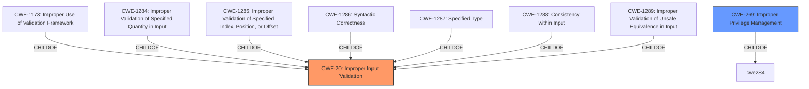

# Analysis Report for CVE-2022-28126

# Vulnerability Analysis Report: CVE-2022-28126

## Description


## Analysis (with Relationship Data)

# Summary
| CWE ID | CWE Name | Confidence | CWE Abstraction Level | CWE Vulnerability Mapping Label | CWE-Vulnerability Mapping Notes |
|---|---|---|---|---|---|
| CWE-20 | Improper Input Validation | 0.8 | Class | Primary CWE | Discouraged |
| CWE-269 | Improper Privilege Management | 0.5 | Class | Secondary Candidate | Discouraged |

## Evidence and Confidence

*   **Confidence Score:** 0.7
*   **Evidence Strength:** MEDIUM

## Relationship Analysis
The primary relationship influencing the decision is the parent-child relationship between CWE-20 and its potential children (CWE-1173, CWE-1284, CWE-1285, CWE-1286, CWE-1287, CWE-1288, and CWE-1289). While a more specific child CWE might be ideal, the provided information is too vague, stating only "**Improper input validation**". The vulnerability leads to privilege escalation, suggesting a potential connection to CWE-269, but the evidence is insufficient to confirm this. CWE-20 can precede other weaknesses like CWE-22, CWE-41, CWE-74, CWE-119, and CWE-770.



## Vulnerability Chain
The vulnerability chain starts with **improper input validation (CWE-20)**, leading to an escalation of privilege. The chain is:

1.  **Improper Input Validation (CWE-20)**: The software **does not properly validate input**.
2.  Escalation of Privilege: The **improper validation** leads to a privileged user being able to escalate privileges.

Missing Links: The specific mechanism by which the **improper input validation** leads to privilege escalation is not detailed.

## Summary of Analysis
The initial analysis strongly points to **CWE-20 (Improper Input Validation)** as the primary weakness. The vulnerability description explicitly mentions "**Improper input validation**" as the root cause. The CVE Reference Links Content Summary reinforces this by stating, "Root cause of vulnerability: **Improper input validation**." However, the description lacks specific details about the type of input being validated or the specific validation failure.

The retriever results also suggest CWE-20 as a candidate, although it is marked as "Discouraged" due to its generality. The recommendation is to consider lower-level children of CWE-20, such as CWE-1173, CWE-1284, CWE-1285, CWE-1286, CWE-1287, CWE-1288, or CWE-1289. However, without more specific information, it is difficult to choose a more precise CWE.

The resulting impact is an "escalation of privilege", which hints at **CWE-269 (Improper Privilege Management)**. However, since the root cause is clearly stated as **improper input validation**, CWE-269 would be a secondary consideration, and the lack of details on the privilege management aspect makes this a less confident mapping.

The final decision is to assign **CWE-20 (Improper Input Validation)** as the primary CWE due to the explicit mention of **improper input validation** as the root cause in both the vulnerability description and the CVE reference summary. While CWE-20 is a high-level class, the lack of specific details prevents assigning a more specific child CWE. CWE-269 is considered as a secondary candidate.

Relevant CWE Information:

# Enhanced Context (25 CWEs)
The following CWEs were identified as potentially relevant to this vulnerability:

## CWE-1173: Improper Use of Validation Framework
**Abstraction Level**: Base
**Similarity Score**: 0.78
**Source**: dense

**Description**:
The product does not use, or incorrectly uses, an input validation framework that is provided by the source language or an independent library.

**Mapping Guidance**:
- Usage: Allowed
- Rationale: This CWE entry is at the Base level of abstraction, which is a preferred level of abstraction for mapping to the root causes of vulnerabilities.

## CWE-1289: Improper Validation of Unsafe Equivalence in Input
**Abstraction Level**: Base
**Similarity Score**: 0.75
**Source**: dense

**Description**:
The product receives an input value that is used as a resource identifier or other type of reference, but it does not validate or incorrectly validates that the input is equivalent to a potentially-unsafe value.

**Mapping Guidance**:
- Usage: Allowed
- Rationale: This CWE entry is at the Base level of abstraction, which is a preferred level of abstraction for mapping to the root causes of vulnerabilities.

## CWE-691: Insufficient Control Flow Management
**Abstraction Level**: Pillar
**Similarity Score**: 0.74
**Source**: dense

**Description**:
The code does not sufficiently manage its control flow during execution, creating conditions in which the control flow can be modified in unexpected ways.

**Mapping Guidance**:
- Usage: Discouraged
- Rationale: This CWE entry is extremely high-level, a Pillar. However, classification research is limited for weaknesses of this type, so there can be gaps or organizational difficulties within CWE that force use of this weakness, even at such a high level of abstraction.

## CWE-807: Reliance on Untrusted Inputs in a Security Decision
**Abstraction Level**: Base
**Similarity Score**: 0.74
**Source**: dense

**Description**:
The product uses a protection mechanism that relies on the existence or values of an input, but the input can be modified by an untrusted actor in a way that bypasses the protection mechanism.

**Mapping Guidance**:
- Usage: Allowed
- Rationale: This CWE entry is at the Base level of abstraction, which is a preferred level of abstraction for mapping to the root causes of vulnerabilities.

## CWE-653: Improper Isolation or Compartmentalization
**Abstraction Level**: Class
**Similarity Score**: 0.73
**Source**: dense

**Description**:
The product does not properly compartmentalize or isolate functionality, processes, or resources that require different privilege levels, rights, or permissions.

**Mapping Guidance**:
- Usage: Allowed
- Rationale: This CWE entry is at the Base level of abstraction, which is a preferred level of abstraction for mapping to the root causes of vulnerabilities.

## CWE-693: Protection Mechanism Failure
**Abstraction Level**: Pillar
**Similarity Score**: 0.73
**Source**: dense

**Description**:
The product does not use or incorrectly uses a protection mechanism that provides sufficient defense against directed attacks against the product.

**Mapping Guidance**:
- Usage: Discouraged
- Rationale: This CWE entry is extremely high-level, a Pillar.

## CWE-274: Improper Handling of Insufficient Privileges
**Abstraction Level**: Base
**Similarity Score**: 0.73
**Source**: dense

**Description**:
The product does not handle or incorrectly handles when it has insufficient privileges to perform an operation, leading to resultant weaknesses.

**Mapping Guidance**:
- Usage: Discouraged
- Rationale: This CWE entry could be deprecated in a future version of CWE.

## CWE-657: Violation of Secure Design Principles
**Abstraction Level**: Class
**Similarity Score**: 0.72
**Source**: dense

**Description**:
The product violates well-established principles for secure design.

**Mapping Guidance**:
- Usage:


## CWE Relationship Analysis

Current CWEs represent these abstraction levels: .


### Vulnerability Chain Analysis

**Chain starting from CWE-41:**
- 41 (Improper Resolution of Path Equivalence) - ROOT


**Chain starting from CWE-807:**
- 807 (Reliance on Untrusted Inputs in a Security Decision) - ROOT


### CWE Relationship Diagram

```mermaid
graph TD
    classDef primary fill:#f96,stroke:#333,stroke-width:2px
    classDef secondary fill:#69f,stroke:#333
    classDef tertiary fill:#9e9,stroke:#333
```


*Report generated on 2025-03-31 09:55:43*
