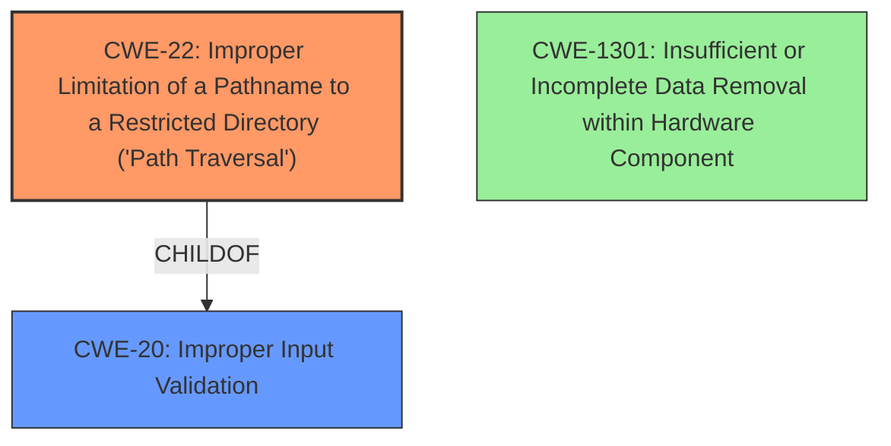

# Analysis for CVE-2022-28127

# Summary
| CWE ID | CWE Name | Confidence | CWE Abstraction Level | CWE Vulnerability Mapping Label | CWE-Vulnerability Mapping Notes |
|---|---|---|---|---|---|
| **CWE-22** | Improper Limitation of a Pathname to a Restricted Directory ('Path Traversal') | 0.9 | Base | Primary | Allowed |
| CWE-20 | Improper Input Validation | 0.8 | Class | Secondary | Discouraged |
| CWE-1301 | Insufficient or Incomplete Data Removal within Hardware Component | 0.6 | Base | Secondary | Allowed |

## Evidence and Confidence

*   **Confidence Score:** 0.9
*   **Evidence Strength:** HIGH

## Relationship Analysis
The primary CWE is CWE-22, as the vulnerability involves improper limitation of a pathname to a restricted directory, leading to path traversal. CWE-22 is a base level CWE. CWE-20 is a parent of CWE-22, representing a more general class of input validation issues. CWE-1301 is related, as the vulnerability involves **data removal** but stems from incorrect path handling rather than issues within the removal process itself.

## Vulnerability Chain
The vulnerability chain starts with **improper input validation**, specifically the failure to adequately restrict the pathname. This leads to path traversal, allowing an attacker to delete arbitrary files. The final impact is **arbitrary file deletion**.

## Summary of Analysis
The analysis indicates a **data removal** vulnerability due to insufficient input validation. The vulnerability occurs in the `/ajax/remove/` API, which checks for `..` to prevent path traversal, but it doesn't prevent absolute paths from being used in the `file_name` parameter, allowing an attacker to delete arbitrary files.

The primary CWE is CWE-22 Improper Limitation of a Pathname to a Restricted Directory ('Path Traversal'). The "CVE Reference Links Content Summary" section states that "the API checks for `..` to prevent path traversal, but it doesn't prevent absolute paths from being used in the `file_name` parameter." This aligns directly with the description of CWE-22, which involves "external input to construct a pathname that is intended to identify a file or directory that is located underneath a restricted parent directory, but the product does not properly neutralize special elements within the pathname that can cause the pathname to resolve to a location that is outside of the restricted directory."

CWE-20 Improper Input Validation is considered as a secondary CWE. The "CVE Reference Links Content Summary" also states that "The web server does not properly validate the input provided to the `/ajax/remove/` API. It only checks for `..` but not other methods to perform file system traversal." This indicates a general lack of proper input validation, which aligns with CWE-20. However, CWE-22 is more specific to the path traversal aspect of the vulnerability. The Mapping Guidance for CWE-20 recommends considering child-level CWEs such as CWE-22.

CWE-1301, Insufficient or Incomplete Data Removal within Hardware Component was considered because the initial description mentioned **data removal** vulnerability. However, the root cause is not within the data removal process, but within the improper input validation and path traversal.

The final selection of CWE-22 and CWE-20 is based on the evidence that the root cause is the **improper** handling of pathnames combined with a general lack of input validation and results in **arbitrary file deletion**. The selected CWEs are at the optimal level of specificity because they directly address the **weakness** identified in the vulnerability description and the content summary.