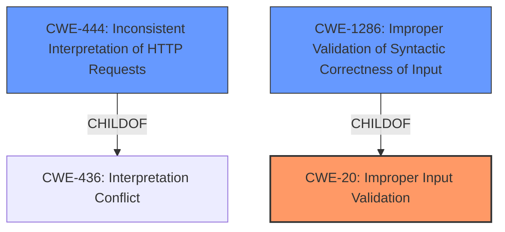

# Analysis for CVE-2022-28129

# Summary
| CWE ID | CWE Name | Confidence | CWE Abstraction Level | CWE Vulnerability Mapping Label | CWE-Vulnerability Mapping Notes |
|---|---|---|---|---|---|
| CWE-20 | Improper Input Validation | 0.9 | Class | Discouraged | Consider lower-level children. |
| CWE-444 | Inconsistent Interpretation of HTTP Requests ('HTTP Request/Response Smuggling') | 0.7 | Base | Allowed | Secondary candidate. |
| CWE-1286 | Improper Validation of Syntactic Correctness of Input | 0.6 | Base | Allowed | Secondary candidate. |

## Evidence and Confidence

*   **Confidence Score:** 0.8
*   **Evidence Strength:** HIGH

## Relationship Analysis
The primary CWE identified is CWE-20, **Improper Input Validation**, which is a Class-level CWE. While it directly reflects the stated **rootcause** in the vulnerability description, the MITRE guidelines discourage its use due to its high-level nature and potential for misuse. The Retriever Results and vulnerability details suggest potential secondary CWEs: CWE-444 and CWE-1286. CWE-444 is related to inconsistent interpretation of HTTP requests, while CWE-1286 focuses on the syntactic correctness of input.

## Vulnerability Chain
The vulnerability chain starts with **Improper Input Validation** (CWE-20) of HTTP/1.1 headers. This leads to the acceptance of invalid headers, which can then be exploited to achieve request smuggling (CWE-444) and cache poisoning. The chain highlights a progression from a general input validation issue to specific exploitable conditions.

## Summary of Analysis
Initially, the vulnerability description points directly to CWE-20 (**Improper Input Validation**). The description explicitly states "**Improper Input Validation** vulnerability in HTTP/1.1 header parsing of Apache Traffic Server allows an attacker to send invalid headers."

However, the mapping guidance for CWE-20 discourages its use due to its high level of abstraction. The Retriever results suggest CWE-444 (Inconsistent Interpretation of HTTP Requests) and CWE-1286 (Improper Validation of Syntactic Correctness of Input) as more specific alternatives. The evidence supports CWE-20 as the primary **rootcause**, but it's important to consider the more specific aspects of the vulnerability.

CWE-444 is related to request smuggling, which is a potential consequence of the vulnerability, making it a secondary candidate. CWE-1286, focusing on the syntactic correctness of the input, is also a valid secondary candidate because the **improper input validation** relates to the syntax of HTTP headers.

Given the MITRE guidance against using CWE-20 directly, I am including CWE-20 but marking it as "Discouraged" and recommending that lower-level children be considered. The confidence level is high because the vulnerability description clearly identifies **improper input validation** as the **rootcause**. The secondary candidates are CWE-444 and CWE-1286 with lower confidence.

Relevant CWE Information:
- CWE-20: Improper Input Validation
- CWE-444: Inconsistent Interpretation of HTTP Requests ('HTTP Request/Response Smuggling')
- CWE-1286: Improper Validation of Syntactic Correctness of Input