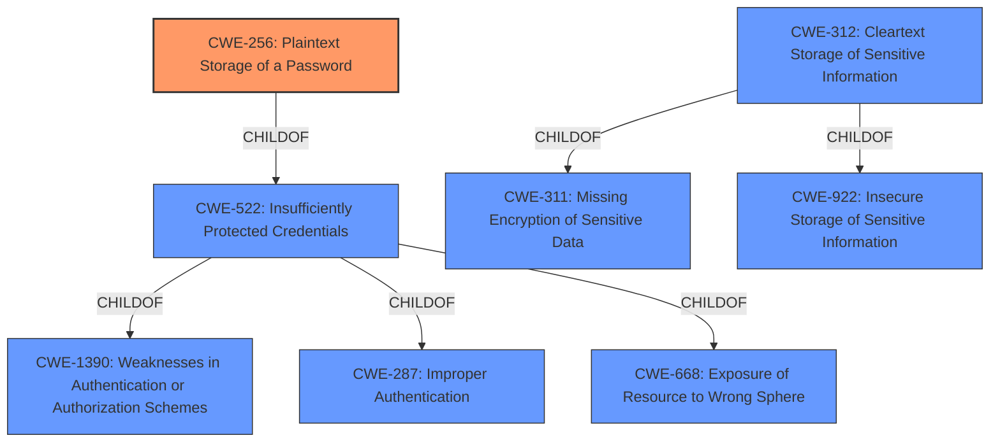

# Analysis Report for CVE-2022-28135

# Vulnerability Analysis Report: CVE-2022-28135

## Description


## Analysis (with Relationship Data)

# Summary
| CWE ID | CWE Name | Confidence | CWE Abstraction Level | CWE Vulnerability Mapping Label | CWE-Vulnerability Mapping Notes |
|---|---|---|---|---|---|
| CWE-256 | Plaintext Storage of a Password | 1 | Base | Allowed | Primary CWE |
| CWE-312 | Cleartext Storage of Sensitive Information | 0.7 | Base | Allowed | Secondary Candidate |
| CWE-522 | Insufficiently Protected Credentials | 0.6 | Class | Allowed-with-Review | Secondary Candidate |

## Evidence and Confidence

*   **Confidence Score:** 0.9
*   **Evidence Strength:** HIGH

## Relationship Analysis
The primary CWE is CWE-256, which is a `ChildOf` CWE-522. CWE-312 is also a potential candidate, with relationship as `ChildOf` to CWE-311 and CWE-922. The abstraction levels influenced the selection, favoring the more specific Base level CWE-256 over the Class level CWE-522.



## Vulnerability Chain
The chain of events starts with the **unencrypted storage of passwords** in the configuration file. This leads to the exposure of those passwords to unauthorized users who have access to the Jenkins controller file system.

## Summary of Analysis
The analysis indicates that the vulnerability stems from storing passwords in plaintext in a configuration file, allowing unauthorized users to view them.

The selection is based on the vulnerability description and the CVE Reference Links Content Summary, which explicitly state that the passwords are stored **unencrypted**. The **rootcause** is **unencrypted storage of sensitive information**.

*   "Jenkins instant-messaging Plugin 1.41 and earlier stores passwords for group chats **unencrypted** in the global configuration file"
*   "The instant-messaging Plugin stores passwords for group chats **unencrypted**."

The graph relationships highlight the hierarchy of CWEs, guiding the selection towards the most specific and relevant option. CWE-256 aligns perfectly with the described vulnerability, representing the **plaintext storage of a password**.

Relevant CWE Information:

*   **CWE-256: Plaintext Storage of a Password:** This is the primary CWE because the description matches the vulnerability exactly. The vulnerability description states that passwords for group chats are stored **unencrypted**, which directly aligns with the definition of CWE-256.
*   **CWE-312: Cleartext Storage of Sensitive Information:** This is a broader CWE, but still relevant. The vulnerability involves storing sensitive information (passwords) in cleartext, which aligns with CWE-312. However, CWE-256 is more specific since it focuses on passwords, making it a better fit.
*   **CWE-522: Insufficiently Protected Credentials:** This is a higher-level class of weakness that includes various ways credentials can be insecurely handled. While the vulnerability falls under this category, CWE-256 provides a more precise description of the specific issue.

CWEs Considered but Not Used:

*   **CWE-260: Password in Configuration File:** While related, this CWE is less specific than CWE-256. CWE-256 directly addresses the issue of passwords being stored in plaintext, while CWE-260 only mentions the storage location. Plaintext storage is the core issue, so CWE-256 is a better fit.
*   **CWE-538: Insertion of Sensitive Information into Externally-Accessible File or Directory:** This CWE focuses on the placement of sensitive information in accessible files. While this is a component of the vulnerability, the primary weakness is the lack of encryption.
*   **CWE-862: Missing Authorization and CWE-863: Incorrect Authorization:** These CWEs relate to authorization issues, which are not the primary concern in this vulnerability. The core issue is the **unencrypted** storage of passwords, not a lack of authorization checks.

The selected CWEs are at the optimal level of specificity because they directly address the **rootcause** of the vulnerability: the **unencrypted storage of passwords**. This is a base-level weakness that leads directly to the potential compromise of user credentials.


## CWE Relationship Analysis

Current CWEs represent these abstraction levels: .


### Vulnerability Chain Analysis

**Chain starting from CWE-862:**
- 862 (Missing Authorization) - ROOT


**Chain starting from CWE-922:**
- 922 (Insecure Storage of Sensitive Information) - ROOT


### CWE Relationship Diagram

```mermaid
graph TD
    classDef primary fill:#f96,stroke:#333,stroke-width:2px
    classDef secondary fill:#69f,stroke:#333
    classDef tertiary fill:#9e9,stroke:#333
```


*Report generated on 2025-03-31 01:17:41*
