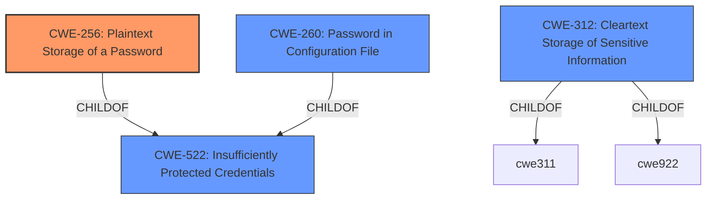

# Analysis for CVE-2022-28141

# Summary
| CWE ID | CWE Name | Confidence | CWE Abstraction Level | CWE Vulnerability Mapping Label | CWE-Vulnerability Mapping Notes |
|---|---|---|---|---|---|
| CWE-256 | Plaintext Storage of a Password | 1.0 | Base | Allowed | Primary CWE |
| CWE-522 | Insufficiently Protected Credentials | 0.7 | Class | Allowed-with-Review | Secondary Candidate |
| CWE-260 | Password in Configuration File | 0.6 | Base | Allowed | Secondary Candidate |
| CWE-312 | Cleartext Storage of Sensitive Information | 0.5 | Base | Allowed | Secondary Candidate |

## Evidence and Confidence

*   **Confidence Score:** 0.9
*   **Evidence Strength:** HIGH

## Relationship Analysis
The primary CWE selected is CWE-256 (Plaintext Storage of a Password), a Base level CWE. This is a child of the Class-level CWE-522 (Insufficiently Protected Credentials). CWE-260 (Password in Configuration File) is another Base-level CWE and child of CWE-522, representing a more specific scenario. CWE-312 (Cleartext Storage of Sensitive Information) is another related Base-level CWE that describes the general issue of storing sensitive data without encryption. The relationship analysis indicates that CWE-256 is the most specific and appropriate choice given the vulnerability description.

## Vulnerability Chain
The chain of events is as follows:
1.  **Root Cause:** The application stores the Proxmox Datacenter password **unencrypted** in the global config.xml file (CWE-256).
2.  **Weakness:** The password is now stored in **plaintext**.
3.  **Impact:** Users with access to the Jenkins controller file system can view the Proxmox Datacenter password, leading to potential unauthorized access to the Proxmox environment.

## Summary of Analysis
The initial assessment, based on the vulnerability description, CVE reference, and retriever results, points towards CWE-256 (Plaintext Storage of a Password) as the primary weakness.

The vulnerability description clearly states: "Jenkins Proxmox Plugin 0.5.0 and earlier stores the Proxmox Datacenter password **unencrypted** in the global config.xml file on the Jenkins controller." The CVE reference confirms this: "The Proxmox plugin stores the Proxmox Datacenter password in **plain text** in the global `config.xml` file on the Jenkins controller."

The retriever results also list CWE-256 as the top match.

While other CWEs like CWE-522 (Insufficiently Protected Credentials), CWE-260 (Password in Configuration File), and CWE-312 (Cleartext Storage of Sensitive Information) are related and also appear in the retriever results, CWE-256 is the most specific and accurately captures the root cause of the vulnerability.

CWE-256 is at the Base level of abstraction, which is the preferred level for mapping root causes. The MITRE mapping guidance for CWE-256 states: "This CWE entry is at the Base level of abstraction, which is a preferred level of abstraction for mapping to the root causes of vulnerabilities."

Other CWEs considered but not used:

*   **CWE-522 (Insufficiently Protected Credentials):** This is a Class-level CWE and a parent of CWE-256. While relevant, it is less specific than CWE-256. The mapping guidance suggests examining children for a better fit, which led to the selection of CWE-256.
*   **CWE-260 (Password in Configuration File):** While this is a Base-level CWE and also related to the vulnerability, it is less precise than CWE-256. CWE-260 describes storing a password in a configuration file, but CWE-256 specifically addresses the fact that the password is stored in *plaintext*.
*   **CWE-312 (Cleartext Storage of Sensitive Information):** This is a more general CWE than CWE-256, as it refers to storing *any* sensitive information in cleartext. CWE-256 focuses specifically on passwords, making it a more accurate fit.
*   **CWE-538 (Insertion of Sensitive Information into Externally-Accessible File or Directory):** The description of this CWE indicates "sensitive information into files or directories that are accessible to actors who are allowed to have access to the files, but not to the sensitive information." This CWE is focused on a file permission issue and is not related to the rootcause of password being stored in plaintext.

The final decision to use CWE-256 is based on its specificity, its alignment with the vulnerability description and CVE reference, its Base level of abstraction, and the MITRE mapping guidance.