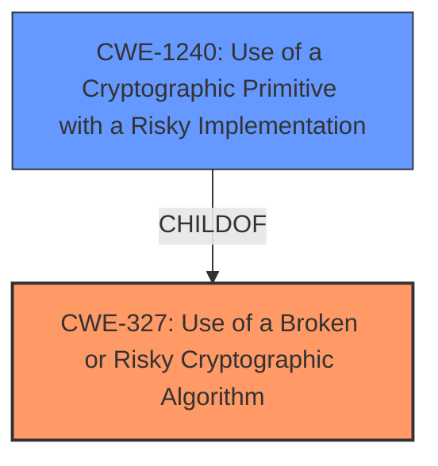

# Enhanced Analysis for CVE-2022-28164

# Summary
| CWE ID  | CWE Name                                              | Confidence | CWE Abstraction Level | CWE Vulnerability Mapping Label | CWE-Vulnerability Mapping Notes |
|---------|-------------------------------------------------------|------------|-----------------------|---------------------------------|------------------------------------|
| CWE-327 | Use of a Broken or Risky Cryptographic Algorithm | 0.9        | Class                 | Allowed-with-Review              | Primary CWE                       |
| CWE-1240 | Use of a Cryptographic Primitive with a Risky Implementation | 0.7 | Base | Allowed | Secondary Candidate |

## Evidence and Confidence

*   **Confidence Score:** 0.8
*   **Evidence Strength:** HIGH

## Relationship Analysis
The primary relationship influencing my decision is the hierarchical structure of CWEs related to cryptographic issues. CWE-327 (Use of a Broken or Risky Cryptographic Algorithm) is a Class-level CWE that encompasses various issues related to the use of weak or broken cryptographic algorithms. CWE-1240 (Use of a Cryptographic Primitive with a Risky Implementation) is a Base-level CWE that is more specific, focusing on the risky implementation of cryptographic primitives. Given that the vulnerability description specifies the use of the Blowfish algorithm, a well-known but potentially risky algorithm, CWE-327 serves as the primary classification. Additionally, the vulnerability could further be refined with CWE-1240, however, this is secondary given that the vulnerability description key phrases doesn't specify implementation, but merely algorithm choice.



## Vulnerability Chain
The vulnerability chain involves the selection of a weak cryptographic algorithm (Blowfish) for password storage, leading to the potential decryption of stored passwords by an attacker. The chain can be summarized as:
1.  **Root Cause:** Use of the Blowfish algorithm for password storage.
2.  **Weakness:** The Blowfish algorithm is susceptible to decryption attacks.
3.  **Impact:** An authenticated attacker can decrypt stored account passwords, leading to unauthorized access.

## Summary of Analysis
Initially, the vulnerability description indicated the use of the Blowfish symmetric encryption algorithm for password storage, which led to the identification of **CWE-327 (Use of a Broken or Risky Cryptographic Algorithm)** as the primary weakness. The "CVE Reference Links Content Summary" section explicitly states that the root cause of the vulnerability is the use of the Blowfish algorithm, which allows an attacker to decrypt stored account passwords. This aligns with the description of CWE-327, which covers the use of cryptographic algorithms that are considered broken or risky.

The retriever results also listed several other CWEs, such as **CWE-257 (Storing Passwords in a Recoverable Format)**, **CWE-321 (Use of Hard-coded Cryptographic Key)**, and **CWE-916 (Use of Password Hash With Insufficient Computational Effort)**. However, these CWEs were deemed less relevant because they address different aspects of password storage vulnerabilities. CWE-257 is related to storing passwords in a recoverable format, which is not explicitly mentioned in the vulnerability description. CWE-321 involves the use of hard-coded cryptographic keys, which is also not indicated in the description. CWE-916 focuses on the use of password hashes with insufficient computational effort, which is not the primary issue in this case, as the vulnerability stems from the choice of the encryption algorithm itself.

While **CWE-1240 (Use of a Cryptographic Primitive with a Risky Implementation)** was considered, it was deemed a secondary classification. The vulnerability description specifies the use of the Blowfish algorithm, which is a known but potentially risky algorithm.

The selection of **CWE-327** as the primary CWE is based on the evidence that the vulnerability stems from the use of a specific cryptographic algorithm that is considered weak or risky. This aligns with the description of CWE-327, which covers the use of broken or risky cryptographic algorithms. The provided evidence and the relationship analysis support this classification, making it the most appropriate choice for this vulnerability.

Relevant CWE Information:

# Enhanced Context (25 CWEs)

## CWE-1391: Use of Weak Credentials
**Abstraction Level**: Class
**Similarity Score**: 0.79
**Source**: dense

**Description**:
The product uses weak credentials (such as a default key or hard-coded password) that can be calculated, derived, reused, or guessed by an attacker.

**Mapping Guidance**:
- Usage: Allowed-with-Review
- Rationale: This CWE entry is a Class and might have Base-level children that would be more appropriate

## CWE-1240: Use of a Cryptographic Primitive with a Risky Implementation
**Abstraction Level**: Base
**Similarity Score**: 0.78
**Source**: dense

**Description**:
To fulfill the need for a cryptographic primitive, the product implements a cryptographic algorithm using a non-standard, unproven, or disallowed/non-compliant cryptographic implementation.

**Mapping Guidance**:
- Usage: Allowed
- Rationale: This CWE entry is at the Base level of abstraction, which is a preferred level of abstraction for mapping to the root causes of vulnerabilities.

## CWE-916: Use of Password Hash With Insufficient Computational Effort
**Abstraction Level**: Base
**Similarity Score**: 0.77
**Source**: dense

**Description**:
The product generates a hash for a password, but it uses a scheme that does not provide a sufficient level of computational effort that would make password cracking attacks infeasible or expensive.

**Mapping Guidance**:
- Usage: Allowed
- Rationale: This CWE entry is at the Base level of abstraction, which is a preferred level of abstraction for mapping to the root causes of vulnerabilities.

## CWE-312: Cleartext Storage of Sensitive Information
**Abstraction Level**: Base
**Similarity Score**: 0.77
**Source**: dense

**Description**:
The product stores sensitive information in cleartext within a resource that might be accessible to another control sphere.

**Mapping Guidance**:
- Usage: Allowed
- Rationale: This CWE entry is at the Base level of abstraction, which is a preferred level of abstraction for mapping to the root causes of vulnerabilities.

## CWE-257: Storing Passwords in a Recoverable Format
**Abstraction Level**: Base
**Similarity Score**: 0.77
**Source**: dense

**Description**:
The storage of passwords in a recoverable format makes them subject to password reuse attacks by malicious users. In fact, it should be noted that recoverable encrypted passwords provide no significant benefit over plaintext passwords since they are subject not only to reuse by malicious attackers but also by malicious insiders. If a system administrator can recover a password directly, or use a brute force search on the available information, the administrator can use the password on other accounts.

**Mapping Guidance**:
- Usage: Allowed
- Rationale: This CWE entry is at the Base level of abstraction, which is a preferred level of abstraction for mapping to the root causes of vulnerabilities.

## CWE-331: Insufficient Entropy
**Abstraction Level**: Base
**Similarity Score**: 0.76
**Source**: dense

**Description**:
The product uses an algorithm or scheme that produces insufficient entropy, leaving patterns or clusters of values that are more likely to occur than others.

**Mapping Guidance**:
- Usage: Allowed
- Rationale: This CWE entry is at the Base level of abstraction, which is a preferred level of abstraction for mapping to the root causes of vulnerabilities.

## CWE-1204: Generation of Weak Initialization Vector (IV)
**Abstraction Level**: Base
**Similarity Score**: 0.76
**Source**: dense

**Description**:
The product uses a cryptographic primitive that uses an Initialization
			Vector (IV), but the product does not generate IVs that are
			sufficiently unpredictable or unique according to the expected
			cryptographic requirements for that primitive.
			

**Mapping Guidance**:
- Usage: Allowed
- Rationale: This CWE entry is at the Base level of abstraction, which is a preferred level of abstraction for mapping to the root causes of vulnerabilities.

## CWE-311: Missing Encryption of Sensitive Data
**Abstraction Level**: Class
**Similarity Score**: 0.76
**Source**: dense

**Description**:
The product does not encrypt sensitive or critical information before storage or transmission.

**Mapping Guidance**:
- Usage: Discouraged
- Rationale: CWE-311 is high-level with more precise children available. It is a level-1 Class (i.e., a child of a Pillar).

## CWE-328: Use of Weak Hash
**Abstraction Level**: Base
**Similarity Score**: 0.75
**Source**: dense

**Description**:
The product uses an algorithm that produces a digest (output value) that does not meet security expectations for a hash function that allows an adversary to reasonably determine the


## CWE Relationship Analysis

Current CWEs represent these abstraction levels: .


### Vulnerability Chain Analysis

**Chain starting from CWE-916:**
- 916 (Use of Password Hash With Insufficient Computational Effort) - ROOT


**Chain starting from CWE-327:**
- 327 (Use of a Broken or Risky Cryptographic Algorithm) - ROOT


### CWE Relationship Diagram

```mermaid
graph TD
    classDef primary fill:#f96,stroke:#333,stroke-width:2px
    classDef secondary fill:#69f,stroke:#333
    classDef tertiary fill:#9e9,stroke:#333
```