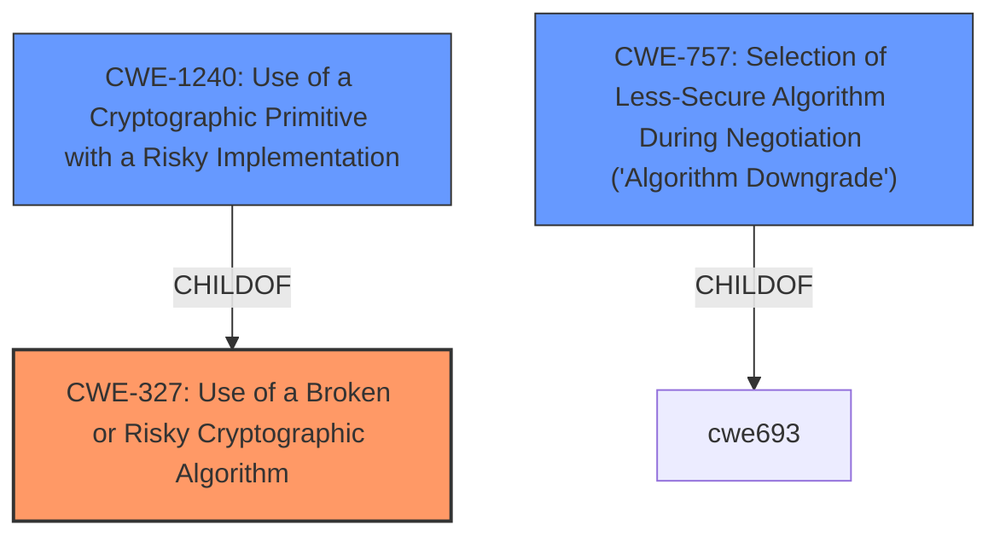

# Analysis for CVE-2022-28166

# Summary
| CWE ID  | CWE Name   | Confidence | CWE Abstraction Level | CWE Vulnerability Mapping Label | CWE-Vulnerability Mapping Notes |
|--------------|------------------------------------------------------------------------|-------------------|--------------------------|------------------------------------|---------------------------------------------------------------------------------|
| **CWE-327** | Use of a Broken or Risky Cryptographic Algorithm | 0.9 | Class | Primary | Allowed-with-Review |
| CWE-1240 | Use of a Cryptographic Primitive with a Risky Implementation | 0.7 | Base | Secondary | Allowed |
| CWE-757 | Selection of Less-Secure Algorithm During Negotiation ('Algorithm Downgrade') | 0.6 | Base | Secondary | Allowed |

## Evidence and Confidence

*   **Confidence Score:** 0.8
*   **Evidence Strength:** HIGH

## Relationship Analysis
The primary relationship influencing the CWE selection is the parent-child relationship between CWE-327 (Use of a Broken or Risky Cryptographic Algorithm) and CWE-1240 (Use of a Cryptographic Primitive with a Risky Implementation). CWE-327 is a Class, while CWE-1240 is a Base. Although the vulnerability description is specific to the **use of static key ciphers**, which could suggest a more specific CWE, the use of static key ciphers falls under the broader category of using risky cryptographic algorithms. CWE-757 is added because **the static key ciphers are allowed and used**, so they are being selected even if they are less secure.

## Vulnerability Chain
The vulnerability chain starts with the **implementation of a TLS/SSL server** that **allows the use of static key ciphers**.
  - **Root Cause:** Allowing the use of static key ciphers.
  - **Weakness:** The static key ciphers are **vulnerable to eavesdropping attacks**.
  - **Impact:** Disclosure of sensitive information due to potential decryption of communications.

## Summary of Analysis
The initial assessment focused on identifying the most specific CWE that accurately represents the vulnerability. The primary evidence comes from the "Vulnerability Description Key Phrases" which highlights the **weakness** as the **use of static key ciphers**, and from the "CVE Reference Links Content Summary" which states that "the vulnerability stems from the implementation of TLS/SSL server in Brocade SANnav which supports the use of static key ciphers".

CWE-327 (Use of a Broken or Risky Cryptographic Algorithm) is selected as the primary CWE because the **use of static key ciphers** directly aligns with the description of using a risky cryptographic algorithm. While a more specific CWE could potentially exist, CWE-327 provides a suitable level of abstraction for this vulnerability. CWE-1240 (Use of a Cryptographic Primitive with a Risky Implementation) is included as static key ciphers are a risky implementation of cryptographic primitives. The inclusion of CWE-757 (Selection of Less-Secure Algorithm During Negotiation ('Algorithm Downgrade')) acknowledges that the system allows and selects **static key ciphers** even though they are less secure.

The confidence score is high (0.8) due to the clear evidence in the vulnerability description and the alignment with the CWE descriptions.

Relevant CWE Information:
# Enhanced Context (25 CWEs)
The following CWEs were identified as potentially relevant to this vulnerability:

## CWE-1240: Use of a Cryptographic Primitive with a Risky Implementation
**Abstraction Level**: Base
**Similarity Score**: 0.82
**Source**: dense

**Description**:
To fulfill the need for a cryptographic primitive, the product implements a cryptographic algorithm using a non-standard, unproven, or disallowed/non-compliant cryptographic implementation.

**Mapping Guidance**:
- Usage: Allowed
- Rationale: This CWE entry is at the Base level of abstraction, which is a preferred level of abstraction for mapping to the root causes of vulnerabilities.

## CWE-327: Use of a Broken or Risky Cryptographic Algorithm
**Abstraction Level**: Class

### Technical Explanation for CWE-327:
The Brocade SANnav implementation of TLS/SSL supports **static key ciphers**, which are considered risky cryptographic algorithms. This aligns directly with CWE-327's description: "The product uses a broken or risky cryptographic algorithm or protocol."
### Security Implications:
The use of **static key ciphers** allows attackers to potentially eavesdrop on communications, as the same key is used for all sessions. If the key is compromised, all past and future communications can be decrypted.
### Relationship and Chain Patterns:
CWE-327 is a Class-level CWE. It is related to CWE-1240, which is a more specific Base-level CWE describing the use of a risky implementation.
### Mapping Guidance Influence:
The mapping guidance suggests that CWE-327 might have more specific children. While this is true, CWE-327 adequately captures the essence of the vulnerability, making it a suitable primary CWE.
### Additional Notes:
CWE-327 is slated for extensive research and analysis to improve terminology and relationships, indicating its importance in cryptographic vulnerabilities.

### Technical Explanation for CWE-1240:
The Brocade SANnav implementation uses static key ciphers, which are a risky implementation of cryptographic primitives within the TLS/SSL protocol.
### Security Implications:
Compromising the static key allows decryption of all communications using that key.
### Relationship and Chain Patterns:
CWE-1240 is a Base-level CWE and a child of CWE-327.
### Mapping Guidance Influence:
The mapping guidance recommends using the Base level of abstraction, which is appropriate for CWE-1240.
### Additional Notes:
The terminology notes highlight the importance of consistent and accurate terminology in cryptography-related CWEs.

### Technical Explanation for CWE-757:
The Brocade SANnav implementation allows negotiation of cryptographic algorithms, and it doesn't prevent the selection of less-secure **static key ciphers**.
### Security Implications:
Attackers could potentially force the system to use less secure algorithms, making it easier to compromise communications.
### Relationship and Chain Patterns:
CWE-757 is a Base-level CWE and a child of CWE-693.
### Mapping Guidance Influence:
The mapping guidance recommends using the Base level of abstraction, which is appropriate for CWE-757.
### Additional Notes:
This CWE is related to CWE-300, as it involves a downgrade attack, but CWE-757 is more specific to algorithm selection.

### Other CWEs Considered but Not Used:
- **CWE-321 (Use of Hard-coded Cryptographic Key):** This CWE was considered but not used because the vulnerability is not necessarily about a hard-coded key, but rather the use of static key ciphers, which are weak regardless of whether they are hard-coded.
- **CWE-330 (Use of Insufficiently Random Values):** This CWE was considered but not used because the randomness of key generation is not the primary issue; the inherent weakness of static key ciphers is the main concern.
- **CWE-798 (Use of Hard-coded Credentials):** Similar to CWE-321, this is not about hard-coded credentials in general, but the specific use of static key ciphers.
- **CWE-1204 (Generation of Weak Initialization Vector (IV)):** Although IVs are related to ciphers, the core issue is the use of static keys rather than weak IV generation.