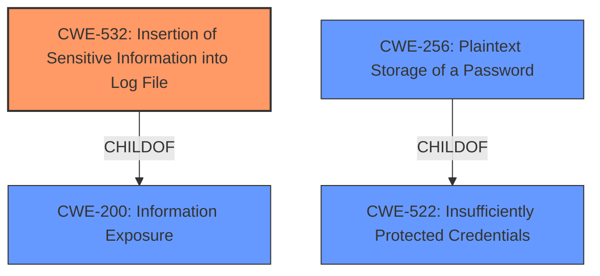

# Raw Analyzer Response for CVE-2022-28167

# Summary
| CWE ID  | CWE Name                                       | Confidence | CWE Abstraction Level | CWE Vulnerability Mapping Label | CWE-Vulnerability Mapping Notes |
| :-------- | :--------------------------------------------- | :--------- | :---------------------- | :------------------------------ | :------------------------------ |
| CWE-532   | Insertion of Sensitive Information into Log File | 1.0        | Base                    | Allowed                       | Primary CWE                   |
| CWE-256   | Plaintext Storage of a Password              | 0.8        | Base                    | Allowed                       | Secondary Candidate           |

## Evidence and Confidence

*   **Confidence Score:** 0.9
*   **Evidence Strength:** HIGH

## Relationship Analysis
The primary relationship influencing the decision is the parent-child relationship between CWE-532 (Insertion of Sensitive Information into Log File) and CWE-200 (Information Exposure). CWE-532 directly addresses the logging of sensitive data, while CWE-200 is a more general case of information exposure. The vulnerability involves logging a password in plaintext, thus CWE-532 is the more specific and appropriate choice. There is also a parent-child relationship between CWE-256 (Plaintext Storage of a Password) and CWE-522 (Insufficiently Protected Credentials).

## Vulnerability Chain
The vulnerability chain begins with the **improper logging** of the password, leading to the password being stored in plaintext, ultimately resulting in potential unauthorized access.

1.  **Root Cause:** **Improper Logging** (inferred, not explicitly a CWE).
2.  CWE-532: Insertion of Sensitive Information into Log File.
3.  CWE-256: Plaintext Storage of a Password.
4.  Impact: Potential unauthorized access to Brocade Fabric OS switches.

## Summary of Analysis
The initial assessment identified **improper logging** as the root cause. The vulnerability involves Brocade SANnav logging the Brocade Fabric OS switch password in plain text in `asyncjobscheduler-manager.log`.

The primary CWE is CWE-532 (Insertion of Sensitive Information into Log File). This is based on the vulnerability description stating that the password is being logged in plain text. The "CVE Reference Links Content Summary" section confirms this by stating: "The Brocade SANnav software logs the Brocade Fabric OS switch password in plain text within the `asyncjobscheduler-manager.log` file."

CWE-256 (Plaintext Storage of a Password) was considered as a secondary CWE. While the password is being stored in plaintext, the primary issue is that it's being logged in the first place. CWE-532 captures the initial weakness of inserting sensitive information into the log file, making it the more direct and appropriate classification.

The graph relationships support the selection of CWE-532 because it highlights the direct action of inserting sensitive information into a log. CWE-256 describes the state of the password being stored in plaintext, which is a consequence of the logging. Therefore, the selected CWEs are at the optimal level of specificity, with CWE-532 representing the primary weakness and CWE-256 as a secondary contributing factor.

Relevant CWE Information:

# Enhanced Context (25 CWEs)
The following CWEs were identified as potentially relevant to this vulnerability:

## CWE-778: Insufficient Logging
**Abstraction Level**: Base
**Similarity Score**: 0.80
**Source**: dense

**Description**:
When a security-critical event occurs, the product either does not record the event or omits important details about the event when logging it.

**Mapping Guidance**:
- Usage: Allowed
- Rationale: This CWE entry is at the Base level of abstraction, which is a preferred level of abstraction for mapping to the root causes of vulnerabilities.

## CWE-1391: Use of Weak Credentials
**Abstraction Level**: Class
**Similarity Score**: 0.75
**Source**: dense

**Description**:
The product uses weak credentials (such as a default key or hard-coded password) that can be calculated, derived, reused, or guessed by an attacker.

**Mapping Guidance**:
- Usage: Allowed-with-Review
- Rationale: This CWE entry is a Class and might have Base-level children that would be more appropriate

## CWE-208: Observable Timing Discrepancy
**Abstraction Level**: Base
**Similarity Score**: 0.75
**Source**: dense

**Description**:
Two separate operations in a product require different amounts of time to complete, in a way that is observable to an actor and reveals security-relevant information about the state of the product, such as whether a particular operation was successful or not.

**Mapping Guidance**:
- Usage: Allowed
- Rationale: This CWE entry is at the Base level of abstraction, which is a preferred level of abstraction for mapping to the root causes of vulnerabilities.

## CWE-798: Use of Hard-coded Credentials
**Abstraction Level**: Base
**Similarity Score**: 0.75
**Source**: dense

**Description**:
The product contains hard-coded credentials, such as a password or cryptographic key.

**Mapping Guidance**:
- Usage: Allowed
- Rationale: This CWE entry is at the Base level of abstraction, which is a preferred level of abstraction for mapping to the root causes of vulnerabilities.

## CWE-312: Cleartext Storage of Sensitive Information
**Abstraction Level**: Base
**Similarity Score**: 0.74
**Source**: dense

**Description**:
The product stores sensitive information in cleartext within a resource that might be accessible to another control sphere.

**Mapping Guidance**:
- Usage: Allowed
- Rationale: This CWE entry is at the Base level of abstraction, which is a preferred level of abstraction for mapping to the root causes of vulnerabilities.

## CWE-303: Incorrect Implementation of Authentication Algorithm
**Abstraction Level**: Base
**Similarity Score**: 0.74
**Source**: dense

**Description**:
The requirements for the product dictate the use of an established authentication algorithm, but the implementation of the algorithm is incorrect.

**Mapping Guidance**:
- Usage: Allowed
- Rationale: This CWE entry is at the Base level of abstraction, which is a preferred level of abstraction for mapping to the root causes of vulnerabilities.

## CWE-212: Improper Removal of Sensitive Information Before Storage or Transfer
**Abstraction Level**: Base
**Similarity Score**: 0.74
**Source**: dense

**Description**:
The product stores, transfers, or shares a resource that contains sensitive information, but it does not properly remove that information before the product makes the resource available to unauthorized actors.

**Mapping Guidance**:
- Usage: Allowed
- Rationale: This CWE entry is at the Base level of abstraction, which is a preferred level of abstraction for mapping to the root causes of vulnerabilities.

## CWE-319: Cleartext Transmission of Sensitive Information
**Abstraction Level**: Base
**Similarity Score**: 0.74
**Source**: dense

**Description**:
The product transmits sensitive or security-critical data in cleartext in a communication channel that can be sniffed by unauthorized actors.

**Mapping Guidance**:
- Usage: Allowed
- Rationale: This CWE entry is at the Base level of abstraction, which is a preferred level of abstraction for mapping to the root causes of vulnerabilities.

## CWE-204: Observable Response Discrepancy
**Abstraction Level**: Base
**Similarity Score**: 0.74
**Source**: dense

**Description**:
The product provides different responses to incoming requests in a way that reveals internal state information to an unauthorized actor outside of the intended control sphere.

**Mapping Guidance**:
- Usage: Allowed
- Rationale: This CWE entry is at the Base level of abstraction, which is a preferred level of abstraction for mapping to the root causes of vulnerabilities.

## CWE-1390: Weak Authentication
**Abstraction Level**: Class
**Similarity Score**: 0.74
**Source**: dense

**Description**:
The product uses an authentication mechanism to restrict access to specific users or identities, but the mechanism does not sufficiently prove that the claimed identity is correct.

**Mapping Guidance**:
- Usage: Allowed-with-Review
- Rationale: This CWE entry is a Class and might have Base-level children that would be more appropriate

## CWE-798: Use of Hard-coded Credentials
**Abstraction Level**: Base
**Similarity Score**: 5659.64
**Source**: sparse

**Description**:
The product contains hard-coded credentials, such as a password or cryptographic key.