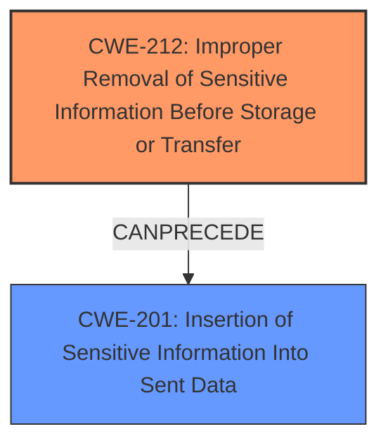

# Raw Analyzer Response for CVE-2022-2818

# Summary
| CWE ID | CWE Name | Confidence | CWE Abstraction Level | CWE Vulnerability Mapping Label | CWE-Vulnerability Mapping Notes |
|---|---|---|---|---|---|
| CWE-212 | Improper Removal of Sensitive Information Before Storage or Transfer | 1.00 | Base | Allowed | Primary CWE |
| CWE-201 | Insertion of Sensitive Information Into Sent Data | 0.75 | Base | Allowed | Secondary Candidate |

## Evidence and Confidence

*   **Confidence Score:** 0.9
*   **Evidence Strength:** HIGH

## Relationship Analysis
The primary CWE is CWE-212, which focuses on the failure to remove sensitive information before storage or transfer. CWE-201 represents a potential follow-on weakness where the sensitive information is then inserted into sent data. The relationship between these two CWEs is that CWE-212 can precede CWE-201. Both CWE-212 and CWE-201 are Base level.

## Vulnerability Chain
The chain of weaknesses starts with the **improper removal of sensitive information** (the 2FA secret) which leads to its inclusion in the JWT, resulting in the exposure of that sensitive information during transfer.

## Summary of Analysis
The initial analysis strongly suggests CWE-212 as the primary weakness, as the vulnerability description explicitly mentions "**improper removal of sensitive information**". The "CVE Reference Links Content Summary" confirms that the root cause lies in the inclusion of the user's 2FA secret within the JWT, indicating a failure to remove this sensitive data before creating the token.
CWE-201 is considered as a secondary candidate because after the sensitive information was not removed, it was then inserted into the JWT.

Relevant CWE Information:

# Enhanced Context (25 CWEs)
The following CWEs were identified as potentially relevant to this vulnerability:

## CWE-668: Exposure of Resource to Wrong Sphere
**Abstraction Level**: Class
**Similarity Score**: 0.77
**Source**: dense

**Description**:
The product exposes a resource to the wrong control sphere, providing unintended actors with inappropriate access to the resource.

**Mapping Guidance**:
- Usage: Discouraged
- Rationale: CWE-668 is high-level and is often misused as a catch-all when lower-level CWE IDs might be applicable. It is sometimes used for low-information vulnerability reports [REF-1287]. It is a level-1 Class (i.e., a child of a Pillar). It is not useful for trend analysis.

## CWE-212: Improper Removal of Sensitive Information Before Storage or Transfer
**Abstraction Level**: Base
**Similarity Score**: 0.76
**Source**: dense

**Description**:
The product stores, transfers, or shares a resource that contains sensitive information, but it does not properly remove that information before the product makes the resource available to unauthorized actors.

**Mapping Guidance**:
- Usage: Allowed
- Rationale: This CWE entry is at the Base level of abstraction, which is a preferred level of abstraction for mapping to the root causes of vulnerabilities.

## CWE-201: Insertion of Sensitive Information Into Sent Data
**Abstraction Level**: Base
**Similarity Score**: 0.70
**Source**: sparse

**Description**:
The code transmits data to another actor, but a portion of the data includes sensitive information that should not be accessible to that actor.

**Mapping Guidance**:
- Usage: Allowed
- Rationale: This CWE entry is at the Base level of abstraction, which is a preferred level of abstraction for mapping to the root causes of vulnerabilities.

CWE-212 (Improper Removal of Sensitive Information Before Storage or Transfer) is chosen as the primary CWE because the vulnerability lies in the **failure to remove the 2FA secret before including it in the JWT**. This aligns directly with CWE-212's description: "The product stores, transfers, or shares a resource that contains sensitive information, but it does not properly remove that information before the product makes the resource available to unauthorized actors."

CWE-201 (Insertion of Sensitive Information Into Sent Data) is considered as a secondary CWE, because the 2FA secret was included in the JWT. This aligns with CWE-201's description: "The code transmits data to another actor, but a portion of the data includes sensitive information that should not be accessible to that actor."

CWE-668 (Exposure of Resource to Wrong Sphere) was considered but not chosen because it is a high-level Class CWE and the mapping guidance discourages its use when more specific CWEs are available. The issue is not merely exposing a resource to the wrong sphere, but the specific act of failing to remove sensitive data before storage/transfer.