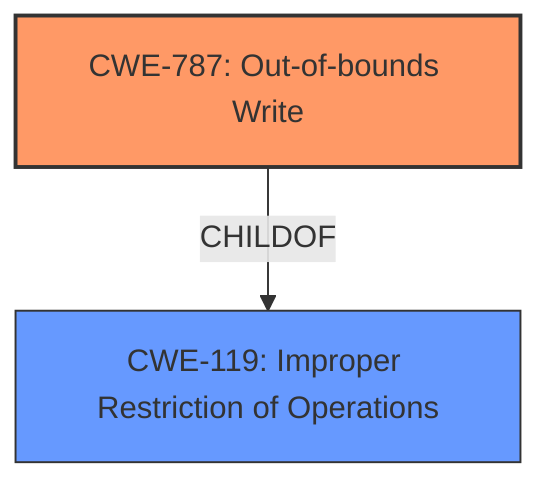

# Analysis for CVE-2022-28194

# Summary
| CWE ID | CWE Name | Confidence | CWE Abstraction Level | CWE Vulnerability Mapping Label | CWE-Vulnerability Mapping Notes |
|---|---|---|---|---|---|
| CWE-787 | Out-of-bounds Write | 1.0 | Base | Allowed | Primary CWE |
| CWE-119 | Improper Restriction of Operations within the Bounds of a Memory Buffer | 0.7 | Class | Discouraged | Secondary Candidate |

## Evidence and Confidence

*   **Confidence Score:** 1.0
*   **Evidence Strength:** HIGH

## Relationship Analysis
The primary CWE is CWE-787, which is a child of CWE-119. CWE-119 is a class-level CWE and is discouraged for use when more specific CWEs are available. Therefore, CWE-787 is a better fit.

## Vulnerability Chain
The vulnerability chain starts with insufficient validation of untrusted data, leading to a memory buffer overflow, and potentially resulting in code execution, loss of integrity, limited denial of service, and some impact to confidentiality.
  - Root Cause: Insufficient validation of untrusted data
  - Weakness: Memory buffer overflow (CWE-787)
  - Impact: Code execution, loss of integrity, limited denial of service, and some impact to confidentiality.

## Summary of Analysis
The vulnerability is a **memory buffer overflow** due to insufficient validation of untrusted data. The primary CWE is CWE-787 (Out-of-bounds Write), which accurately describes the **memory buffer overflow**.

The evidence from the vulnerability description is: "NVIDIA Jetson Linux Driver Package contains a vulnerability in the Cboot module tegrabl_cbo.c, where, if TFTP is enabled, a local attacker with elevated privileges can cause a **memory buffer overflow**, which may lead to code execution, loss of Integrity, limited denial of service, and some impact to confidentiality."

The evidence from the CVE Reference Links Content Summary is:
- **Root cause of vulnerability:** Insufficient validation of untrusted data in the Cboot module `tegrabl_cbo.c` when TFTP is enabled.
- **Weaknesses/vulnerabilities present:** Memory buffer overflow.

The Retriever Results also list CWE-787 as a possible CWE. The other possible CWEs are not as good a fit, for the following reasons:
- CWE-119: Improper Restriction of Operations within the Bounds of a Memory Buffer is too general.
- CWE-190: Integer Overflow or Wraparound is not directly related to the **memory buffer overflow**.
- CWE-125: Out-of-bounds Read is a read, not a write.
- CWE-1284: Improper Validation of Specified Quantity in Input is a possible root cause, but not the primary weakness.
- CWE-122: Heap-based Buffer Overflow, and CWE-121: Stack-based Buffer Overflow are variants of CWE-787, but there is no information to know if the buffer is on the heap or stack.

CWE-787 is the most specific and accurate CWE for this vulnerability.

# Relevant CWE Information:

## CWE-131: Incorrect Calculation of Buffer Size
**Abstraction Level**: Base
**Similarity Score**: 0.79
**Source**: dense

**Description**:
The product does not correctly calculate the size to be used when allocating a buffer, which could lead to a buffer overflow.

**Mapping Guidance**:
- Usage: Allowed
- Rationale: This CWE entry is at the Base level of abstraction, which is a preferred level of abstraction for mapping to the root causes of vulnerabilities.

*Not Selected:* While this could be a contributing factor, the primary issue is the out-of-bounds write, not necessarily the incorrect calculation of the buffer size.

## CWE-191: Integer Underflow (Wrap or Wraparound)
**Abstraction Level**: Base
**Similarity Score**: 0.79
**Source**: dense

**Description**:
The product subtracts one value from another, such that the result is less than the minimum allowable integer value, which produces a value that is not equal to the correct result.

**Mapping Guidance**:
- Usage: Allowed
- Rationale: This CWE entry is at the Base level of abstraction, which is a preferred level of abstraction for mapping to the root causes of vulnerabilities.

*Not Selected:* Integer underflow is not mentioned in the description.

## CWE-125: Out-of-bounds Read
**Abstraction Level**: Base
**Similarity Score**: 0.78
**Source**: dense

**Description**:
The product reads data past the end, or before the beginning, of the intended buffer.

**Mapping Guidance**:
- Usage: Allowed
- Rationale: This CWE entry is at the Base level of abstraction, which is a preferred level of abstraction for mapping to the root causes of vulnerabilities.

*Not Selected:* The vulnerability description clearly states a "memory buffer overflow", which implies a write operation rather than a read.

## CWE-129: Improper Validation of Array Index
**Abstraction Level**: Variant
**Similarity Score**: 0.78
**Source**: dense

**Description**:
The product uses untrusted input when calculating or using an array index, but the product does not validate or incorrectly validates the index to ensure the index references a valid position within the array.

**Mapping Guidance**:
- Usage: Allowed
- Rationale: This CWE entry is at the Variant level of abstraction, which is a preferred level of abstraction for mapping to the root causes of vulnerabilities.

*Not Selected:* While this could be a contributing factor, the description does not explicitly discuss issues with array index validation.

## CWE-681: Incorrect Conversion between Numeric Types
**Abstraction Level**: Base
**Similarity Score**: 0.77
**Source**: dense

**Description**:
When converting from one data type to another, such as long to integer, data can be omitted or translated in a way that produces unexpected values. If the resulting values are used in a sensitive context, then dangerous behaviors may occur.

**Mapping Guidance**:
- Usage: Allowed
- Rationale: This CWE entry is at the Base level of abstraction, which is a preferred level of abstraction for mapping to the root causes of vulnerabilities.

*Not Selected:* Numeric type conversion issues are not mentioned.

## CWE-805: Buffer Access with Incorrect Length Value
**Abstraction Level**: Base
**Similarity Score**: 0.77
**Source**: dense

**Description**:
The product uses a sequential operation to read or write a buffer, but it uses an incorrect length value that causes it to access memory that is outside of the bounds of the buffer.

**Mapping Guidance**:
- Usage: Allowed
- Rationale: This CWE entry is at the Base level of abstraction, which is a preferred level of abstraction for mapping to the root causes of vulnerabilities.

*Not Selected:* Could be a contributing factor, but the description focuses on the overflow itself.

## CWE-667: Improper Locking
**Abstraction Level**: Class
**Similarity Score**: 0.77
**Source**: dense

**Description**:
The product does not properly acquire or release a lock on a resource, leading to unexpected resource state changes and behaviors.

**Mapping Guidance**:
- Usage: Allowed-with-Review
- Rationale: This CWE entry is a Class and might have Base-level children that would be more appropriate

*Not Selected:* Improper locking is not mentioned.

## CWE-126: Buffer Over-read
**Abstraction Level**: Variant
**Similarity Score**: 0.76
**Source**: dense

**Description**:
The product reads from a buffer using buffer access mechanisms such as indexes or pointers that reference memory locations after the targeted buffer.

**Mapping Guidance**:
- Usage: Allowed
- Rationale: This CWE entry is at the Variant level of abstraction, which is a preferred level of abstraction for mapping to the root causes of vulnerabilities.

*Not Selected:* The vulnerability is a buffer overflow, which implies a write operation rather than a read.

## CWE-197: Numeric Truncation Error
**Abstraction Level**: Base
**Similarity Score**: 0.76
**Source**: dense

**Description**:
Truncation errors occur when a primitive is cast to a primitive of a smaller size and data is lost in the conversion.

**Mapping Guidance**:
- Usage: Allowed
- Rationale: This CWE entry is at the Base level of abstraction, which is a preferred level of abstraction for mapping to the root causes of vulnerabilities.

*Not Selected:* Numeric truncation errors are not mentioned.

## CWE-823: Use of Out-of-range Pointer Offset
**Abstraction Level**: Base
**Similarity Score**: 0.76
**Source**: dense

**Description**:
The product performs pointer arithmetic on a valid pointer, but it uses an offset that can point outside of the intended range