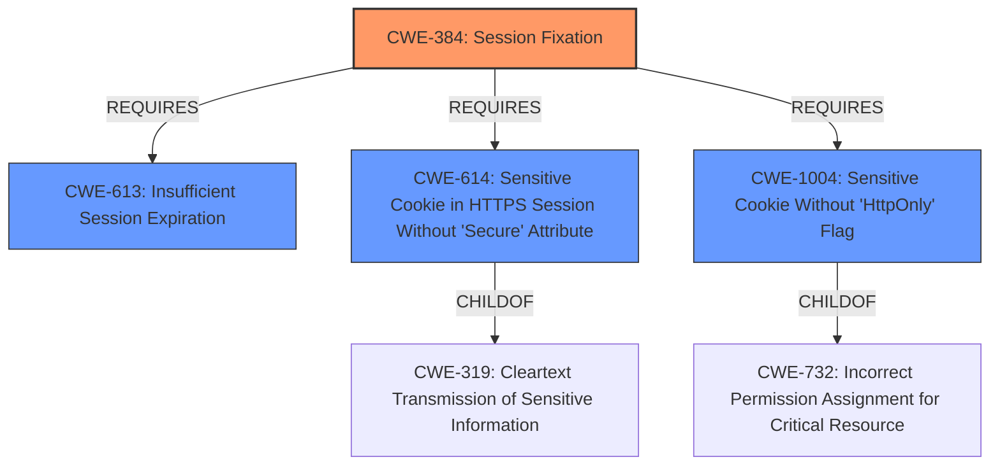

# Raw Analyzer Response for CVE-2022-2820

# Summary
| CWE ID | CWE Name | Confidence | CWE Abstraction Level | CWE Vulnerability Mapping Label | CWE-Vulnerability Mapping Notes |
|---|---|---|---|---|---|
| CWE-384 | Session Fixation | 0.9 | Compound | Allowed | Primary CWE |
| CWE-613 | Insufficient Session Expiration | 0.8 | Base | Allowed | Secondary CWE |
| CWE-614 | Sensitive Cookie in HTTPS Session Without 'Secure' Attribute | 0.7 | Variant | Allowed | Secondary CWE |
| CWE-1004 | Sensitive Cookie Without 'HttpOnly' Flag | 0.6 | Variant | Allowed | Secondary CWE |

## Evidence and Confidence

*   **Confidence Score:** 0.8
*   **Evidence Strength:** HIGH

## Relationship Analysis
The primary CWE is CWE-384 (Session Fixation), a compound weakness that results from multiple underlying issues. Contributing factors include insufficient session expiration (CWE-613) and insecure cookie handling (CWE-614, CWE-1004). The compound nature of CWE-384 means it relies on these other weaknesses to be effectively exploited. The Variant level CWEs (CWE-614, CWE-1004) are specific instances of insecure cookie configuration, while CWE-613 represents a broader problem of sessions not expiring properly, which can exacerbate the session fixation risk.

## Vulnerability Chain
The vulnerability chain begins with **Session Fixation** (**CWE-384**). This is facilitated by:
  - **Insufficient Session Expiration** (**CWE-613**) which allows old sessions to be reused.
  - **Insecure Cookie Handling** (**CWE-614** and **CWE-1004**), where sensitive cookies are transmitted without the 'Secure' and 'HttpOnly' flags, respectively.
This leads to the impact of unauthorized access and potential account takeover.

## Summary of Analysis
The initial assessment identified **Session Fixation** as the primary vulnerability, supported by evidence from the "CVE Reference Links Content Summary" which states: "It can be deduced that the session hash is stored in a cookie, and if this cookie is compromised, an attacker can utilize it to impersonate the user." This aligns with the description of **CWE-384 (Session Fixation)**, which involves an attacker forcing a known session identifier on a user.

The analysis also highlighted contributing factors such as **Insufficient Session Expiration (CWE-613)**, and **Insecure Cookie Handling (CWE-614, CWE-1004)**. The "CVE Reference Links Content Summary" mentions problems with the 'remember me' functionality and the lack of proper session invalidation, which relates to CWE-613. The absence of 'Secure' and 'HttpOnly' flags on sensitive cookies, which corresponds to CWE-614 and CWE-1004, respectively, increases the risk of session hijacking.

The decision to include CWE-613, CWE-614, and CWE-1004 as secondary CWEs is based on their role in facilitating the session fixation vulnerability. They are not independent vulnerabilities but rather weaknesses that contribute to the overall risk.

The selected CWEs are at the optimal level of specificity. CWE-384 is a compound weakness that accurately captures the overall session fixation issue. CWE-613 is a base-level weakness that describes the problem of insufficient session expiration. CWE-614 and CWE-1004 are variant-level weaknesses that provide specific details about the insecure cookie handling.

Relevant CWE Information:

**CWE-384: Session Fixation**
The vulnerability description clearly indicates a **Session Fixation** issue, which aligns directly with **CWE-384 (Session Fixation)**. The "CVE Reference Links Content Summary" explicitly mentions the possibility of an attacker forcing a known session identifier on a user. The impact is unauthorized access to user accounts. This is a Compound weakness as it depends on other weaknesses.
Confidence: 0.9

**CWE-613: Insufficient Session Expiration**
The "CVE Reference Links Content Summary" indicates that the application lacks a proper mechanism for invalidating sessions and that the 'remember me' functionality might not have proper expiration. This maps to **CWE-613 (Insufficient Session Expiration)**, where a website permits an attacker to reuse old session credentials. This can precede **CWE-287 (Improper Authentication)**.
Confidence: 0.8

**CWE-614: Sensitive Cookie in HTTPS Session Without 'Secure' Attribute**
There's an implied risk of sensitive information being transmitted insecurely if the 'Secure' attribute is not set on cookies. While not explicitly stated, the context of session handling suggests that cookies are used and could potentially be sent over HTTP. This corresponds to **CWE-614 (Sensitive Cookie in HTTPS Session Without 'Secure' Attribute)**. This is a Variant of **CWE-319 (Cleartext Transmission of Sensitive Information)**.
Confidence: 0.7

**CWE-1004: Sensitive Cookie Without 'HttpOnly' Flag**
Similar to CWE-614, the absence of the 'HttpOnly' flag on cookies is not explicitly mentioned but is a common security best practice for session cookies. If the cookies are not marked with the HttpOnly flag, this creates a vulnerability, **CWE-1004 (Sensitive Cookie Without 'HttpOnly' Flag)**.
Confidence: 0.6

CWEs Considered but Not Used:

*   CWE-434 (Unrestricted Upload of File with Dangerous Type): This was considered due to its presence in the retriever results, but it does not align with the vulnerability description, which focuses on session management issues.
*   CWE-201 (Insertion of Sensitive Information Into Sent Data): While the description mentions potential information leakage, the primary issue is not about sending sensitive information but about insecure session handling.
*   CWE-331 (Insufficient Entropy): This was considered because of the discussion of session hashes, but there is not enough evidence to suggest that the entropy is insufficient in the hash generation itself.
*   CWE-579 (J2EE Bad Practices: Non-serializable Object Stored in Session) and CWE-567 (Unsynchronized Access to Shared Data in a Multithreaded Context): These are not applicable as the application is not J2EE.