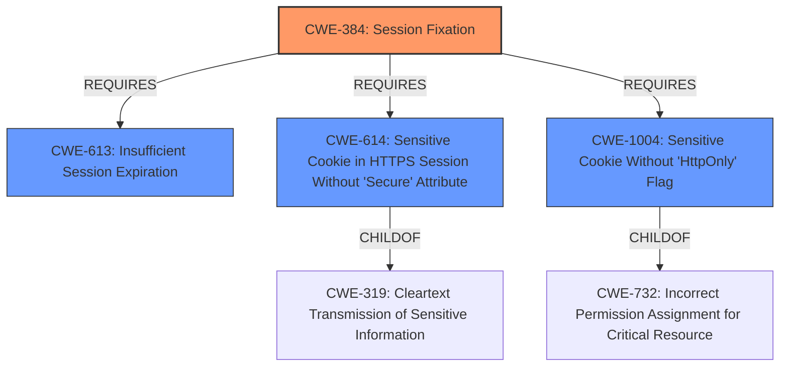

# Analysis for CVE-2022-2820

# Summary
| CWE ID | CWE Name | Confidence | CWE Abstraction Level | CWE Vulnerability Mapping Label | CWE-Vulnerability Mapping Notes |
|---|---|---|---|---|---|
| CWE-384 | Session Fixation | 0.9 | Compound | Allowed | Primary CWE |
| CWE-613 | Insufficient Session Expiration | 0.8 | Base | Allowed | Secondary CWE |
| CWE-614 | Sensitive Cookie in HTTPS Session Without 'Secure' Attribute | 0.7 | Variant | Allowed | Secondary CWE |
| CWE-1004 | Sensitive Cookie Without 'HttpOnly' Flag | 0.6 | Variant | Allowed | Secondary CWE |

## Evidence and Confidence

*   **Confidence Score:** 0.8
*   **Evidence Strength:** HIGH

## Relationship Analysis
The primary CWE is CWE-384 (Session Fixation), a compound weakness that results from multiple underlying issues. Contributing factors include insufficient session expiration (CWE-613) and insecure cookie handling (CWE-614, CWE-1004). The compound nature of CWE-384 means it relies on these other weaknesses to be effectively exploited. The Variant level CWEs (CWE-614, CWE-1004) are specific instances of insecure cookie configuration, while CWE-613 represents a broader problem of sessions not expiring properly, which can exacerbate the session fixation risk.



## Vulnerability Chain
The vulnerability chain begins with **Session Fixation** (**CWE-384**). This is facilitated by:
  - **Insufficient Session Expiration** (**CWE-613**) which allows old sessions to be reused.
  - **Insecure Cookie Handling** (**CWE-614** and **CWE-1004**), where sensitive cookies are transmitted without the 'Secure' and 'HttpOnly' flags, respectively.
This leads to the impact of unauthorized access and potential account takeover.

## Summary of Analysis
The initial assessment identified **Session Fixation** as the primary vulnerability, supported by evidence from the "CVE Reference Links Content Summary" which states: "It can be deduced that the session hash is stored in a cookie, and if this cookie is compromised, an attacker can utilize it to impersonate the user." This aligns with the description of **CWE-384 (Session Fixation)**, which involves an attacker forcing a known session identifier on a user.

The analysis also highlighted contributing factors such as **Insufficient Session Expiration (CWE-613)**, and **Insecure Cookie Handling (CWE-614, CWE-1004)**. The "CVE Reference Links Content Summary" mentions problems with the 'remember me' functionality and the lack of proper session invalidation, which relates to CWE-613. The absence of 'Secure' and 'HttpOnly' flags on sensitive cookies, which corresponds to CWE-614 and CWE-1004, respectively, increases the risk of session hijacking.

The decision to include CWE-613, CWE-614, and CWE-1004 as secondary CWEs is based on their role in facilitating the session fixation vulnerability. They are not independent vulnerabilities but rather weaknesses that contribute to the overall risk.

The selected CWEs are at the optimal level of specificity. CWE-384 is a compound weakness that accurately captures the overall session fixation issue. CWE-613 is a base-level weakness that describes the problem of insufficient session expiration. CWE-614 and CWE-1004 are variant-level weaknesses that provide specific details about the insecure cookie handling.

Relevant CWE Information:

**CWE-384: Session Fixation**
The vulnerability description clearly indicates a **Session Fixation** issue, which aligns directly with **CWE-384 (Session Fixation)**. The "CVE Reference Links Content Summary" explicitly mentions the possibility of an attacker forcing a known session identifier on a user. The impact is unauthorized access to user accounts. This is a Compound weakness as it depends on other weaknesses.
Confidence: 0.9

**CWE-613: Insufficient Session Expiration**
The "CVE Reference Links Content Summary" indicates that the application lacks a proper mechanism for invalidating sessions and that the 'remember me' functionality might not have proper expiration. This maps to **CWE-613 (Insufficient Session Expiration)**, where a website permits an attacker to reuse old session credentials. This can precede **CWE-287 (Improper Authentication)**.
Confidence: 0.8

**CWE-614: Sensitive Cookie in HTTPS Session Without 'Secure' Attribute**
There's an implied risk of sensitive information being transmitted insecurely if the 'Secure' attribute is not set on cookies. While not explicitly stated, the context of session handling suggests that cookies are used and could potentially be sent over HTTP. This corresponds to **CWE-614 (Sensitive Cookie in HTTPS Session Without 'Secure' Attribute)**. This is a Variant of **CWE-319 (Cleartext Transmission of Sensitive Information)**.
Confidence: 0.7

**CWE-1004: Sensitive Cookie Without 'HttpOnly' Flag**
Similar to CWE-614, the absence of the 'HttpOnly' flag on cookies is not explicitly mentioned but is a common security best practice for session cookies. If the cookies are not marked with the HttpOnly flag, this creates a vulnerability, **CWE-1004 (Sensitive Cookie Without 'HttpOnly' Flag)**.
Confidence: 0.6

CWEs Considered but Not Used:

*   CWE-434 (Unrestricted Upload of File with Dangerous Type): This was considered due to its presence in the retriever results, but it does not align with the vulnerability description, which focuses on session management issues.
*   CWE-201 (Insertion of Sensitive Information Into Sent Data): While the description mentions potential information leakage, the primary issue is not about sending sensitive information but about insecure session handling.
*   CWE-331 (Insufficient Entropy): This was considered because of the discussion of session hashes, but there is not enough evidence to suggest that the entropy is insufficient in the hash generation itself.
*   CWE-579 (J2EE Bad Practices: Non-serializable Object Stored in Session) and CWE-567 (Unsynchronized Access to Shared Data in a Multithreaded Context): These are not applicable as the application is not J2EE.

# Enhanced Query for CVE-2022-2820

## Vulnerability Description
**Session Fixation** in GitHub repository namelessmc/nameless prior to v2.0.2.

### Vulnerability Description Key Phrases
- **rootcause:** **Session Fixation**
- **product:** namelessmc/nameless
- **version:** prior to v2.0.2

## CVE Reference Links Content Summary
Based on the provided content, here's an analysis of the identified vulnerability:

**Root Cause of Vulnerability:**
The vulnerability stems from how user sessions are handled in the NamelessMC platform. The commit 469bebc focuses on reworking the user session system. The core issue is related to how session hashes are generated, stored, and validated. There's a specific focus on the `users_session` table and the handling of 'remember me' functionality, along with admin sessions. The changes in `core/classes/Core/User.php`, `core/init.php`, and associated migration files suggest that the vulnerability likely lies in the logic around session creation, storage, and validation, especially related to the `hash` column in the `users_session` table.

**Weaknesses/Vulnerabilities Present:**

*   **Insecure Session Handling:** The code changes in `core/classes/Core/User.php` reveals a problem with updating the `active` status of user sessions during logout. Instead of targeting a specific session for deactivation, the code attempts to update *all* sessions for the user and deactivates the session with a matching hash, which is retrieved from the session rather than targeting the session being logged out of.

    ```php
    $this->_db->update('users_session', [['user_id', $this->data()->id], ['hash', Session::get($this->_sessionName)]], [
        'active' => 0
    ]);
    ```
    This can lead to all sessions associated with the user being logged out when only one is intended.
*   **Session Fixation:** It can be deduced that the session hash is stored in a cookie, and if this cookie is compromised, an attacker can utilize it to impersonate the user.
*   **Improper 'Remember Me' Implementation:** The 'remember me' functionality is tied to a session hash, but the way it is implemented may have weaknesses, such as reusing the same hash and not implementing proper expiration of remember me cookies/session entries which could be exploitable.
*   **Lack of proper session invalidation:** It seems that the application lacks a proper mechanism for invalidating a session when a user logs out. Instead of deleting the current session, all sessions related to the user's ID are deactivated, but a user may have multiple sessions active at one time, potentially leading to unexpected behavior or unauthorized access.

**Impact of Exploitation:**
*   **Unauthorized Access:** An attacker can potentially gain unauthorized access to user accounts by exploiting the insecure session handling or session fixation.
*   **Account Takeover:** An attacker may be able to fully take over user accounts, especially if the 'remember me' feature is compromised.
*   **Denial of Service (Indirect):** Due to the improper logout implementation, legitimate users may lose their sessions unexpectedly, causing usability issues.

**Attack Vectors:**
*   **Man-in-the-Middle (MITM) Attacks:** An attacker could intercept session cookies or hashes during insecure communication, potentially allowing them to reuse the credentials.
*   **Cross-Site Scripting (XSS):** If an XSS vulnerability exists, an attacker could steal session cookies and impersonate the user.
*   **Social Engineering:** An attacker could trick a user into using a compromised link to gain access to a valid session, or otherwise steal credentials and subsequently the session token.

**Required Attacker Capabilities/Position:**

*   **Network Access:** The attacker needs to have network access to intercept communications or to perform man-in-the-middle attacks.
*   **Ability to Intercept Cookies:** The attacker needs to be able to intercept or obtain user session cookies, which can be done through network sniffing, XSS, or social engineering.
*  **Some level of persistence/knowledge of target:** To utilize a stolen session, the attacker needs to retain the session information, and have some awareness of the target user's environment.

**Additional Details from the Content:**
*   The commit introduces a new `active` column in the `users_session` table, which indicates if a session is active, alongside `remember_me` and `login_method` columns.
*   The commit also deletes the `nl2_users_admin_session` table, indicating a change in how admin sessions are handled.
*   The comment by @agnihackers suggests that they believe there is a vulnerability and requested a CVE to be assigned, reinforcing the idea of a significant security flaw.

In conclusion, the commit content indicates a potential vulnerability related to insecure session management and improper session invalidation. The details provided highlight the possibility of session fixation and other weaknesses that could lead to unauthorized access and account takeover, as described in the points above.

## Retriever Results

### Top Combined Results

| Rank | CWE ID | Name | Abstraction | Usage  | Retrievers | Individual Scores |
|------|--------|------|-------------|-------|------------|-------------------|
| 1 | 384 | Session Fixation | Compound | Allowed | sparse | 0.212 |
| 2 | 613 | Insufficient Session Expiration | Base | Allowed | sparse | 0.095 |
| 3 | 614 | Sensitive Cookie in HTTPS Session Without 'Secure' Attribute | Variant | Allowed | sparse | 0.081 |
| 4 | 1004 | Sensitive Cookie Without 'HttpOnly' Flag | Variant | Allowed | sparse | 0.069 |
| 5 | 434 | Unrestricted Upload of File with Dangerous Type | Base | Allowed | sparse | 0.068 |
| 6 | 579 | J2EE Bad Practices: Non-serializable Object Stored in Session | Variant | Allowed | dense | 0.440 |
| 7 | 567 | Unsynchronized Access to Shared Data in a Multithreaded Context | Base | Allowed | graph | 0.002 |
| 8 | 130 | Improper Handling of Length Parameter Inconsistency | Base | Allowed | sparse | 0.067 |
| 9 | 201 | Insertion of Sensitive Information Into Sent Data | Base | Allowed | sparse | 0.064 |
| 10 | 331 | Insufficient Entropy | Base | Allowed | sparse | 0.064 |


# Complete CWE Specifications


## CWE-384: Session Fixation
**Abstraction:** Compound
**Status:** Incomplete

### Description
Authenticating a user, or otherwise establishing a new user session, without invalidating any existing session identifier gives an attacker the opportunity to steal authenticated sessions.

### Extended Description


Such a scenario is commonly observed when:


  - A web application authenticates a user without first invalidating the existing session, thereby continuing to use the session already associated with the user.

  - An attacker is able to force a known session identifier on a user so that, once the user authenticates, the attacker has access to the authenticated session.

  - The application or container uses predictable session identifiers.

In the generic exploit of session fixation vulnerabilities, an attacker creates a new session on a web application and records the associated session identifier. The attacker then causes the victim to associate, and possibly authenticate, against the server using that session identifier, giving the attacker access to the user's account through the active session.

### Alternative Terms
None

### Relationships
ChildOf -> CWE-610
ChildOf -> CWE-610
Requires -> CWE-346
Requires -> CWE-472
Requires -> CWE-441

### Mapping Guidance
**Usage:** Allowed
**Rationale:** This is a well-known Composite of multiple weaknesses that must all occur simultaneously, although it is attack-oriented in nature.
**Comments:** While attack-oriented composites are supported in CWE, they have not been a focus of research. There is a chance that future research or CWE scope clarifications will change or deprecate them. Perform root-cause analysis to determine which weaknesses allow session fixation to occur, and map to those weaknesses. For example, predictable session identifiers might enable session fixation attacks to succeed; if this occurs, they might be better characterized as randomness/predictability weaknesses.
**Reasons:**
- Other


### Additional Notes
**[Other]** Other attack vectors include DNS poisoning and related network based attacks where an attacker causes the user to visit a malicious site by redirecting a request for a valid site. Network based attacks typically involve a physical presence on the victim's network or control of a compromised machine on the network, which makes them harder to exploit remotely, but their significance should not be overlooked. Less secure session management mechanisms, such as the default implementation in Apache Tomcat, allow session identifiers normally expected in a cookie to be specified on the URL as well, which enables an attacker to cause a victim to use a fixed session identifier simply by emailing a malicious URL.


### Observed Examples
- **CVE-2022-2820:** Website software for game servers does not proprerly terminate user sessions, allowing for possible session fixation


## CWE-613: Insufficient Session Expiration
**Abstraction:** Base
**Status:** Incomplete

### Description
According to WASC, "Insufficient Session Expiration is when a web site permits an attacker to reuse old session credentials or session IDs for authorization."

### Extended Description
Not provided

### Alternative Terms
None

### Relationships
ChildOf -> CWE-672
ChildOf -> CWE-672
CanPrecede -> CWE-287

### Mapping Guidance
**Usage:** Allowed
**Rationale:** This CWE entry is at the Base level of abstraction, which is a preferred level of abstraction for mapping to the root causes of vulnerabilities.
**Comments:** Carefully read both the name and description to ensure that this mapping is an appropriate fit. Do not try to 'force' a mapping to a lower-level Base/Variant simply to comply with this preferred level of abstraction.
**Reasons:**
- Acceptable-Use


### Additional Notes
**[Other]** The lack of proper session expiration may improve the likely success of certain attacks. For example, an attacker may intercept a session ID, possibly via a network sniffer or Cross-site Scripting attack. Although short session expiration times do not help if a stolen token is immediately used, they will protect against ongoing replaying of the session ID. In another scenario, a user might access a web site from a shared computer (such as at a library, Internet cafe, or open work environment). Insufficient Session Expiration could allow an attacker to use the browser's back button to access web pages previously accessed by the victim.


## CWE-614: Sensitive Cookie in HTTPS Session Without 'Secure' Attribute
**Abstraction:** Variant
**Status:** Draft

### Description
The Secure attribute for sensitive cookies in HTTPS sessions is not set, which could cause the user agent to send those cookies in plaintext over an HTTP session.

### Extended Description
Not provided

### Alternative Terms
None

### Relationships
ChildOf -> CWE-319

### Mapping Guidance
**Usage:** Allowed
**Rationale:** This CWE entry is at the Variant level of abstraction, which is a preferred level of abstraction for mapping to the root causes of vulnerabilities.
**Comments:** Carefully read both the name and description to ensure that this mapping is an appropriate fit. Do not try to 'force' a mapping to a lower-level Base/Variant simply to comply with this preferred level of abstraction.
**Reasons:**
- Acceptable-Use


### Observed Examples
- **CVE-2004-0462:** A product does not set the Secure attribute for sensitive cookies in HTTPS sessions, which could cause the user agent to send those cookies in plaintext over an HTTP session with the product.
- **CVE-2008-3663:** A product does not set the secure flag for the session cookie in an https session, which can cause the cookie to be sent in http requests and make it easier for remote attackers to capture this cookie.
- **CVE-2008-3662:** A product does not set the secure flag for the session cookie in an https session, which can cause the cookie to be sent in http requests and make it easier for remote attackers to capture this cookie.


## CWE-1004: Sensitive Cookie Without 'HttpOnly' Flag
**Abstraction:** Variant
**Status:** Incomplete

### Description
The product uses a cookie to store sensitive information, but the cookie is not marked with the HttpOnly flag.

### Extended Description
The HttpOnly flag directs compatible browsers to prevent client-side script from accessing cookies. Including the HttpOnly flag in the Set-Cookie HTTP response header helps mitigate the risk associated with Cross-Site Scripting (XSS) where an attacker's script code might attempt to read the contents of a cookie and exfiltrate information obtained. When set, browsers that support the flag will not reveal the contents of the cookie to a third party via client-side script executed via XSS.

### Alternative Terms
None

### Relationships
ChildOf -> CWE-732

### Mapping Guidance
**Usage:** Allowed
**Rationale:** This CWE entry is at the Variant level of abstraction, which is a preferred level of abstraction for mapping to the root causes of vulnerabilities.
**Comments:** Carefully read both the name and description to ensure that this mapping is an appropriate fit. Do not try to 'force' a mapping to a lower-level Base/Variant simply to comply with this preferred level of abstraction.
**Reasons:**
- Acceptable-Use


### Observed Examples
- **CVE-2022-24045:** Web application for a room automation system has client-side Javascript that sets a sensitive cookie without the HTTPOnly security attribute, allowing the cookie to be accessed.
- **CVE-2014-3852:** CMS written in Python does not include the HTTPOnly flag in a Set-Cookie header, allowing remote attackers to obtain potentially sensitive information via script access to this cookie.
- **CVE-2015-4138:** Appliance for managing encrypted communications does not use HttpOnly flag.


## CWE-434: Unrestricted Upload of File with Dangerous Type
**Abstraction:** Base
**Status:** Draft

### Description
The product allows the upload or transfer of dangerous file types that are automatically processed within its environment.

### Extended Description
Not provided

### Alternative Terms
Unrestricted File Upload: Used in vulnerability databases and elsewhere, but it is insufficiently precise. The phrase could be interpreted as the lack of restrictions on the size or number of uploaded files, which is a resource consumption issue.

### Relationships
ChildOf -> CWE-669
ChildOf -> CWE-669
PeerOf -> CWE-351
PeerOf -> CWE-436
PeerOf -> CWE-430

### Mapping Guidance
**Usage:** Allowed
**Rationale:** This CWE entry is at the Base level of abstraction, which is a preferred level of abstraction for mapping to the root causes of vulnerabilities.
**Comments:** Carefully read both the name and description to ensure that this mapping is an appropriate fit. Do not try to 'force' a mapping to a lower-level Base/Variant simply to comply with this preferred level of abstraction.
**Reasons:**
- Acceptable-Use


### Additional Notes
**[Relationship]** 

This can have a chaining relationship with incomplete denylist / permissive allowlist errors when the product tries, but fails, to properly limit which types of files are allowed (CWE-183, CWE-184).


This can also overlap multiple interpretation errors for intermediaries, e.g. anti-virus products that do not remove or quarantine attachments with certain file extensions that can be processed by client systems.


### Observed Examples
- **CVE-2023-5227:** PHP-based FAQ management app does not check the MIME type for uploaded images
- **CVE-2001-0901:** Web-based mail product stores ".shtml" attachments that could contain SSI
- **CVE-2002-1841:** PHP upload does not restrict file types


## CWE-579: J2EE Bad Practices: Non-serializable Object Stored in Session
**Abstraction:** Variant
**Status:** Draft

### Description
The product stores a non-serializable object as an HttpSession attribute, which can hurt reliability.

### Extended Description
A J2EE application can make use of multiple JVMs in order to improve application reliability and performance. In order to make the multiple JVMs appear as a single application to the end user, the J2EE container can replicate an HttpSession object across multiple JVMs so that if one JVM becomes unavailable another can step in and take its place without disrupting the flow of the application. This is only possible if all session data is serializable, allowing the session to be duplicated between the JVMs.

### Alternative Terms
None

### Relationships
ChildOf -> CWE-573

### Mapping Guidance
**Usage:** Allowed
**Rationale:** This CWE entry is at the Variant level of abstraction, which is a preferred level of abstraction for mapping to the root causes of vulnerabilities.
**Comments:** Carefully read both the name and description to ensure that this mapping is an appropriate fit. Do not try to 'force' a mapping to a lower-level Base/Variant simply to comply with this preferred level of abstraction.
**Reasons:**
- Acceptable-Use


## CWE-567: Unsynchronized Access to Shared Data in a Multithreaded Context
**Abstraction:** Base
**Status:** Draft

### Description
The product does not properly synchronize shared data, such as static variables across threads, which can lead to undefined behavior and unpredictable data changes.

### Extended Description


Within servlets, shared static variables are not protected from concurrent access, but servlets are multithreaded. This is a typical programming mistake in J2EE applications, since the multithreading is handled by the framework. When a shared variable can be influenced by an attacker, one thread could wind up modifying the variable to contain data that is not valid for a different thread that is also using the data within the variable.


Note that this weakness is not unique to servlets.


### Alternative Terms
None

### Relationships
ChildOf -> CWE-820
ChildOf -> CWE-662
ChildOf -> CWE-662
CanPrecede -> CWE-488

### Mapping Guidance
**Usage:** Allowed
**Rationale:** This CWE entry is at the Base level of abstraction, which is a preferred level of abstraction for mapping to the root causes of vulnerabilities.
**Comments:** Carefully read both the name and description to ensure that this mapping is an appropriate fit. Do not try to 'force' a mapping to a lower-level Base/Variant simply to comply with this preferred level of abstraction.
**Reasons:**
- Acceptable-Use


## CWE-130: Improper Handling of Length Parameter Inconsistency
**Abstraction:** Base
**Status:** Incomplete

### Description
The product parses a formatted message or structure, but it does not handle or incorrectly handles a length field that is inconsistent with the actual length of the associated data.

### Extended Description
If an attacker can manipulate the length parameter associated with an input such that it is inconsistent with the actual length of the input, this can be leveraged to cause the target application to behave in unexpected, and possibly, malicious ways. One of the possible motives for doing so is to pass in arbitrarily large input to the application. Another possible motivation is the modification of application state by including invalid data for subsequent properties of the application. Such weaknesses commonly lead to attacks such as buffer overflows and execution of arbitrary code.

### Alternative Terms
length manipulation
length tampering

### Relationships
ChildOf -> CWE-240
ChildOf -> CWE-119
ChildOf -> CWE-119
CanPrecede -> CWE-805

### Mapping Guidance
**Usage:** Allowed
**Rationale:** This CWE entry is at the Base level of abstraction, which is a preferred level of abstraction for mapping to the root causes of vulnerabilities.
**Comments:** Carefully read both the name and description to ensure that this mapping is an appropriate fit. Do not try to 'force' a mapping to a lower-level Base/Variant simply to comply with this preferred level of abstraction.
**Reasons:**
- Acceptable-Use


### Additional Notes
**[Relationship]** This probably overlaps other categories including zero-length issues.


### Observed Examples
- **CVE-2014-0160:** Chain: "Heartbleed" bug receives an inconsistent length parameter (CWE-130) enabling an out-of-bounds read (CWE-126), returning memory that could include private cryptographic keys and other sensitive data.
- **CVE-2009-2299:** Web application firewall consumes excessive memory when an HTTP request contains a large Content-Length value but no POST data.
- **CVE-2001-0825:** Buffer overflow in internal string handling routine allows remote attackers to execute arbitrary commands via a length argument of zero or less, which disables the length check.


## CWE-201: Insertion of Sensitive Information Into Sent Data
**Abstraction:** Base
**Status:** Draft

### Description
The code transmits data to another actor, but a portion of the data includes sensitive information that should not be accessible to that actor.

### Extended Description
Not provided

### Alternative Terms
None

### Relationships
ChildOf -> CWE-200
CanAlsoBe -> CWE-209
CanAlsoBe -> CWE-202

### Mapping Guidance
**Usage:** Allowed
**Rationale:** This CWE entry is at the Base level of abstraction, which is a preferred level of abstraction for mapping to the root causes of vulnerabilities.
**Comments:** Carefully read both the name and description to ensure that this mapping is an appropriate fit. Do not try to 'force' a mapping to a lower-level Base/Variant simply to comply with this preferred level of abstraction.
**Reasons:**
- Acceptable-Use


### Additional Notes
**[Other]** Sensitive information could include data that is sensitive in and of itself (such as credentials or private messages), or otherwise useful in the further exploitation of the system (such as internal file system structure).


### Observed Examples
- **CVE-2022-0708:** Collaboration platform does not clear team emails in a response, allowing leak of email addresses


## CWE-331: Insufficient Entropy
**Abstraction:** Base
**Status:** Draft

### Description
The product uses an algorithm or scheme that produces insufficient entropy, leaving patterns or clusters of values that are more likely to occur than others.

### Extended Description
Not provided

### Alternative Terms
None

### Relationships
ChildOf -> CWE-330
ChildOf -> CWE-330

### Mapping Guidance
**Usage:** Allowed
**Rationale:** This CWE entry is at the Base level of abstraction, which is a preferred level of abstraction for mapping to the root causes of vulnerabilities.
**Comments:** Carefully read both the name and description to ensure that this mapping is an appropriate fit. Do not try to 'force' a mapping to a lower-level Base/Variant simply to comply with this preferred level of abstraction.
**Reasons:**
- Acceptable-Use


### Additional Notes
**[Maintenance]** As of CWE 4.5, terminology related to randomness, entropy, and predictability can vary widely. Within the developer and other communities, "randomness" is used heavily. However, within cryptography, "entropy" is distinct, typically implied as a measurement. There are no commonly-used definitions, even within standards documents and cryptography papers. Future versions of CWE will attempt to define these terms and, if necessary, distinguish between them in ways that are appropriate for different communities but do not reduce the usability of CWE for mapping, understanding, or other scenarios.


### Observed Examples
- **CVE-2001-0950:** Insufficiently random data used to generate session tokens using C rand(). Also, for certificate/key generation, uses a source that does not block when entropy is low.
- **CVE-2008-2108:** Chain: insufficient precision (CWE-1339) in random-number generator causes some zero bits to be reliably generated, reducing the amount of entropy (CWE-331)

