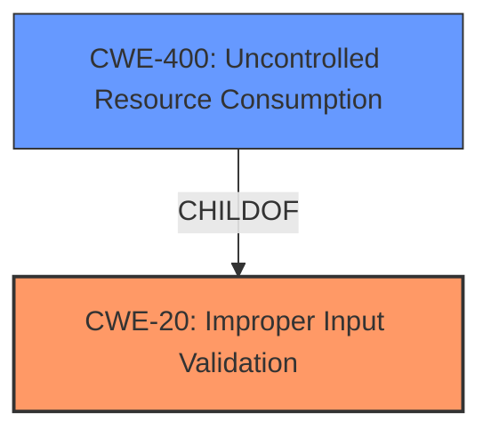

# Analysis Report for CVE-2022-28220

# Vulnerability Analysis Report: CVE-2022-28220

## Description


## Analysis (with Relationship Data)

# Summary

| CWE ID   | CWE Name                                                                         | Confidence | CWE Abstraction Level | CWE Vulnerability Mapping Label | CWE-Vulnerability Mapping Notes |
| :------- | :------------------------------------------------------------------------------- | :--------- | :-------------------- | :------------------------------ | :------------------------------ |
| CWE-20   | Improper Input Validation                                                        | 0.80       | Base                  | Primary                         | Allowed                       |
| CWE-400 | Uncontrolled Resource Consumption                                                        | 0.70       | Class                  | Secondary                       | Allowed                       |

## Evidence and Confidence

*   **Confidence Score:** 0.75
*   **Evidence Strength:** MEDIUM

## Relationship Analysis
The primary relationship that impacted my decision was the parent-child relationship between CWE-400 and several potential child CWEs. However, the information provided was not specific enough to select a child CWE.


## Vulnerability Chain
The vulnerability chain starts with **improper input validation** and progresses to **uncontrolled resource consumption**. This leads to a buffering attack that can lead to man-in-the-middle attacks, leakage of sensitive information and data integrity compromise.

## Summary of Analysis
The initial analysis focused on identifying the **root cause** of the vulnerability. The description mentions a **"parser differential and do not take into account concurrent requests."** This points towards **improper input validation** (CWE-20) because the system **fails to properly validate** or handle input, leading to a buffering attack. The failure to account for concurrent requests suggests a lack of proper resource management, which can be classified as **uncontrolled resource consumption** (CWE-400).

Evidence from the vulnerability description key phrases and CVE Reference Links Content Summary supports this:

*   **"parser differential and do not take into account concurrent requests"** indicates a **failure to properly handle input** and manage concurrent requests.
*   **"Buffering Attack"** and **"Lack of Concurrency Handling"** from CVE Reference Links Content Summary implies **resource consumption** issues.

The selected CWEs are at the optimal level of specificity because, while more specific CWEs like CWE-1333 (Inefficient Regular Expression Complexity) were considered, the provided information did not pinpoint the exact nature of the input validation failure or resource consumption issue. Therefore, the broader CWE-20 and CWE-400 are more appropriate.

Relevant CWE Information:

# Enhanced Context (25 CWEs)

## CWE-80: Improper Neutralization of Script-Related HTML Tags in a Web Page (Basic XSS)
**Abstraction Level**: Variant
**Similarity Score**: 0.79

This CWE was not selected because the vulnerability description does not mention anything related to web page generation or script-related HTML tags.

## CWE-74: Improper Neutralization of Special Elements in Output Used by a Downstream Component ('Injection')
**Abstraction Level**: Class
**Similarity Score**: 0.79

This CWE was not selected because while there is command injection, the rootcause is **improper input validation** and **uncontrolled resource consumption**.

## CWE-23: Relative Path Traversal
**Abstraction Level**: Base
**Similarity Score**: 0.78

This CWE was not selected because the vulnerability description does not mention anything related to file paths or directory traversal.

## CWE-41: Improper Resolution of Path Equivalence
**Abstraction Level**: Base
**Similarity Score**: 0.78

This CWE was not selected because the vulnerability description does not mention anything related to file paths or directory traversal.

## CWE-116: Improper Encoding or Escaping of Output
**Abstraction Level**: Class
**Similarity Score**: 0.77

This CWE was not selected because the vulnerability description does not focus on the encoding or escaping of output, but rather on the **improper handling** of the `STARTTLS` command.

## CWE-184: Incomplete List of Disallowed Inputs
**Abstraction Level**: Base
**Similarity Score**: 0.77

This CWE was not selected because the vulnerability description does not explicitly mention an incomplete list of disallowed inputs.

## CWE-113: Improper Neutralization of CRLF Sequences in HTTP Headers ('HTTP Request/Response Splitting')
**Abstraction Level**: Variant
**Similarity Score**: 0.77

This CWE was not selected because the vulnerability description does not focus on HTTP headers or CRLF sequences.

## CWE-639: Authorization Bypass Through User-Controlled Key
**Abstraction Level**: Base
**Similarity Score**: 0.77

This CWE was not selected because the vulnerability description does not mention authorization bypass through a user-controlled key.

## CWE-1289: Improper Validation of Unsafe Equivalence in Input
**Abstraction Level**: Base
**Similarity Score**: 0.77

This CWE was not selected because the vulnerability description does not mention unsafe equivalence in input.

## CWE-923: Improper Restriction of Communication Channel to Intended Endpoints
**Abstraction Level**: Class
**Similarity Score**: 0.77

This CWE was not selected because the vulnerability description does not mention communication channels or endpoints.

## CWE-22: Improper Limitation of a Pathname to a Restricted Directory ('Path Traversal')
**Abstraction Level**: Base
**Similarity Score**: 7735.34

This CWE was not selected because the vulnerability description does not mention anything related to file paths or directory traversal.

## CWE-79: Improper Neutralization of Input During Web Page Generation ('Cross-site Scripting')
**Abstraction Level**: Base
**Similarity Score**: 7561.78

This CWE was not selected because the vulnerability description does not mention anything related to web page generation or cross-site scripting.

## CWE-23: Relative Path Traversal
**Abstraction Level**: Base
**Similarity Score**: 7539.97

This CWE was not selected because the vulnerability description does not mention anything related to file paths or directory traversal.

## CWE-918: Server-Side Request Forgery (SSRF)
**Abstraction Level**: Base
**Similarity Score**: 7241.78

This CWE was not selected because the vulnerability description does not mention anything related to server-side request forgery.

## CWE-863: Incorrect Authorization
**Abstraction Level**: Class
**Similarity Score**: 7236.48

This CWE was not selected because the vulnerability description does not mention anything related to authorization.

## CWE-73: External Control of File Name or Path
**Abstraction Level**: base
**Similarity Score**: 4.82

This CWE was not selected because the vulnerability description does not mention anything related to file paths or directory traversal.

## CWE-770: Allocation of Resources Without Limits or Throttling
**Abstraction Level**: base
**Similarity Score**: 4.33

CWE-770 was considered as a secondary CWE. The **parser differential and concurrent requests** can lead to resource exhaustion issues. The vulnerability involves a buffering attack related to the `STARTTLS` command. This points to a potential lack of limits or throttling on resource allocation. While the evidence is not direct, the nature of the attack suggests that the server might be allocating resources without proper controls, which could lead to denial of service.

## CWE-22: Improper Limitation of a Pathname to a Restricted Directory ('Path Traversal')
**Abstraction Level**: base
**Similarity Score**: 4.33

This CWE was not selected because the vulnerability description does not mention anything related to file paths or directory traversal.

## CWE-59: Improper Link Resolution Before File Access ('Link Following')
**Abstraction Level**: base
**Similarity Score**: 4.33

This CWE was not selected because the vulnerability description does not mention anything related to file access or link following.

## CWE-494: Download of Code Without Integrity Check
**Abstraction Level**: base
**Similarity Score**: 4.33

This CWE was not selected because the vulnerability description does not mention anything related to downloads or integrity checks.

## CWE-1284: Improper Validation of Specified Quantity in Input
**Abstraction Level**: base
**Similarity Score**: 4.33

This CWE was not selected because although there is **improper input validation**, there is no specified quantity in input.

## CWE-789: Memory Allocation with Excessive Size Value
**Abstraction Level**: variant
**Similarity Score**: 3.88

This CWE was not selected because although there is **improper input validation**, there is no excessive size value.

## CWE-190: Integer Overflow or Wraparound
**Abstraction Level**: base
**Similarity Score**: 3.65

This CWE was not selected because there are no integer overflow or wraparound issues.

## CWE-178: Improper Handling of Case Sensitivity
**Abstraction Level**: base
**Similarity Score**:


## CWE Relationship Analysis

Current CWEs represent these abstraction levels: .


### Vulnerability Chain Analysis

**Chain starting from CWE-41:**
- 41 (Improper Resolution of Path Equivalence) - ROOT


**Chain starting from CWE-494:**
- 494 (Download of Code Without Integrity Check) - ROOT


### CWE Relationship Diagram

```mermaid
graph TD
    classDef primary fill:#f96,stroke:#333,stroke-width:2px
    classDef secondary fill:#69f,stroke:#333
    classDef tertiary fill:#9e9,stroke:#333
```


*Report generated on 2025-03-30 21:06:19*
