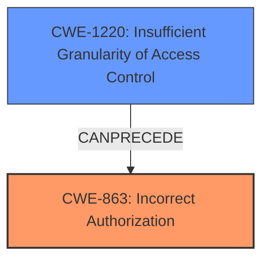

# Analysis for CVE-2022-28224

# Summary
| CWE ID | CWE Name | Confidence | CWE Abstraction Level | CWE Vulnerability Mapping Label | CWE-Vulnerability Mapping Notes |
|---|---|---|---|---|---|
| CWE-863 | Incorrect Authorization | 0.9 | Class | Primary | Allowed-with-Review |
| CWE-1220 | Insufficient Granularity of Access Control | 0.7 | Base | Secondary | Allowed |

## Evidence and Confidence

*   **Confidence Score:** 0.9
*   **Evidence Strength:** HIGH

## Relationship Analysis
The primary CWE is CWE-863 (Incorrect Authorization), which is a Class-level CWE. CWE-1220 (Insufficient Granularity of Access Control) is a Base-level CWE and a potential contributing factor.

## Vulnerability Chain
The vulnerability chain starts with **insufficient validation**, leading to the possibility of setting a floating IP annotation even when the feature is disabled. This leads to incorrect authorization, where a privileged user can bypass intended restrictions, ultimately leading to potential traffic interception and rerouting.

## Summary of Analysis
Initial analysis focused on the provided vulnerability description and the "CVE Reference Links Content Summary," specifically highlighting the **root cause** of **insufficient validation** in the floating IP feature. The ability to set the floating IP annotation even when the feature is disabled points towards an authorization issue, as the intended restriction is bypassed.

CWE-863 (Incorrect Authorization) is a Class-level CWE that describes a scenario where an authorization check is performed, but it's done incorrectly. This perfectly aligns with the **insufficient validation** leading to the ability to set a floating IP annotation when it shouldn't be possible. The attacker, by setting this annotation, gains unauthorized control over network traffic routing.

CWE-1220 (Insufficient Granularity of Access Control) was also considered, because the **insufficient validation** can be considered an issue where the access control lacks the required granularity. The access control policy, although intended to prevent the use of floating IP annotation when the feature is not enabled, it is too broad, allowing unauthorized agents (attacker) to access security-sensitive assets (ability to set floating IP annotation).

The Retriever Results also listed CWE-863 as a candidate with a relatively high score. The mapping guidance for CWE-863 suggests examining child CWEs for a better fit. However, none of the children CWEs offer a more precise description of the vulnerability. Therefore, selecting CWE-863 is the most suitable option.

The selection of CWE-863 is based on the evidence provided, emphasizing the **root cause** of **insufficient validation** leading to an authorization bypass. This bypass allows the attacker to perform actions (rerouting traffic) that should be restricted, aligning perfectly with the definition of CWE-863. The chosen CWE is at the appropriate level of specificity, capturing the essence of the authorization flaw.

Relevant CWE Information:

# Enhanced Context (25 CWEs)
The following CWEs were identified as potentially relevant to this vulnerability:

## CWE-1220: Insufficient Granularity of Access Control
**Abstraction Level**: Base
**Similarity Score**: 0.76
**Source**: dense

**Description**:
The product implements access controls via a policy or other feature with the intention to disable or restrict accesses (reads and/or writes) to assets in a system from untrusted agents. However, implemented access controls lack required granularity, which renders the control policy too broad because it allows accesses from unauthorized agents to the security-sensitive assets.

**Mapping Guidance**:
- Usage: Allowed
- Rationale: This CWE entry is at the Base level of abstraction, which is a preferred level of abstraction for mapping to the root causes of vulnerabilities.

## CWE-20: Improper Input Validation
**Abstraction:** Class
**Status:** Stable

### Description
The product receives input or data, but it does
        not validate or incorrectly validates that the input has the
        properties that are required to process the data safely and
        correctly.

### Extended Description

Input validation is a frequently-used technique for checking potentially dangerous inputs in order to ensure that the inputs are safe for processing within the code, or when communicating with other components. When software does not validate input properly, an attacker is able to craft the input in a form that is not expected by the rest of the application. This will lead to parts of the system receiving unintended input, which may result in altered control flow, arbitrary control of a resource, or arbitrary code execution.

## CWE-941: Incorrectly Specified Destination in a Communication Channel
**Abstraction Level**: Base
**Similarity Score**: 7135.23
**Source**: sparse

**Description**:
The product creates a communication channel to initiate an outgoing request to an actor, but it does not correctly specify the intended destination for that actor.

**Mapping Guidance**:
- Usage: Allowed
- Rationale: This CWE entry is at the Base level of abstraction, which is a preferred level of abstraction for mapping to the root causes of vulnerabilities.

### Other Considered CWEs and Why Not Used:

*   **CWE-20 (Improper Input Validation):** While the **root cause** is **insufficient validation**, CWE-20 is a high-level Class CWE and is discouraged. Furthermore, the issue is more specifically about authorization rather than general input validation.
*   **CWE-941 (Incorrectly Specified Destination in a Communication Channel):** This CWE is related to communication channels and specifying destinations, which is not the core issue here. The primary problem is the lack of proper authorization that allows the attacker to manipulate network traffic, not a flaw in specifying the communication destination itself.
*   **CWE-1220 (Insufficient Granularity of Access Control):** Considered as a secondary CWE because the **insufficient validation** can be considered an issue where the access control lacks the required granularity.