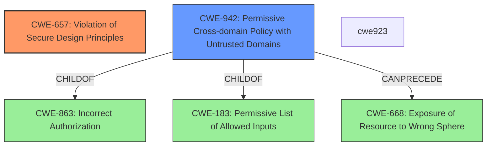

# Analysis Report for CVE-2022-28244

# Vulnerability Analysis Report: CVE-2022-28244

## Description


## Analysis (with Relationship Data)

# Summary
| CWE ID  | CWE Name                                                                                              | Confidence | CWE Abstraction Level | CWE Vulnerability Mapping Label | CWE-Vulnerability Mapping Notes |
| :-------- | :---------------------------------------------------------------------------------------------------- | :--------- | :---------------------- | :------------------------------ | :------------------------------ |
| CWE-657   | Violation of Secure Design Principles                                                               | 0.8        | Class                   | Primary                         | Discouraged                   |
| CWE-942   | Permissive Cross-domain Policy with Untrusted Domains                                               | 0.6        | Variant                 | Secondary                       | Allowed                       |

## Evidence and Confidence

*   **Confidence Score:** 0.7
*   **Evidence Strength:** MEDIUM

## Relationship Analysis
The primary CWE, CWE-657 **Violation of Secure Design Principles**, is a Class-level CWE, which makes it a higher level of abstraction. The secondary CWE, CWE-942 **Permissive Cross-domain Policy with Untrusted Domains**, is a Variant-level CWE, which is more specific. CWE-942 is a child of CWE-863 **Incorrect Authorization**, CWE-923, and CWE-183 **Permissive List of Allowed Inputs**. It can precede CWE-668 **Exposure of Resource to Wrong Sphere**.



## Vulnerability Chain
The vulnerability chain starts with the **violation of secure design principles** (CWE-657), leading to a bypassing of the content security policy. This allows an attacker to send arbitrarily configured requests to the cross-origin attack target domain (CWE-942). The exploitation requires user interaction, as the victim needs to access a crafted PDF file on an attacker's server.

## Summary of Analysis
The initial analysis pointed towards CWE-657 **Violation of Secure Design Principles** due to the **rootcause** identified in the vulnerability description and CVE Reference Links Content Summary. However, this is a high-level Class CWE. Given the additional detail about bypassing the content security policy, CWE-942 **Permissive Cross-domain Policy with Untrusted Domains** was considered as a secondary, more specific weakness.

The vulnerability description explicitly mentions a **violation of secure design principles** as the **rootcause**, which directly aligns with CWE-657. The CVE Reference Links Content Summary also states the same. However, the retriever results suggest that CWE-657 is a Class and should be avoided. More specific causes should be identified.

The vulnerability also involves bypassing the content security policy, allowing an attacker to send arbitrarily configured requests to a cross-origin domain. This suggests that there is a cross-domain policy issue and aligns with CWE-942 **Permissive Cross-domain Policy with Untrusted Domains**.

The evidence supports both CWE-657 and CWE-942. CWE-657 captures the high-level design flaw, while CWE-942 provides a more specific description of the cross-domain policy issue.

The final decision includes both CWEs. CWE-657 is the primary, as it describes the high-level cause. CWE-942 is a secondary CWE that specifies the cross-domain policy that results from the violation of secure design principles. The usage for CWE-657 is discouraged because it is a level-1 Class.

Relevant CWE Information:
- CWE-657: Violation of Secure Design Principles
- CWE-942: Permissive Cross-domain Policy with Untrusted Domains
- CWE-20: Improper Input Validation
- CWE-73: External Control of File Name or Path
- CWE-787: Out-of-bounds Write
- CWE-200: Exposure of Sensitive Information to an Unauthorized Actor


## CWE Relationship Analysis

Current CWEs represent these abstraction levels: .


### Vulnerability Chain Analysis

**Chain starting from CWE-942:**
- 942 (Permissive Cross-domain Policy with Untrusted Domains) - ROOT


**Chain starting from CWE-200:**
- 200 (Exposure of Sensitive Information to an Unauthorized Actor) - ROOT


### CWE Relationship Diagram

```mermaid
graph TD
    classDef primary fill:#f96,stroke:#333,stroke-width:2px
    classDef secondary fill:#69f,stroke:#333
    classDef tertiary fill:#9e9,stroke:#333
```


*Report generated on 2025-03-31 01:09:40*
