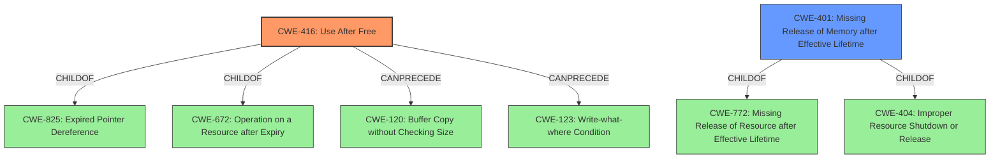

# Analysis Report for CVE-2022-28269

# Vulnerability Analysis Report: CVE-2022-28269

## Description


## Analysis (with Relationship Data)

# Summary
| CWE ID | CWE Name | Confidence | CWE Abstraction Level | CWE Vulnerability Mapping Label | CWE-Vulnerability Mapping Notes |
|---|---|---|---|---|---|
| CWE-416 | Use After Free | 1.0 | Variant | Allowed | Primary CWE |
| CWE-401 | Missing Release of Memory after Effective Lifetime | 0.7 | Variant | Allowed | Secondary Candidate |

## Evidence and Confidence

*   **Confidence Score:** 1.0
*   **Evidence Strength:** HIGH

## Relationship Analysis
The primary CWE is CWE-416 (**CWE-416: Use After Free**) which is a variant. It is a child of CWE-825 (**CWE-825: Expired Pointer Dereference**), CWE-672. CWE-416 can precede CWE-120 (**CWE-120: Buffer Copy without Checking Size of Input ('Classic Buffer Overflow')**) and CWE-123 (**CWE-123: Write-what-where Condition**). CWE-401 (**CWE-401: Missing Release of Memory after Effective Lifetime**) is a variant and is a child of CWE-772 (**CWE-772: Missing Release of Resource after Effective Lifetime**) and CWE-404 (**CWE-404: Improper Resource Shutdown or Release**).



## Vulnerability Chain
The vulnerability chain starts with a **use-after-free** (CWE-416) in the processing of Annotation objects, which leads to a memory leak (CWE-401).

## Summary of Analysis
The vulnerability is a **use-after-free** that can lead to a memory leak.

The vulnerability description states: "Acrobat Reader DC versions 22.001.20085 (and earlier), 20.005.3031x (and earlier) and 17.012.30205 (and earlier) are affected by a **use-after-free** vulnerability in the processing of Annotation objects that could result in a memory leak in the context of the current user. Exploitation of this issue requires user interaction in that a victim must open a malicious file."

The CVE Reference Links Content Summary states:
*   **Root Cause of Vulnerability**: **Use-After-Free** (UAF)
*   **Weaknesses/Vulnerabilities Present**: The vulnerability is a **Use-After-Free** error, which occurs when a program attempts to use memory that has already been freed.
*   **Impact of Exploitation**: Exploitation of this vulnerability could lead to a memory leak.

CWE-416 (**CWE-416: Use After Free**) is a variant-level CWE. The description of CWE-416 matches the vulnerability description, "The product reuses or references memory after it has been freed." The mapping guidance for CWE-416 says that usage is allowed.

CWE-401 (**CWE-401: Missing Release of Memory after Effective Lifetime**) is a variant-level CWE. The description of CWE-401 matches the impact of the vulnerability, "The product does not sufficiently track and release allocated memory after it has been used, which slowly consumes remaining memory." The mapping guidance for CWE-401 says that usage is allowed.

CWE-787 (**CWE-787: Out-of-bounds Write**), CWE-125 (**CWE-125: Out-of-bounds Read**), and CWE-788 (**CWE-788: Access of Memory Location After End of Buffer**) were not selected as the vulnerability description explicitly states "**use-after-free**" as the root cause. These CWEs are related to buffer overflows and out-of-bounds access.

CWE-200 (**CWE-200: Exposure of Sensitive Information to an Unauthorized Actor**) was not selected because the vulnerability is not directly related to the mishandling of sensitive information, as the description of CWE-200 discusses.

My assessment is based on the provided evidence only, and the selected CWEs are at the optimal level of specificity.


## CWE Relationship Analysis

Current CWEs represent these abstraction levels: .


### Vulnerability Chain Analysis

**Chain starting from CWE-788:**
- 788 (Access of Memory Location After End of Buffer) - ROOT


**Chain starting from CWE-200:**
- 200 (Exposure of Sensitive Information to an Unauthorized Actor) - ROOT


### CWE Relationship Diagram

```mermaid
graph TD
    classDef primary fill:#f96,stroke:#333,stroke-width:2px
    classDef secondary fill:#69f,stroke:#333
    classDef tertiary fill:#9e9,stroke:#333
```


*Report generated on 2025-03-31 08:53:37*
