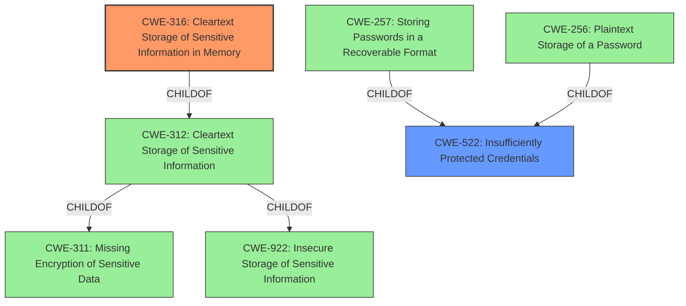

# Analysis Report for CVE-2022-28291

# Vulnerability Analysis Report: CVE-2022-28291

## Description


## Analysis (with Relationship Data)

# Summary
| CWE ID  | CWE Name                                        | Confidence | CWE Abstraction Level | CWE Vulnerability Mapping Label | CWE-Vulnerability Mapping Notes |
|---------|-------------------------------------------------|------------|-----------------------|---------------------------------|-----------------------------------|
| CWE-316 | Cleartext Storage of Sensitive Information in Memory | 0.9        | Variant               | Allowed                         | Primary CWE                       |
| CWE-522 | Insufficiently Protected Credentials            | 0.7        | Class                 | Allowed-with-Review           | Secondary Candidate               |

## Evidence and Confidence

*   **Confidence Score:** 0.8
*   **Evidence Strength:** HIGH

## Relationship Analysis
The primary CWE is CWE-316, which is a variant of CWE-312 (Cleartext Storage of Sensitive Information), which is itself a child of CWE-311 (Missing Encryption of Sensitive Data) and CWE-922 (Insecure Storage of Sensitive Information). CWE-522 (Insufficiently Protected Credentials) is a Class-level CWE that encompasses a broader range of credential protection issues, and has multiple base-level children including CWE-257 (Storing Passwords in a Recoverable Format) and CWE-256 (Plaintext Storage of a Password).



## Vulnerability Chain
The vulnerability chain starts with the **insufficient protection of credentials**, specifically storing them in **cleartext in memory**. This allows an attacker with debug privileges to perform a process dump and **retrieve the stored credentials**, potentially leading to the **compromise of customer networks**.

## Summary of Analysis
The initial assessment focused on the **Insufficiently Protected Credentials** (**WEAKNESS**) aspect of the vulnerability, as highlighted in the vulnerability description. However, the detailed information from the CVE Reference Links Content Summary provides a clearer picture of the root cause: the Nessus scanner stores policy credentials in **cleartext within the `nessusd` process memory** (**ROOT CAUSE**). This evidence strongly supports classifying the vulnerability as **CWE-316: Cleartext Storage of Sensitive Information in Memory**.

The retriever results also point towards CWE-312 (Cleartext Storage of Sensitive Information) and CWE-522 (Insufficiently Protected Credentials). While CWE-522 captures the general problem, CWE-316 is more specific about where the sensitive information is stored (memory) and in what format (cleartext). Therefore, CWE-316 is a more precise classification. CWE-312 is a good fit, but since the information is in memory, CWE-316 is a better fit.

The decision to prioritize CWE-316 is based on the following evidence:

*   "Root cause of vulnerability: The Nessus scanner stores policy credentials in cleartext within the `nessusd` process memory."
*   The description of CWE-316: "The product stores sensitive information in cleartext in memory."

The selection of CWE-316 aligns with MITRE's guidance to choose the most specific CWE that accurately represents the vulnerability and is at the Base or Variant level of abstraction.

CWEs Considered But Not Used:

*   CWE-522: While initially considered due to the "Insufficiently Protected Credentials" phrasing, it's a broader class. The vulnerability is more precisely described by the cleartext storage in memory.
*   CWE-312: This is a parent of CWE-316 and a good fit, but since the vulnerability is specifically about storage in memory, CWE-316 is more accurate.
*   CWE-257 and CWE-256: These are related to password storage, but the issue isn't just passwords; it's any sensitive credential. The cleartext storage is the core issue.
*   CWE-532: Insertion of Sensitive Information into Log File. This CWE relates to log files, and the vulnerability is about information stored in memory, so it is not a good fit.


## CWE Relationship Analysis

Current CWEs represent these abstraction levels: .


### Vulnerability Chain Analysis

**Chain starting from CWE-922:**
- 922 (Insecure Storage of Sensitive Information) - ROOT


**Chain starting from CWE-522:**
- 522 (Insufficiently Protected Credentials) - ROOT


### CWE Relationship Diagram

```mermaid
graph TD
    classDef primary fill:#f96,stroke:#333,stroke-width:2px
    classDef secondary fill:#69f,stroke:#333
    classDef tertiary fill:#9e9,stroke:#333
```


*Report generated on 2025-03-30 15:51:55*
