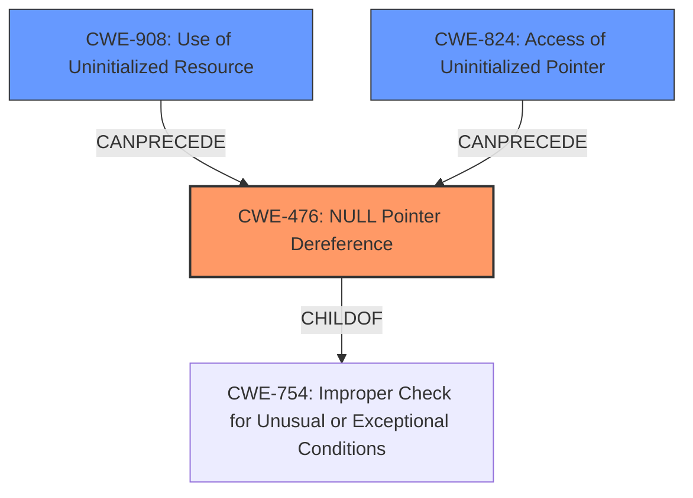

# Analysis for CVE-2022-2832

# Summary

| CWE ID | CWE Name | Confidence | CWE Abstraction Level | CWE Vulnerability Mapping Label | CWE-Vulnerability Mapping Notes |
|---|---|---|---|---|---|
| CWE-476 | NULL Pointer Dereference | 1.0 | Base | Primary | Allowed |
| CWE-908 | Use of Uninitialized Resource | 0.7 | Base | Secondary | Allowed |
| CWE-824 | Access of Uninitialized Pointer | 0.6 | Base | Secondary | Allowed |

## Evidence and Confidence

*   **Confidence Score:** 0.9
*   **Evidence Strength:** HIGH

## Relationship Analysis
The primary relationship influencing the decision is the hierarchical structure. CWE-476 **NULL Pointer Dereference** is a **Base** level CWE, which is preferred. There is also a potential chain relationship where a missing initialization could lead to a null pointer dereference. The other considered CWEs like CWE-824 **Access of Uninitialized Pointer** and CWE-908 **Use of Uninitialized Resource** represent potential prerequisite conditions.

## Vulnerability Chain
The vulnerability chain starts with a **missing initialization** of the GPU backend, potentially leading to the **use of an uninitialized resource** or **access of an uninitialized pointer**. This ultimately results in a **NULL pointer dereference**, causing a crash.

## Summary of Analysis
The initial assessment focused on the **null pointer dereference** as the primary weakness, supported by the phrase "**null pointer dereference**" in the vulnerability description. The CVE Reference Links Content Summary further confirms this by stating: "The primary vulnerability is a null pointer dereference that occurs when the GPU backend is not properly initialized in headless mode." This evidence strongly supports the selection of CWE-476 **NULL Pointer Dereference** as the primary CWE.

However, the analysis also considered the root cause, which is the improper initialization of the GPU backend. Therefore, CWE-908 **Use of Uninitialized Resource** and CWE-824 **Access of Uninitialized Pointer** are considered as secondary CWEs, representing the potential underlying causes that lead to the **NULL pointer dereference**.

The final decision emphasizes the **NULL pointer dereference** (CWE-476) as the most direct and impactful weakness, while acknowledging the contributing factors of **missing initialization** represented by CWE-908 and CWE-824. All selected CWEs are at the Base level of abstraction, providing an appropriate level of specificity.

Other CWEs Considered but Not Used:

*   CWE-252 **Unchecked Return Value**: While a missing return value check *could* theoretically lead to this, there is no explicit mention of it in the provided documentation, so this was excluded.
*   CWE-787 **Out-of-bounds Write** and CWE-125 **Out-of-bounds Read**: The description doesn't indicate any buffer overflow issues, so they're not relevant.
*   CWE-665 **Improper Initialization**: It is a class level CWE, so it is less specific than CWE-908 **Use of Uninitialized Resource** or CWE-824 **Access of Uninitialized Pointer** which are both base level.
*   CWE-833 **Deadlock**: There are no threads or locks mentioned so it is not relevant.
*   CWE-456 **Missing Initialization of a Variable**: It is less descriptive than CWE-908 **Use of Uninitialized Resource** or CWE-824 **Access of Uninitialized Pointer**.