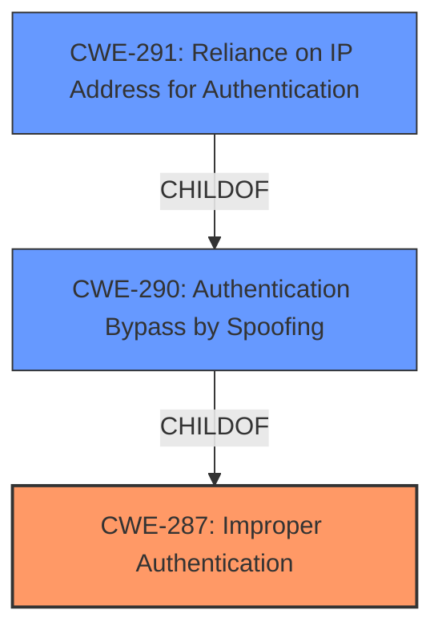

# Raw Analyzer Response for CVE-2022-28321

# Summary
| CWE ID  | CWE Name                                                      | Confidence | CWE Abstraction Level | CWE Vulnerability Mapping Label | CWE-Vulnerability Mapping Notes |
| :-------- | :------------------------------------------------------------ | :--------- | :---------------------- | :------------------------------ | :------------------------------ |
| CWE-287 | Improper Authentication | 0.75 | Class | Primary | Discouraged, but best available |
| CWE-290 | Authentication Bypass by Spoofing | 0.6 | Base | Secondary | Allowed |
| CWE-291 | Reliance on IP Address for Authentication | 0.6 | Variant | Secondary | Allowed |

## Evidence and Confidence

*   **Confidence Score:** 0.7
*   **Evidence Strength:** MEDIUM

## Relationship Analysis
The primary relationship influencing the CWE selection is the hierarchical structure within authentication-related weaknesses.

-   CWE-287 serves as a parent Class, with multiple child CWEs offering more specific contexts.
-   CWE-290 is a child of CWE-287, indicating a subtype of authentication bypass.
-   CWE-291 is a variant of CWE-290, focusing on IP address reliance.

The selection process involved evaluating the level of specificity appropriate for the vulnerability description. While a more specific child or variant CWE is generally preferred, the available evidence and the nature of the **improper restriction of SSH logins** pointed to CWE-287 as the most fitting high-level classification.

## Vulnerability Chain
The vulnerability chain involves a series of weaknesses:
1.  **Improper Restriction:** The initial flaw lies in the **improper restriction of SSH logins** due to the `pam_access.so` module's incorrect handling of IP addresses.
2.  **Incorrect Address Resolution:** The core issue lies in how `pam_access.so` handles IP addresses. It uses `getaddrinfo` with the string of the provided IP, which will fail if the IP has no DNS entry and therefore will not match any access control entry. The fix uses `getaddrinfo` with `tok`, which contains the original string from the configuration.
3.  **Authentication Bypass:** This leads to an authentication bypass, allowing unauthorized access.
4.  **Unauthorized Access:** An attacker can gain unauthorized access to systems even if their IP address is explicitly denied in the `/etc/security/access.conf` configuration, provided their IP is not resolvable via DNS.

## Summary of Analysis
The initial assessment focused on identifying the root cause and primary weakness. The vulnerability description and the CVE reference summary pointed to an authentication bypass due to **improper restriction of SSH logins** when a user connects from an IP address that is not resolvable via DNS.

The evidence for this assessment is primarily based on the "Vulnerability Description Key Phrases" section:

*   **rootcause:** **improper restriction of SSH logins**
*   **impact:** authentication bypass

And the CVE Reference Links Content Summary section:

*   "The vulnerability stems from an incorrect implementation in the `pam_access.so` module of the Linux-PAM package. Specifically, the module fails to properly restrict access when a user attempts to log in from an IP address that cannot be resolved via DNS."
*   "The primary weakness is that the `pam_access.so` module does not correctly enforce access restrictions when a user's IP address is not resolvable via DNS. This bypasses intended access controls."

The graph relationships influenced the selection by highlighting the hierarchical structure of authentication-related CWEs. While CWE-287 is a higher-level Class, it accurately represents the general authentication failure. The more specific children, CWE-290 and CWE-291, provide additional context regarding the nature of the bypass and the reliance on IP addresses, but were kept as secondary.

CWE-287 is selected because the product does not sufficiently prove that the claim is correct, which is further caused by improper handling of IP addresses that are not resolvable via DNS.

### Alternative CWE Considerations:

*   **CWE-1390 (Weak Authentication):** Considered but deemed less appropriate than CWE-287. While the authentication is weak, the core issue is the bypass itself.
*   **CWE-863 (Incorrect Authorization):** Ruled out because the issue occurs during the authentication phase, not the authorization phase.
*   **CWE-291 (Reliance on IP Address for Authentication):** Considered as a secondary weakness since the authentication mechanism relies on IP addresses, which can be spoofed.
*   **CWE-303 (Incorrect Implementation of Authentication Algorithm):** Considered, but the description focuses more on established authentication algorithms, which doesn't seem to be the issue here. The issue is more about how it is restricted.
*   **CWE-290 (Authentication Bypass by Spoofing):** Considered as a secondary weakness since the attacker uses a non-resolvable IP address to spoof their identity.