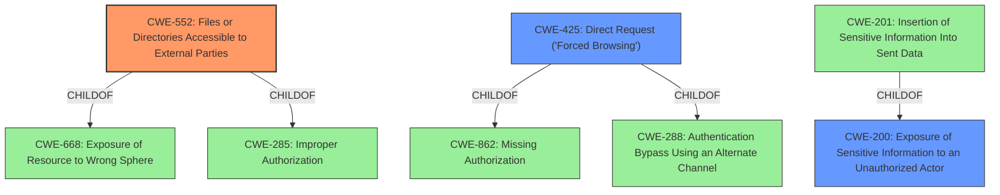

# Enhanced Analysis for CVE-2022-2834

# Summary
| CWE ID | CWE Name | Confidence | CWE Abstraction Level | CWE Vulnerability Mapping Label | CWE-Vulnerability Mapping Notes |
|---|---|---|---|---|---|
| CWE-552 | Files or Directories Accessible to External Parties | 0.9 | Base | Allowed | Primary CWE |
| CWE-200 | Exposure of Sensitive Information to an Unauthorized Actor | 0.7 | Class | Discouraged | Secondary Candidate |
| CWE-425 | Direct Request ('Forced Browsing') | 0.6 | Base | Allowed | Secondary Candidate |

## Evidence and Confidence

*   **Confidence Score:** 0.8
*   **Evidence Strength:** HIGH

## Relationship Analysis
The primary CWE, CWE-552, is a base-level weakness and a child of CWE-668 (Exposure of Resource to Wrong Sphere) and CWE-285 (Improper Authorization). CWE-200 (Exposure of Sensitive Information to an Unauthorized Actor) is a class-level weakness and a parent of CWE-201 (Insertion of Sensitive Information Into Sent Data). CWE-425 (Direct Request ('Forced Browsing')) is a base-level weakness and a child of CWE-862 (Missing Authorization) and CWE-288 (Authentication Bypass Using an Alternate Channel). The hierarchical relationships helped determine the optimal level of specificity, favoring the base-level CWE-552 and CWE-425 over the class-level CWE-200. There were no chain relationships that impacted my decision.



## Vulnerability Chain
The vulnerability chain starts with the **root cause**: the plugin **puts the exported logs and feedbacks in a publicly accessible location and guessable names**. This leads to the weakness of files being accessible to external parties (CWE-552). This, in turn, allows attackers to download these files and retrieve sensitive information, resulting in the impact of information disclosure (CWE-200).

## Summary of Analysis
The initial analysis identified that the plugin **puts the exported logs and feedbacks in a publicly accessible location and guessable names**, leading to the potential for attackers to download and retrieve sensitive information.

The retriever results suggested CWE-552 (Files or Directories Accessible to External Parties) as the top candidate, and this aligns well with the vulnerability description. The "CVE Reference Links Content Summary" confirms this by stating: "The plugin stores exported logs and feedbacks in publicly accessible locations with predictable file names" and "The files are placed in the `wp-content/uploads/helpful` directory, and are accessible without authentication."

CWE-200 (Exposure of Sensitive Information to an Unauthorized Actor) was considered due to the "impact" being the retrieval of "sensitive information such as IP, Names and Email Address". However, CWE-200 is a class-level CWE and is discouraged because it "is commonly misused to represent the loss of confidentiality in a vulnerability, but confidentiality loss is a technical impact - not a root cause error." Therefore, while the impact is information exposure, the **root cause** is the publicly accessible location.

CWE-425 (Direct Request ('Forced Browsing')) was also considered, given the files are directly accessible. This is a base-level CWE, and the description "The web application does not adequately enforce appropriate authorization on all restricted URLs, scripts, or files" applies, but the root cause is better represented by CWE-552.

CWE-552 is at the optimal level of specificity as it directly addresses the **root cause** of the vulnerability: files being placed in a publicly accessible location.

Relevant CWE Information:

# Enhanced Context (25 CWEs)

## CWE-552: Files or Directories Accessible to External Parties
**Abstraction Level**: Base
**Similarity Score**: 0.78
**Source**: dense

**Description**:
The product makes files or directories accessible to unauthorized actors, even though they should not be.

**Mapping Guidance**:
- Usage: Allowed
- Rationale: This CWE entry is at the Base level of abstraction, which is a preferred level of abstraction for mapping to the root causes of vulnerabilities.

## CWE-200: Exposure of Sensitive Information to an Unauthorized Actor
**Abstraction Level**: Class
**Similarity Score**: 6225.78
**Source**: sparse

**Description**:
The product exposes sensitive information to an actor that is not explicitly authorized to have access to that information.

**Mapping Guidance**:
- Usage: Discouraged
- Rationale: CWE-200 is commonly misused to represent the loss of confidentiality in a vulnerability, but confidentiality loss is a technical impact - not a root cause error. As of CWE 4.9, over 400 CWE entries can lead to a loss of confidentiality. Other options are often available. [REF-1287].

## CWE-425: Direct Request ('Forced Browsing')
**Abstraction Level**: Base
**Similarity Score**: 6162.98
**Source**: sparse

**Description**:
The web application does not adequately enforce appropriate authorization on all restricted URLs, scripts, or files.

**Mapping Guidance**:
- Usage: Allowed
- Rationale: This CWE entry is at the Base level of abstraction, which is a preferred level of abstraction for mapping to the root causes of vulnerabilities.


## CWE Relationship Analysis

Current CWEs represent these abstraction levels: .


### Vulnerability Chain Analysis

**Chain starting from CWE-552:**
- 552 (Files or Directories Accessible to External Parties) - ROOT


**Chain starting from CWE-201:**
- 201 (Insertion of Sensitive Information Into Sent Data) - ROOT


### CWE Relationship Diagram

```mermaid
graph TD
    classDef primary fill:#f96,stroke:#333,stroke-width:2px
    classDef secondary fill:#69f,stroke:#333
    classDef tertiary fill:#9e9,stroke:#333
```