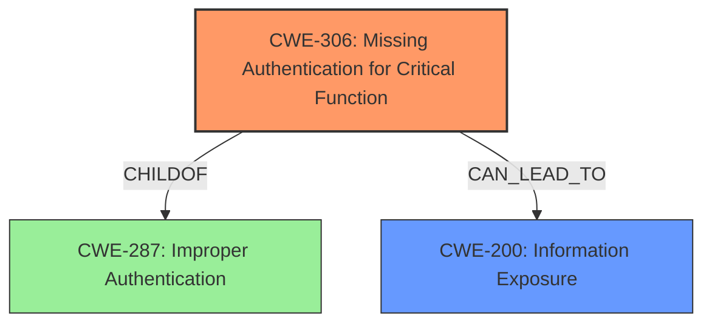

# Analysis Report for CVE-2022-28365

# Vulnerability Analysis Report: CVE-2022-28365

## Description


## Analysis (with Relationship Data)

# Summary
| CWE ID | CWE Name | Confidence | CWE Abstraction Level | CWE Vulnerability Mapping Label | CWE-Vulnerability Mapping Notes |
|---|---|---|---|---|---|
| CWE-306 | Missing Authentication for Critical Function | 0.9 | Base | Primary | Allowed |
| CWE-200 | Information Exposure | 0.7 | Class | Secondary | Allowed-with-Review |

## Evidence and Confidence

*   **Confidence Score:** 0.8
*   **Evidence Strength:** HIGH

## Relationship Analysis
The primary CWE is CWE-306 **Missing Authentication for Critical Function**, which is a Base level CWE and a child of CWE-287 Improper Authentication. The secondary CWE is CWE-200 **Information Exposure**, which is a Class level CWE. The relationship between these is that a missing authentication check leads to information exposure.



## Vulnerability Chain
The vulnerability chain starts with the **lack of access control** on the `/goforms/rlminfo` endpoint (CWE-306), which directly results in **information disclosure** (CWE-200).

## Summary of Analysis
The initial analysis identified **lack of access control** as the root cause for **information disclosure**. The evidence from the CVE Reference Links Content Summary confirms this: "The application discloses sensitive information due to a **lack of access control** on the `/goforms/rlminfo` endpoint." This directly aligns with CWE-306 **Missing Authentication for Critical Function**.

The secondary effect is the **disclosure of software versions, process IDs, network configuration, hostname(s), system architecture, and file/directory information**, which aligns with CWE-200 **Information Exposure**.

The selection of CWE-306 is based on the root cause, while CWE-200 describes the impact. Both CWEs are at appropriate levels of specificity, with CWE-306 at the Base level and CWE-200 at the Class level.

Relevant CWE Information:

# Enhanced Context (25 CWEs)
The following CWEs were identified as potentially relevant to this vulnerability:

## CWE-807: Reliance on Untrusted Inputs in a Security Decision
**Abstraction Level**: Base
**Similarity Score**: 0.78
**Source**: dense

**Description**:
The product uses a protection mechanism that relies on the existence or values of an input, but the input can be modified by an untrusted actor in a way that bypasses the protection mechanism.
**Rationale:** This CWE entry is not applicable as there's no indication of relying on untrusted inputs for a security decision. The issue is the complete absence of authentication.

## CWE-639: Authorization Bypass Through User-Controlled Key
**Abstraction Level**: Base
**Similarity Score**: 0.77
**Source**: dense
**Description**:
The system's authorization functionality does not prevent one user from gaining access to another user's data or record by modifying the key value identifying the data.
**Rationale**: While authorization is bypassed, it's not through a user-controlled key. The endpoint is completely unauthenticated, making CWE-306 a better fit.

## CWE-472: External Control of Assumed-Immutable Web Parameter
**Abstraction Level**: Base
**Similarity Score**: 0.77
**Source**: dense
**Description**:
The web application does not sufficiently verify inputs that are assumed to be immutable but are actually externally controllable, such as hidden form fields.
**Rationale**: There is no mention of immutable web parameters in the vulnerability description.

## CWE-274: Improper Handling of Insufficient Privileges
**Abstraction Level**: Base
**Similarity Score**: 0.76
**Source**: dense
**Description**:
The product does not handle or incorrectly handles when it has insufficient privileges to perform an operation, leading to resultant weaknesses.
**Rationale**: This is not about insufficient privileges, but about the total **lack of authentication**.

## CWE-280: Improper Handling of Insufficient Permissions or Privileges
**Abstraction Level**: Base
**Similarity Score**: 0.76
**Source**: dense
**Description**:
The product does not handle or incorrectly handles when it has insufficient privileges to access resources or functionality as specified by their permissions. This may cause it to follow unexpected code paths that may leave the product in an invalid state.
**Rationale**: This is not about insufficient privileges, but about the total **lack of authentication**.

## CWE-538: Insertion of Sensitive Information into Externally-Accessible File or Directory
**Abstraction Level**: Base
**Similarity Score**: 0.76
**Source**: dense
**Description**:
The product places sensitive information into files or directories that are accessible to actors who are allowed to have access to the files, but not to the sensitive information.
**Rationale**: This CWE is not applicable because the sensitive information is being disclosed via an endpoint, not a file or directory.

## CWE-552: Files or Directories Accessible to External Parties
**Abstraction Level**: Base
**Similarity Score**: 0.76
**Source**: dense
**Description**:
The product makes files or directories accessible to unauthorized actors, even though they should not be.
**Rationale**: This CWE is not applicable because the sensitive information is being disclosed via an endpoint, not a file or directory.

## CWE-1391: Use of Weak Credentials
**Abstraction Level**: Class
**Similarity Score**: 0.76
**Source**: dense
**Description**:
The product uses weak credentials (such as a default key or hard-coded password) that can be calculated, derived, reused, or guessed by an attacker.
**Rationale**: This CWE is not applicable because there's no mention of weak credentials. The issue is a total **lack of authentication**.

## CWE-1220: Insufficient Granularity of Access Control
**Abstraction Level**: Base
**Similarity Score**: 0.76
**Source**: dense
**Description**:
The product implements access controls via a policy or other feature with the intention to disable or restrict accesses (reads and/or writes) to assets in a system from untrusted agents. However, implemented access controls lack required granularity, which renders the control policy too broad because it allows accesses from unauthorized agents to the security-sensitive assets.
**Rationale**: The problem isn't the granularity of access control, but the complete absence of it.

## CWE-668: Exposure of Resource to Wrong Sphere
**Abstraction Level**: Class
**Similarity Score**: 0.76
**Source**: dense
**Description**:
The product exposes a resource to the wrong control sphere, providing unintended actors with inappropriate access to the resource.
**Rationale**: This is too high-level. CWE-306 provides a more specific root cause.

## CWE-863: Incorrect Authorization
**Abstraction Level**: Class
**Similarity Score**: 5246.79
**Source**: sparse
**Description**:
The product performs an authorization check when an actor attempts to access a resource or perform an action, but it does not correctly perform the check.
**Rationale**: There is no authorization check at all, so CWE-306 is a better fit.

## CWE-425: Direct Request ('Forced Browsing')
**Abstraction Level**: Base
**Similarity Score**: 5226.27
**Source**: sparse
**Description**:
The web application does not adequately enforce appropriate authorization on all restricted URLs, scripts, or files.
**Rationale**: While related, this CWE is less specific than CWE-306. The core issue is the **missing authentication**, not just inadequate enforcement.

## CWE-285: Improper Authorization
**Abstraction Level**: Class
**Similarity Score**: 5095.56
**Source**: sparse
**Description**:
The product does not perform or incorrectly performs an authorization check when an actor attempts to access a resource or perform an action.
**Rationale**: There is no authorization check at all, so CWE-306 is a better fit.

## CWE-201: Insertion of Sensitive Information Into Sent Data
**Abstraction Level**: Base
**Similarity Score**: 4977.23
**Source**: sparse
**Description**:
The code transmits data to another actor, but a portion of the data includes sensitive information that should not be accessible to that actor.
**Rationale**: While sensitive information is being sent, the root cause is the lack of authentication, making CWE-306 the primary issue and CWE-200 as the resulting impact.

## CWE-471: Modification of Assumed-Immutable Data (MAID)
**Abstraction Level**: base


## CWE Relationship Analysis

Current CWEs represent these abstraction levels: .


### Vulnerability Chain Analysis

**Chain starting from CWE-552:**
- 552 (Files or Directories Accessible to External Parties) - ROOT


**Chain starting from CWE-285:**
- 285 (Improper Authorization) - ROOT


### CWE Relationship Diagram

```mermaid
graph TD
    classDef primary fill:#f96,stroke:#333,stroke-width:2px
    classDef secondary fill:#69f,stroke:#333
    classDef tertiary fill:#9e9,stroke:#333
```


*Report generated on 2025-03-31 08:16:51*
