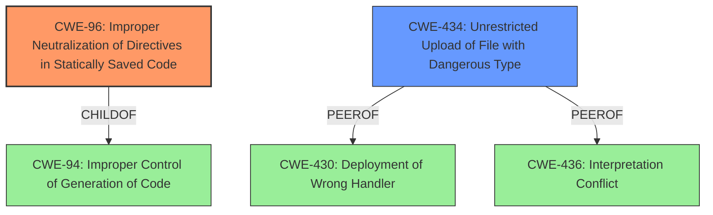

# Raw Analyzer Response for CVE-2022-28368

# Summary
| CWE ID    | CWE Name                                                                          | Confidence | CWE Abstraction Level | CWE Vulnerability Mapping Label | CWE-Vulnerability Mapping Notes |
| :-------- | :-------------------------------------------------------------------------------- | :--------- | :-------------------- | :------------------------------ | :------------------------------ |
| CWE-96    | Improper Neutralization of Directives in Statically Saved Code ('Static Code Injection') | 0.9        | Base                  | Primary                       | Allowed                       |
| CWE-434   | Unrestricted Upload of File with Dangerous Type                                   | 0.8        | Base                  | Secondary                       | Allowed                       |

## Evidence and Confidence

*   **Confidence Score:** 0.85
*   **Evidence Strength:** HIGH

## Relationship Analysis
The primary CWE is CWE-96, which is a child of CWE-94. The secondary CWE is CWE-434, which shares peer relationships with CWE-430 and CWE-436. The abstraction levels are both Base, indicating a good level of specificity.

## Vulnerability Chain
The vulnerability chain begins with the **unrestricted upload of a file with a dangerous type** (CWE-434), specifically a .php file. This leads to the **improper neutralization of directives in statically saved code** (CWE-96), where the PHP code is injected into a font file that is then stored and executed by dompdf, resulting in remote code execution.

## Summary of Analysis
Initially, several CWEs were considered, including CWE-79, CWE-1336, CWE-95, and CWE-434. However, based on the vulnerability description and the CVE Reference Links Content Summary, the most appropriate CWEs are CWE-96 and CWE-434. The **root cause** is the **lack of validation of the contents of font files** and the **storage of these files in a publicly accessible directory**, allowing for PHP code injection.

The vulnerability description states that "Dompdf 1.2.1 allows remote code execution via a .php file in the srcurl field of an @font-face Cascading Style Sheets (CSS) statement (within an HTML input file)." The CVE Reference Links Content Summary further clarifies that "the dompdf library does not validate the contents of font files, only their file type, and stores font files in a publicly accessible directory. This allows a malicious user to inject PHP code into a font file, which is then stored and executed by dompdf."

CWE-96 (Improper Neutralization of Directives in Statically Saved Code) accurately describes the **weakness** where the injected PHP code is saved as part of a font file and then executed. CWE-434 (Unrestricted Upload of File with Dangerous Type) is also relevant because the vulnerability involves the **upload of a .php file, which is then processed by the application**.

The selection of CWE-96 and CWE-434 is at the optimal level of specificity, as they are both Base-level CWEs that directly address the **root cause** and the mechanism of the vulnerability.

Relevant CWE Information:

# Enhanced Context (25 CWEs)
The following CWEs were identified as potentially relevant to this vulnerability:

## CWE-330: Use of Insufficiently Random Values
**Abstraction Level**: Class
**Similarity Score**: 0.81
**Source**: dense

**Description**:
The product uses insufficiently random numbers or values in a security context that depends on unpredictable numbers.

**Mapping Guidance**:
- Usage: Discouraged
- Rationale: This CWE entry is a level-1 Class (i.e., a child of a Pillar). It might have lower-level children that would be more appropriate

*Not Selected*: This CWE is not relevant because the vulnerability does not involve the use of random values.

## CWE-1289: Improper Validation of Unsafe Equivalence in Input
**Abstraction Level**: Base
**Similarity Score**: 0.77
**Source**: dense

**Description**:
The product receives an input value that is used as a resource identifier or other type of reference, but it does not validate or incorrectly validates that the input is equivalent to a potentially-unsafe value.

**Mapping Guidance**:
- Usage: Allowed
- Rationale: This CWE entry is at the Base level of abstraction, which is a preferred level of abstraction for mapping to the root causes of vulnerabilities.

*Not Selected*: This CWE is not relevant because the vulnerability does not involve validating equivalence of inputs.

## CWE-331: Insufficient Entropy
**Abstraction Level**: Base
**Similarity Score**: 0.77
**Source**: dense

**Description**:
The product uses an algorithm or scheme that produces insufficient entropy, leaving patterns or clusters of values that are more likely to occur than others.

**Mapping Guidance**:
- Usage: Allowed
- Rationale: This CWE entry is at the Base level of abstraction, which is a preferred level of abstraction for mapping to the root causes of vulnerabilities.

*Not Selected*: This CWE is not relevant because the vulnerability does not involve entropy.

## CWE-74: Improper Neutralization of Special Elements in Output Used by a Downstream Component ('Injection')
**Abstraction Level**: Class
**Similarity Score**: 0.76
**Source**: dense

**Description**:
The product constructs all or part of a command, data structure, or record using externally-influenced input from an upstream component, but it does not neutralize or incorrectly neutralizes special elements that could modify how it is parsed or interpreted when it is sent to a downstream component.

**Mapping Guidance**:
- Usage: Discouraged
- Rationale: CWE-74 is high-level and often misused when lower-level weaknesses are more appropriate.

*Not Selected*: This CWE is too broad. More specific CWEs like CWE-96 and CWE-434 are more appropriate.

## CWE-1391: Use of Weak Credentials
**Abstraction Level**: Class
**Similarity Score**: 0.76
**Source**: dense

**Description**:
The product uses weak credentials (such as a default key or hard-coded password) that can be calculated, derived, reused, or guessed by an attacker.

**Mapping Guidance**:
- Usage: Allowed-with-Review
- Rationale: This CWE entry is a Class and might have Base-level children that would be more appropriate

*Not Selected*: This CWE is not relevant because the vulnerability does not involve weak credentials.

## CWE-665: Improper Initialization
**Abstraction Level**: Class
**Similarity Score**: 0.76
**Source**: dense

**Description**:
The product does not initialize or incorrectly initializes a resource, which might leave the resource in an unexpected state when it is accessed or used.

**Mapping Guidance**:
- Usage: Discouraged
- Rationale: This CWE entry is a level-1 Class (i.e., a child of a Pillar). It might have lower-level children that would be more appropriate

*Not Selected*: This CWE is not relevant because the vulnerability does not involve improper initialization.

## CWE-41: Improper Resolution of Path Equivalence
**Abstraction Level**: Base
**Similarity Score**: 0.75
**Source**: dense

**Description**:
The product is vulnerable to file system contents disclosure through path equivalence. Path equivalence involves the use of special characters in file and directory names. The associated manipulations are intended to generate multiple names for the same object.

**Mapping Guidance**:
- Usage: Allowed
- Rationale: This CWE entry is at the Base level of abstraction, which is a preferred level of abstraction for mapping to the root causes of vulnerabilities.

*Not Selected*: This CWE is not relevant because the vulnerability does not involve path equivalence.

## CWE-703: Improper Check or Handling of Exceptional Conditions
**Abstraction Level**: Pillar
**Similarity Score**: 0.75
**Source**: dense

**Description**:
The product does not properly anticipate or handle exceptional conditions that rarely occur during normal operation of the product.

**Mapping Guidance**:
- Usage: Discouraged
- Rationale: This CWE entry is extremely high-level, a Pillar.

*Not Selected*: This CWE is too high-level and does not accurately describe the specific vulnerability.

## CWE-138: Improper Neutralization of Special Elements
**