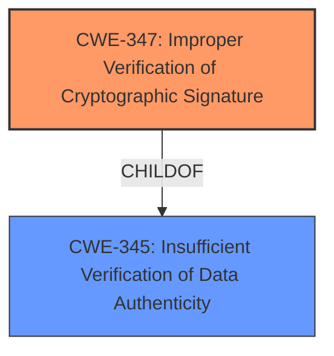

# Analysis for CVE-2022-28370

# Summary
| CWE ID | CWE Name | Confidence | CWE Abstraction Level | CWE Vulnerability Mapping Label | CWE-Vulnerability Mapping Notes |
|---|---|---|---|---|---|
| CWE-347 | Improper Verification of Cryptographic Signature | 1.0 | Base | Allowed | Primary CWE |
| CWE-345 | Insufficient Verification of Data Authenticity | 0.7 | Class | Discouraged | Secondary Candidate |

## Evidence and Confidence

*   **Confidence Score:** 1.0
*   **Evidence Strength:** HIGH

## Relationship Analysis
The primary CWE, CWE-347, is a child of CWE-345, indicating a hierarchical relationship where the former is a specific type of the latter. The vulnerability description explicitly states **no cryptographic validation of the image**, directly aligning with CWE-347. While CWE-345 is a broader category, CWE-347 provides a more precise classification. Therefore, choosing CWE-347 as the primary weakness leverages this parent-child relationship for increased specificity.

## Vulnerability Chain
The vulnerability chain starts with the **lack of cryptographic validation** (CWE-347), leading to the ability to **modify the installed firmware**. This represents a direct cause-and-effect relationship, where the absence of proper signature verification allows for unauthorized modification of the firmware.

## Summary of Analysis
The analysis is based on the vulnerability description, which clearly states the **rootcause** as **no cryptographic validation of the image**. This directly corresponds to CWE-347 (Improper Verification of Cryptographic Signature).

The retriever results also suggest CWE-347 as a potential candidate. The relationship analysis shows that CWE-347 is a child of CWE-345 (Insufficient Verification of Data Authenticity). While CWE-345 is also a potential candidate, CWE-347 is more specific and accurately reflects the vulnerability.

The mapping guidance for CWE-347 allows its usage, and it is at the Base level of abstraction, which is preferred.

Therefore, the selected CWE is at the optimal level of specificity.

Relevant CWE Information:

# Enhanced Context (25 CWEs)
The following CWEs were identified as potentially relevant to this vulnerability:

## CWE-345: Insufficient Verification of Data Authenticity
**Abstraction Level**: Class
**Similarity Score**: 0.82
**Source**: dense

**Description**:
The product does not sufficiently verify the origin or authenticity of data, in a way that causes it to accept invalid data.

**Mapping Guidance**:
- Usage: Discouraged
- Rationale: This CWE entry is a level-1 Class (i.e., a child of a Pillar). It might have lower-level children that would be more appropriate

## CWE-347: Improper Verification of Cryptographic Signature
**Abstraction Level**: Base
**Similarity Score**: 0.79
**Source**: dense

**Description**:
The product does not verify, or incorrectly verifies, the cryptographic signature for data.

**Mapping Guidance**:
- Usage: Allowed
- Rationale: This CWE entry is at the Base level of abstraction, which is a preferred level of abstraction for mapping to the root causes of vulnerabilities.

---
### Additional Notes on Other CWEs Considered But Not Used

*   CWE-798 (Use of Hard-coded Credentials), CWE-321 (Use of Hard-coded Cryptographic Key), CWE-259 (Use of Hard-coded Password): These CWEs were considered but are not relevant because the vulnerability is not related to the use of hard-coded credentials, but rather the **lack of verification of the firmware image.**
*   CWE-327 (Use of a Broken or Risky Cryptographic Algorithm): This CWE is not relevant because the vulnerability is not about using a weak algorithm, but about **not using any cryptographic validation at all.**
*   CWE-1277 (Firmware Not Updateable): While the vulnerability allows modifying the firmware, the **root cause is the missing validation,** not the inability to update.
*   CWE-184 (Incomplete List of Disallowed Inputs): This CWE is not relevant as the **root cause** is not related to an incomplete list of disallowed inputs.
*   CWE-1391 (Use of Weak Credentials): This CWE is not relevant as the **root cause** is not related to use of weak credentials.
*   CWE-306 (Missing Authentication for Critical Function): This CWE is not relevant as the **root cause** is not related to missing authentication.
*   CWE-295 (Improper Certificate Validation): This CWE is not relevant as the **root cause** is not related to improper certificate validation.