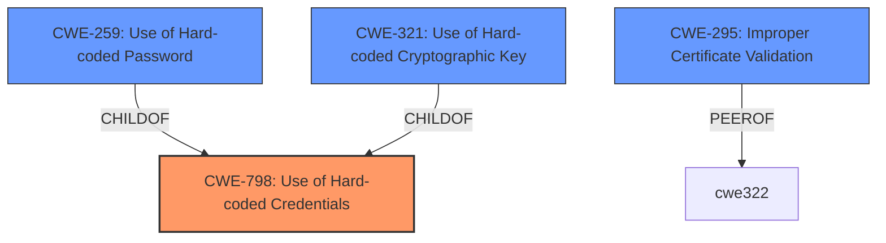

# Analysis for CVE-2022-28371

# Summary
| CWE ID | CWE Name | Confidence | CWE Abstraction Level | CWE Vulnerability Mapping Label | CWE-Vulnerability Mapping Notes |
|---|---|---|---|---|---|
| CWE-798 | Use of Hard-coded Credentials | 1.0 | Base | Allowed | Primary CWE |
| CWE-295 | Improper Certificate Validation | 0.7 | Base | Allowed | Secondary Candidate |

## Evidence and Confidence

*   **Confidence Score:** 0.9
*   **Evidence Strength:** HIGH

## Relationship Analysis
The primary relationship that influenced the decision was the ChildOf relationship between CWE-259 (Use of Hard-coded Password) and CWE-798 (Use of Hard-coded Credentials), as well as CWE-321 (Use of Hard-coded Cryptographic Key) and CWE-798. While CWE-259 and CWE-321 are more specific, the vulnerability description mentions a static certificate, making CWE-798 a more appropriate fit. CWE-295 (Improper Certificate Validation) is also related, but the core issue is the use of a hard-coded certificate rather than its validation. The abstraction levels of the chosen CWEs are base, which is preferred.

## Vulnerability Chain
The vulnerability chain starts with the **use of a static, firmware-embedded certificate (CWE-798)** for authentication. This **weakness** allows attackers with access to the firmware to bypass authentication. The impact of this is potential remote code execution when combined with other vulnerabilities.

## Summary of Analysis
The initial analysis focused on the **weakness** of using a static certificate for authentication. The retriever results strongly suggested CWE-798 (Use of Hard-coded Credentials), CWE-259 (Use of Hard-coded Password), and CWE-321 (Use of Hard-coded Cryptographic Key). After reviewing the vulnerability description and the definitions of these CWEs, CWE-798 was chosen as the primary CWE because the vulnerability involves a static certificate, which is a form of hard-coded credential. While CWE-259 and CWE-321 are more specific, CWE-798 is a better fit for the overall **weakness**. CWE-295 (Improper Certificate Validation) was considered, however the description focuses on the certificate being static and not on its validation.

The selection of CWE-798 is based on the following evidence from the vulnerability description and CVE Reference Links Content Summary:

*   "the CRTC and ODU RPC endpoints rely on a static certificate for access control."
*   "This certificate is embedded in the firmware, and is identical across the fleet of devices."
*   "An attacker need only download this firmware and extract the private components of these certificates (from /etc/lighttpd.d/ca.pem and /etc/lighttpd.d/server.pem) to gain access."
*   "The Verizon 5G LVSKIHP modem (both IDU and ODU components) utilizes a static, firmware-embedded certificate for authentication to JSON listeners."

These statements clearly indicate the **use of hard-coded credentials (CWE-798)**, as the certificate is static, embedded in the firmware, and identical across all devices.

The selected CWEs are at the optimal level of specificity. CWE-798 is a Base CWE, which is preferred, and accurately represents the **root cause** of the vulnerability.

Relevant CWE Information:

# Enhanced Context (25 CWEs)
The following CWEs were identified as potentially relevant to this vulnerability:

## CWE-798: Use of Hard-coded Credentials
**Abstraction:** Base
**Similarity Score**: 8100.98
**Source**: sparse

**Description**:
The product contains hard-coded credentials, such as a password or cryptographic key.

**Mapping Guidance**:
- Usage: Allowed
- Rationale: This CWE entry is at the Base level of abstraction, which is a preferred level of abstraction for mapping to the root causes of vulnerabilities.

## CWE-295: Improper Certificate Validation
**Abstraction:** Base
**Similarity Score**: 7350.46
**Source**: sparse

**Description**:
The product does not validate, or incorrectly validates, a certificate.

**Mapping Guidance**:
- Usage: Allowed
- Rationale: This CWE entry is at the Base level of abstraction, which is a preferred level of abstraction for mapping to the root causes of vulnerabilities.

### Technical Explanation for CWE-798 (Use of Hard-coded Credentials):
The vulnerability involves the **use of a static certificate embedded in the firmware** for access control. This means the same certificate is used across all devices, making it a hard-coded credential. An attacker can extract this certificate from the firmware and use it to bypass authentication.

*   **How the vulnerability's details match the CWE's characteristics:** The vulnerability directly matches the CWE's description: "The product contains hard-coded credentials, such as a password or cryptographic key." In this case, the hard-coded credential is a certificate.
*   **The security implications and potential impact:** The security implication is a bypass of authentication, potentially leading to remote code execution when combined with other vulnerabilities. The impact is significant, as an attacker can gain unauthorized access to the device's internal interfaces.
*   **Any parent-child relationships or chain patterns that influenced your mapping:** CWE-798 has child relationships with CWE-259 (Use of Hard-coded Password) and CWE-321 (Use of Hard-coded Cryptographic Key). While the certificate contains a private key, using CWE-798 encompasses this without being overly specific.
*   **Whether the weakness is primary or secondary in the vulnerability:** This is the primary weakness.
*   **How the official MITRE mapping guidance influenced your decision:** The MITRE mapping guidance for CWE-798 states that it is at the Base level of abstraction, which is a preferred level for mapping, and its usage is allowed. This aligns with the analysis.

### Technical Explanation for CWE-295 (Improper Certificate Validation):
The vulnerability could also involve some form of improper certificate validation. If the system validated the certificate but didn't properly check its origin or whether it was static, that would match this CWE. This is considered a secondary candidate.

*   **How the vulnerability's details match the CWE's characteristics:** If the product is not properly validating the certificate against a trusted source or checking if it's a default certificate, it aligns with CWE-295.
*   **The security implications and potential impact:** An attacker could use the static certificate to spoof a trusted entity.
*   **Any parent-child relationships or chain patterns that influenced your mapping:** CWE-295 is a base level weakness.
*   **Whether the weakness is primary or secondary in the vulnerability:** This is a secondary weakness, dependent on whether the certificate validation is happening at all.
*   **How the official MITRE mapping guidance influenced your decision:** The MITRE mapping guidance for CWE-295 states that it is at the Base level of abstraction and its usage is allowed.

### CWEs Considered But Not Used:

*   **CWE-259 (Use of Hard-coded Password) and CWE-321 (Use of Hard-coded Cryptographic Key):** These are more specific variants of CWE-798. The vulnerability involves a certificate, not just a password or key, making CWE-798 the more appropriate choice.
*   **CWE-345 (Insufficient Verification of Data Authenticity):** This CWE is too high-level. The **root cause** is the use of hard-coded credentials, not just a general lack of data authenticity verification.
*   **CWE-912 (Hidden Functionality):** While the use of a static certificate could be considered hidden functionality, the primary issue is the **weakness** of using hard-coded credentials for authentication.