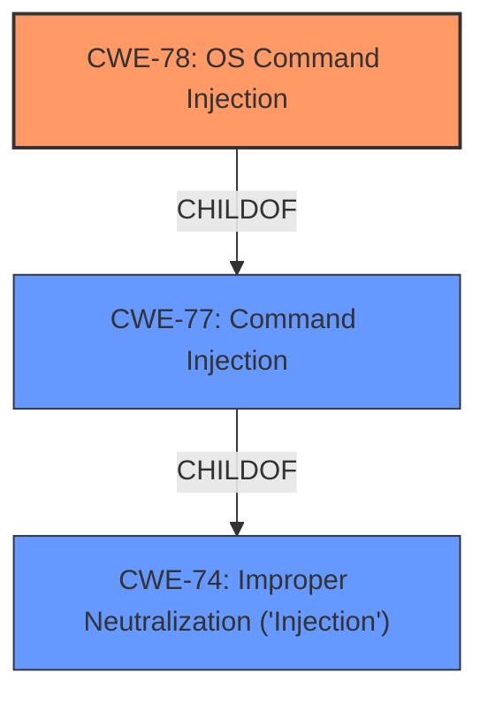

# Analysis Report for CVE-2022-28375

# Vulnerability Analysis Report: CVE-2022-28375

## Description


## Analysis (with Relationship Data)

# Summary
| CWE ID | CWE Name | Confidence | CWE Abstraction Level | CWE Vulnerability Mapping Label | CWE-Vulnerability Mapping Notes |
|---|---|---|---|---|---|
| CWE-78 | Improper Neutralization of Special Elements used in an OS Command ('OS Command Injection') | 1.0 | Base | Allowed | Primary CWE: The vulnerability allows injecting shell metacharacters into a function, leading to remote code execution. |
| CWE-77 | Improper Neutralization of Special Elements used in a Command ('Command Injection') | 0.7 | Class | Discouraged | Considered as a broader category, but CWE-78 provides more specific details.|
| CWE-74 | Improper Neutralization of Special Elements in Output Used by a Downstream Component ('Injection') | 0.6 | Class | Discouraged | Considered as a broader category of injection, but CWE-78 is more specific to OS commands. |

## Evidence and Confidence

*   **Confidence Score:** 1.0
*   **Evidence Strength:** HIGH

## Relationship Analysis
The primary relationship influencing the decision is the hierarchical structure, where CWE-78 is a base-level weakness and a child of CWE-77 and CWE-74, which are class-level weaknesses. This makes CWE-78 the most specific and appropriate choice.



## Vulnerability Chain
The vulnerability chain starts with **improper input sanitization**, leading to **OS command injection** and culminating in **remote code execution as root**.

## Summary of Analysis
The analysis is based on the provided vulnerability description and CVE reference summary. The vulnerability involves **improper input sanitization** within the `crtcswitchsimprofile` function, allowing a remote attacker to inject shell metacharacters and achieve remote code execution as root. The evidence clearly points to CWE-78 as the most accurate classification. The CVE Reference Links Content Summary explicitly mentions "Command Injection" as a vulnerability. The retriever results also rank CWE-78 as the top candidate.

The selection of CWE-78 is based on the following evidence:

*   Vulnerability Description Key Phrases: "**improper input sanitization**", "**inject shell metacharacters**", "remote code execution"
*   CVE Reference Links Content Summary: "The root cause lies in the lack of proper sanitization of user-controlled parameters...shell metacharacters are not filtered, allowing for command injection." and "**Command Injection:** The primary vulnerability is a command injection flaw."
*   Retriever Results: CWE-78 is the top-ranked candidate.
*   CWE-78 Description: "The product constructs all or part of an OS command using externally-influenced input...but it does not neutralize or incorrectly neutralizes special elements that could modify the intended OS command..."

The abstraction level of CWE-78 (Base) is also appropriate, as it represents a specific type of weakness rather than a more general category.

Relevant CWE Information:

# Enhanced Context (25 CWEs)
The following CWEs were identified as potentially relevant to this vulnerability:

## CWE-74: Improper Neutralization of Special Elements in Output Used by a Downstream Component ('Injection')
**Abstraction Level**: Class
**Similarity Score**: 0.77

## CWE-1391: Use of Weak Credentials
**Abstraction Level**: Class
**Similarity Score**: 0.77

## CWE-138: Improper Neutralization of Special Elements
**Abstraction Level**: Class
**Similarity Score**: 0.75

## CWE-1289: Improper Validation of Unsafe Equivalence in Input
**Abstraction Level**: Base
**Similarity Score**: 0.75

## CWE-807: Reliance on Untrusted Inputs in a Security Decision
**Abstraction Level**: Base
**Similarity Score**: 0.75

## CWE-345: Insufficient Verification of Data Authenticity
**Abstraction Level**: Class
**Similarity Score**: 0.75

## CWE-330: Use of Insufficiently Random Values
**Abstraction Level**: Class
**Similarity Score**: 0.75

## CWE-798: Use of Hard-coded Credentials
**Abstraction Level**: Base
**Similarity Score**: 0.75

## CWE-41: Improper Resolution of Path Equivalence
**Abstraction Level**: Base
**Similarity Score**: 0.75

## CWE-472: External Control of Assumed-Immutable Web Parameter
**Abstraction Level**: Base
**Similarity Score**: 0.74

## CWE-116: Improper Encoding or Escaping of Output
**Abstraction Level**: Class
**Similarity Score**: 8182.77

## CWE-88: Improper Neutralization of Argument Delimiters in a Command ('Argument Injection')
**Abstraction Level**: Base
**Similarity Score**: 8162.41

## CWE-138: Improper Neutralization of Special Elements
**Abstraction Level**: Class
**Similarity Score**: 7883.72

## CWE-22: Improper Limitation of a Pathname to a Restricted Directory ('Path Traversal')
**Abstraction Level**: Base
**Similarity Score**: 7724.90

## CWE-94: Improper Control of Generation of Code ('Code Injection')
**Abstraction Level**: Base
**Similarity Score**: 7625.70

## CWE-78: Improper Neutralization of Special Elements used in an OS Command ('OS Command Injection')
**Abstraction Level**: base
**Similarity Score**: 4.47

## CWE-434: Unrestricted Upload of File with Dangerous Type
**Abstraction Level**: base
**Similarity Score**: 4.33

## CWE-94: Improper Control of Generation of Code ('Code Injection')
**Abstraction Level**: base
**Similarity Score**: 4.33

## CWE-22: Improper Limitation of a Pathname to a Restricted Directory ('Path Traversal')
**Abstraction Level**: base
**Similarity Score**: 4.33

## CWE-59: Improper Link Resolution Before File Access ('Link Following')
**Abstraction Level**: base
**Similarity Score**: 4.33

## CWE-98: Improper Control of Filename for Include/Require Statement in PHP Program ('PHP Remote File Inclusion')
**Abstraction Level**: variant
**Similarity Score**: 3.89

## CWE-79: Improper Neutralization of Input During Web Page Generation ('Cross-site Scripting')
**Abstraction Level**: base
**Similarity Score**: 3.89

## CWE-426: Untrusted Search Path
**Abstraction Level**: base
**Similarity Score**: 3.64

## CWE-257: Storing Passwords in a Recoverable Format
**Abstraction Level**: base
**Similarity Score**: 3.64

## CWE-41: Improper Resolution of Path Equivalence
**Abstraction Level**: Base
**Similarity Score**: 3.32

CWEs Considered but Not Used:

*   CWE-77: Improper Neutralization of Special Elements used in a Command ('Command Injection'): This is a parent of CWE-78, and while relevant, CWE-78 provides a more specific classification as the injection occurs in an OS command.
*   CWE-74: Improper Neutralization of Special Elements in Output Used by a Downstream Component ('Injection'): This is a more general class of injection vulnerabilities. Since the vulnerability specifically involves OS command injection, CWE-78 is more appropriate.
*   CWE-94: Improper Control of Generation of Code ('Code Injection'): While the vulnerability leads to code execution, the root cause is the **improper neutralization** of input, not the generation of code itself. Therefore, CWE-78 is a better fit.
*   CWE-88: Improper Neutralization of Argument Delimiters in a Command ('Argument Injection'): This CWE is related to injecting arguments into a command, but the primary issue here is the ability to inject entire commands due to **lack of sanitization**, making CWE-78 a more direct match.


## CWE Relationship Analysis

Current CWEs represent these abstraction levels: .


### Vulnerability Chain Analysis

**Chain starting from CWE-41:**
- 41 (Improper Resolution of Path Equivalence) - ROOT


**Chain starting from CWE-807:**
- 807 (Reliance on Untrusted Inputs in a Security Decision) - ROOT


### CWE Relationship Diagram

```mermaid
graph TD
    classDef primary fill:#f96,stroke:#333,stroke-width:2px
    classDef secondary fill:#69f,stroke:#333
    classDef tertiary fill:#9e9,stroke:#333
```


*Report generated on 2025-03-30 16:33:02*
