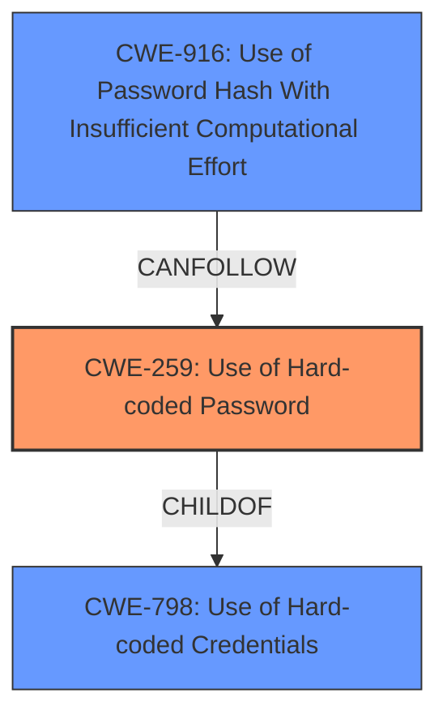

# Analysis for CVE-2022-28376

# Summary
| CWE ID | CWE Name | Confidence | CWE Abstraction Level | CWE Vulnerability Mapping Label | CWE-Vulnerability Mapping Notes |
|---|---|---|---|---|---|
| CWE-259 | Use of Hard-coded Password | 1.0 | Variant | Allowed | Primary CWE |
| CWE-916 | Use of Password Hash With Insufficient Computational Effort | 0.7 | Base | Allowed | Secondary CWE |
| CWE-798 | Use of Hard-coded Credentials | 0.6 | Base | Allowed | Secondary CWE |

## Evidence and Confidence

*   **Confidence Score:** 0.9
*   **Evidence Strength:** HIGH

## Relationship Analysis
The primary weakness is the use of a hard-coded password (CWE-259). This is a variant of the more general weakness, Use of Hard-coded Credentials (CWE-798). The password is "hard-coded" in the sense that it's derived from static device information and a known algorithm. Although a hash is involved, the hashing scheme lacks sufficient computational effort, leading to CWE-916.

## Vulnerability Chain
The vulnerability chain starts with the **weakness** of using a predictable method to generate the password for the engineering account. The password is created by combining the serial number and model of the device, and then hashing that value with SHA256. The hash is then truncated, meaning the computational effort is weak. This leads to the **impact** of unauthorized access to the CPE admin website. The chain is: Predictable Password Generation -> **CWE-259** -> **CWE-916** -> Unauthorized Access.

## Summary of Analysis
The initial assessment identified several potential CWEs related to the use of weak credentials and hard-coded values. After careful review, the most specific and accurate classification is CWE-259, Use of Hard-coded Password, because the vulnerability description and CVE details clearly state that the password for the 'verizon' account is derived in a predictable manner from the device's serial number and model. This predictable derivation makes it effectively a **hard-coded** password, even though it's not literally stored in the firmware.

The supporting evidence for this decision is found in the "CVE Reference Links Content Summary":
"The vulnerability arises from the pre-generation of a static password for the 'verizon' engineering account in both the IDU (InDoor Unit) and ODU (OutDoor Unit) of the Verizon 5G LVSKIHP modem/router."
"The static password is derived from a predictable combination of the device's serial number and model number via a SHA256 hash."

CWE-916, Use of Password Hash With Insufficient Computational Effort, is a secondary consideration. The password uses a SHA256 hash which is then truncated. This truncation weakens the computational effort needed to crack the password.

CWE-798, Use of Hard-coded Credentials, is also a secondary consideration, since CWE-259 is a variant of CWE-798 and is therefore more specific.

CWE-1391, Use of Weak Credentials, was considered but deemed too general. While the derived password can be considered weak, the weakness stems from the specific **hard-coded** nature and insufficient computational effort, which are better captured by CWE-259 and CWE-916. The mapping guidance for CWE-1391 suggests examining its children for a better fit, which led to the selection of CWE-259.

CWE-291, Reliance on IP Address for Authentication, was deemed irrelevant as the authentication **weakness** doesn't rely on IP addresses but rather on a predictable password.

Relevant CWE Information:

# Enhanced Context (25 CWEs)
The following CWEs were identified as potentially relevant to this vulnerability:

## CWE-74: Improper Neutralization of Special Elements in Output Used by a Downstream Component ('Injection')
**Abstraction Level**: Class
**Similarity Score**: 0.80
**Source**: dense

**Description**:
The product constructs all or part of a command, data structure, or record using externally-influenced input from an upstream component, but it does not neutralize or incorrectly neutralizes special elements that could modify how it is parsed or interpreted when it is sent to a downstream component.

**Mapping Guidance**:
- Usage: Discouraged
- Rationale: CWE-74 is high-level and often misused when lower-level weaknesses are more appropriate.

## CWE-41: Improper Resolution of Path Equivalence
**Abstraction Level**: Base
**Similarity Score**: 0.79
**Source**: dense

**Description**:
The product is vulnerable to file system contents disclosure through path equivalence. Path equivalence involves the use of special characters in file and directory names. The associated manipulations are intended to generate multiple names for the same object.

**Mapping Guidance**:
- Usage: Allowed
- Rationale: This CWE entry is at the Base level of abstraction, which is a preferred level of abstraction for mapping to the root causes of vulnerabilities.

## CWE-1391: Use of Weak Credentials
**Abstraction Level**: Class
**Similarity Score**: 0.79
**Source**: dense

**Description**:
The product uses weak credentials (such as a default key or hard-coded password) that can be calculated, derived, reused, or guessed by an attacker.

**Mapping Guidance**:
- Usage: Allowed-with-Review
- Rationale: This CWE entry is a Class and might have Base-level children that would be more appropriate

## CWE-798: Use of Hard-coded Credentials
**Abstraction Level**: Base
**Similarity Score**: 0.78
**Source**: dense

**Description**:
The product contains hard-coded credentials, such as a password or cryptographic key.

**Mapping Guidance**:
- Usage: Allowed
- Rationale: This CWE entry is at the Base level of abstraction, which is a preferred level of abstraction for mapping to the root causes of vulnerabilities.

## CWE-345: Insufficient Verification of Data Authenticity
**Abstraction Level**: Class
**Similarity Score**: 0.78
**Source**: dense

**Description**:
The product does not sufficiently verify the origin or authenticity of data, in a way that causes it to accept invalid data.

**Mapping Guidance**:
- Usage: Discouraged
- Rationale: This CWE entry is a level-1 Class (i.e., a child of a Pillar). It might have lower-level children that would be more appropriate

## CWE-23: Relative Path Traversal
**Abstraction Level**: Base
**Similarity Score**: 0.78
**Source**: dense

**Description**:
The product uses external input to construct a pathname that should be within a restricted directory, but it does not properly neutralize sequences such as ".." that can resolve to a location that is outside of that directory.

**Mapping Guidance**:
- Usage: Allowed
- Rationale: This CWE entry is at the Base level of abstraction, which is a preferred level of abstraction for mapping to the root causes of vulnerabilities.

## CWE-73: External Control of File Name or Path
**Abstraction Level**: Base
**Similarity Score**: 0.78
**Source**: dense

**Description**:
The product allows user input to control or influence paths or file names that are used in filesystem operations.

**Mapping Guidance**:
- Usage: Allowed
- Rationale: This CWE entry is at the Base level of abstraction, which is a preferred level of abstraction for mapping to the root causes of vulnerabilities.

## CWE-138: Improper Neutralization of Special Elements
**Abstraction Level**: Class
**Similarity Score**: 0.77
**Source**: dense

**Description**:
The product receives input from an upstream component, but it does not neutralize or incorrectly neutralizes special elements that could be interpreted as control elements or syntactic markers when they are sent to a downstream component.

**Mapping Guidance**:
- Usage: Discouraged
- Rationale: This CWE entry is a level-1 Class (i.e., a child of a Pillar). It might have lower-level children that would be more appropriate

## CWE-184: Incomplete List of Disallowed Inputs
**Abstraction Level**: Base
**Similarity Score**: 0.77
**Source**: dense

**Description**:
The product implements a protection mechanism that relies on a list of inputs (or properties of inputs) that are not allowed by policy or otherwise require other action to neutralize before additional processing takes place, but the list is incomplete.

**Mapping Guidance**:
- Usage: Allowed