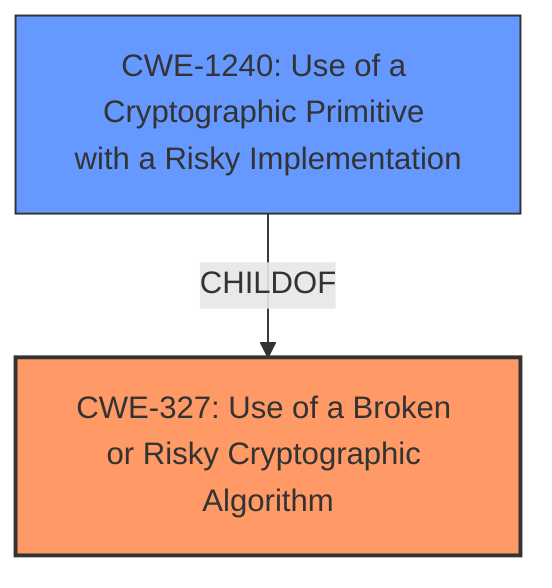

# Enhanced Analysis for CVE-2022-28382

# Summary
| CWE ID | CWE Name | Confidence | CWE Abstraction Level | CWE Vulnerability Mapping Label | CWE-Vulnerability Mapping Notes |
|---|---|---|---|---|---|
| CWE-327 | Use of a Broken or Risky Cryptographic Algorithm | 1.0 | Class | Allowed-with-Review | Primary CWE |
| CWE-1240 | Use of a Cryptographic Primitive with a Risky Implementation | 0.9 | Base | Allowed | Secondary Candidate |

## Evidence and Confidence

*   **Confidence Score:** 0.95
*   **Evidence Strength:** HIGH

## Relationship Analysis
The primary CWE identified is CWE-327, which is a Class-level CWE. The retriever results also point to the more specific, Base-level CWE-1240 as a strong candidate since the vulnerability stems from using a risky implementation of a cryptographic primitive, specifically AES in ECB mode. CWE-1240 is a child of CWE-327, indicating a hierarchical relationship where CWE-1240 is a more specific case of using a broken or risky cryptographic algorithm. The relationship informs the decision to include CWE-1240 as a secondary candidate to capture the specific implementation flaw.



## Vulnerability Chain
The chain of events starts with the **insecure encryption** algorithm used (AES in ECB mode), leading to the potential extraction of information from encrypted data.

ROOT CAUSE: **Insecure encryption** algorithm (AES in ECB mode)
WEAKNESS: Lack of diffusion, allowing repeating byte patterns to be observed.
IMPACT: Potential extraction of information from encrypted data.

## Summary of Analysis
The initial analysis focused on the **root cause** identified in the vulnerability description and the CVE reference links content summary: the use of an **insecure encryption AES mode (Electronic Codebook, aka ECB)**. This aligns directly with CWE-327, "Use of a Broken or Risky Cryptographic Algorithm." The CVE reference also mentions CWE-1240, "Use of a Cryptographic Primitive with a Risky Implementation".

The relationship between CWE-327 and CWE-1240 is that CWE-1240 is a child of CWE-327. Given the specific details of the vulnerability, where the **root cause** is the use of ECB mode with AES, CWE-1240 provides a more precise classification of the weakness. However, since CWE-327 is a class level it will be the primary, and CWE-1240 will be a secondary candidate.

The evidence is strong, as the vulnerability description explicitly mentions the use of ECB mode, and the CVE reference summary confirms this as the root cause.

Relevant CWE Information:

# Enhanced Context (25 CWEs)

## CWE-1240: Use of a Cryptographic Primitive with a Risky Implementation
**Abstraction Level**: Base
**Similarity Score**: 0.82
**Source**: dense

**Description**:
To fulfill the need for a cryptographic primitive, the product implements a cryptographic algorithm using a non-standard, unproven, or disallowed/non-compliant cryptographic implementation.

**Mapping Guidance**:
- Usage: Allowed
- Rationale: This CWE entry is at the Base level of abstraction, which is a preferred level of abstraction for mapping to the root causes of vulnerabilities.

## CWE-327: Use of a Broken or Risky Cryptographic Algorithm
**Abstraction:** Class
**Status:** Draft

### Description
The product uses a broken or risky cryptographic algorithm or protocol.

### Extended Description
Cryptographic algorithms are the methods by which data is scrambled to prevent observation or influence by unauthorized actors. Insecure cryptography can be exploited to expose sensitive information, modify data in unexpected ways, spoof identities of other users or devices, or other impacts.

### Relationships
ChildOf -> CWE-693

### Mapping Guidance
**Usage:** Allowed-with-Review
**Rationale:** This CWE entry is a Class and might have Base-level children that would be more appropriate
**Comments:** Examine children of this entry to see if there is a better fit

**CWE-329: Generation of Predictable IV with CBC Mode** was considered but rejected because the vulnerability is not about the IV, but the ECB mode itself.

**CWE-345: Insufficient Verification of Data Authenticity** was considered but rejected because the vulnerability is not about data authenticity, but about the weakness of the encryption algorithm used.

**CWE-321: Use of Hard-coded Cryptographic Key** was considered but rejected because the vulnerability is not about a hard-coded key, but about the insecure encryption mode.

**CWE-1204: Generation of Weak Initialization Vector (IV)** was considered but rejected because the vulnerability is not about the IV, but the ECB mode itself.


## CWE Relationship Analysis

Current CWEs represent these abstraction levels: .


### Vulnerability Chain Analysis

**Chain starting from CWE-329:**
- 329 (Generation of Predictable IV with CBC Mode) - ROOT


**Chain starting from CWE-327:**
- 327 (Use of a Broken or Risky Cryptographic Algorithm) - ROOT


### CWE Relationship Diagram

```mermaid
graph TD
    classDef primary fill:#f96,stroke:#333,stroke-width:2px
    classDef secondary fill:#69f,stroke:#333
    classDef tertiary fill:#9e9,stroke:#333
```