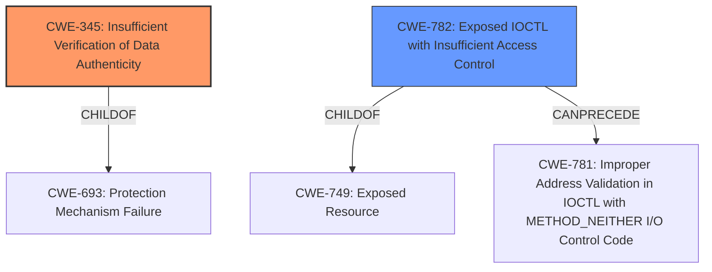

# Analysis Report for CVE-2022-28385

# Vulnerability Analysis Report: CVE-2022-28385

## Description


## Analysis (with Relationship Data)

# Summary
| CWE ID | CWE Name | Confidence | CWE Abstraction Level | CWE Vulnerability Mapping Label | CWE-Vulnerability Mapping Notes |
|---|---|---|---|---|---|
| CWE-345 | Insufficient Verification of Data Authenticity | 0.9 | Class | Primary | Allowed with Review |
| CWE-782 | Exposed IOCTL with Insufficient Access Control | 0.7 | Variant | Secondary | Allowed |

## Evidence and Confidence

*   **Confidence Score:** 0.8
*   **Evidence Strength:** HIGH

## Relationship Analysis
The primary CWE is CWE-345, which is a Class-level CWE. While it is generally discouraged to map to Class-level CWEs, in this case, the description clearly indicates a **missing integrity check**, pointing towards insufficient verification of data authenticity. CWE-345 is a child of CWE-693, which represents improper data handling.

CWE-782 is a Variant level CWE and is included as a secondary weakness because the ISO image can only be accessed using special IOCTL commands. This suggests a potential weakness in how these IOCTLs are exposed and controlled. It is a child of CWE-749, which is a Class level CWE that represents exposed resources, and can precede CWE-781.



## Vulnerability Chain
The vulnerability chain starts with the **missing integrity checks** (CWE-345), leading to the ability to manipulate the ISO-9660 image. The use of IOCTL commands (CWE-782) may expose the attack surface, and allow an attacker to overwrite the image with malicious software. The final impact is arbitrary code execution on the victim's machine.

## Summary of Analysis
The initial analysis and the provided evidence point towards a **missing integrity check** as the root cause of the vulnerability. The CVE description and content summary both support this, with phrases like "**missing integrity checks**" and "Insufficient verification of data authenticity of the emulated CD-ROM drive content." This directly aligns with CWE-345.

The selection of CWE-345 is justified because it accurately represents the core weakness, and the abstraction level is appropriate given the available information. While it is a Class level CWE, the provided evidence does not allow for a more specific mapping.

CWE-782 is included to account for the fact that the ISO image is accessed through IOCTLs, which might be unnecessarily exposed or lack sufficient access control. This is based on the statement "can only be accessed using special IOCTL commands."

Relevant CWE Information:

# Enhanced Context (25 CWEs)
The following CWEs were identified as potentially relevant to this vulnerability:

## CWE-59: Improper Link Resolution Before File Access ('Link Following')
**Abstraction Level**: Base
**Similarity Score**: 0.78
**Source**: dense

**Description**:
The product attempts to access a file based on the filename, but it does not properly prevent that filename from identifying a link or shortcut that resolves to an unintended resource.

**Mapping Guidance**:
- Usage: Allowed
- Rationale: This CWE entry is at the Base level of abstraction, which is a preferred level of abstraction for mapping to the root causes of vulnerabilities.

CWE-59 was considered, but it is not applicable because the vulnerability does not involve symbolic links. The issue is about **missing integrity checks** not about following links to unintended resources.

## CWE-345: Insufficient Verification of Data Authenticity
**Abstraction Level**: Class
**Similarity Score**: 0.77
**Source**: dense

**Description**:
The product does not sufficiently verify the origin or authenticity of data, in a way that causes it to accept invalid data.

**Mapping Guidance**:
- Usage: Discouraged
- Rationale: This CWE entry is a level-1 Class (i.e., a child of a Pillar). It might have lower-level children that would be more appropriate

The vulnerability description explicitly mentions "**missing integrity checks**". CWE-345 directly relates to insufficient verification of data authenticity. The content summary reinforces that root cause, mentioning "Insufficient verification of data authenticity of the emulated CD-ROM drive content." While discouraged because it is a Class level CWE, there is no more specific child that accurately describes the vulnerability, making it an appropriate, although not ideal, selection.

## CWE-782: Exposed IOCTL with Insufficient Access Control
**Abstraction Level**: Variant
**Similarity Score**: 3.88
**Source**: graph

**Description**:
CWE-782: Exposed IOCTL with Insufficient Access Control

**Mapping Guidance**:
- Usage: Allowed
- Rationale: This CWE entry is at the Variant level of abstraction, which is a preferred level of abstraction for mapping to the root causes of vulnerabilities.

CWE-782 is potentially relevant because the vulnerability description mentions that the content of the emulated CD-ROM drive can "only be accessed using special IOCTL commands". This suggests that the IOCTL commands themselves might be exposed without proper access controls.

Therefore:

*   **CWE-345: Insufficient Verification of Data Authenticity** is the primary CWE. The evidence clearly supports this classification due to the **missing integrity checks** and the ability to manipulate the ISO image.
*   **CWE-782: Exposed IOCTL with Insufficient Access Control** is the secondary CWE. The fact that IOCTL commands are required to access the image suggests potential weaknesses in how these commands are exposed and controlled.


## CWE Relationship Analysis

Current CWEs represent these abstraction levels: .


### Vulnerability Chain Analysis

**Chain starting from CWE-693:**
- 693 (Protection Mechanism Failure) - ROOT


**Chain starting from CWE-749:**
- 749 (Exposed Dangerous Method or Function) - ROOT


### CWE Relationship Diagram

```mermaid
graph TD
    classDef primary fill:#f96,stroke:#333,stroke-width:2px
    classDef secondary fill:#69f,stroke:#333
    classDef tertiary fill:#9e9,stroke:#333
```


*Report generated on 2025-03-31 07:12:26*
