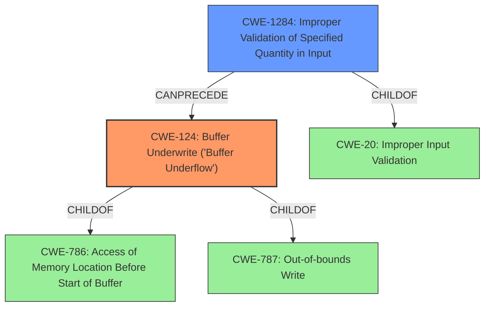

# Raw Analyzer Response for CVE-2022-2845

# Summary
| CWE ID | CWE Name | Confidence | CWE Abstraction Level | CWE Vulnerability Mapping Label | CWE-Vulnerability Mapping Notes |
|---|---|---|---|---|---|
| CWE-124 | Buffer Underwrite ('Buffer Underflow') | 0.9 | Base | Primary | Allowed |
| CWE-1284 | Improper Validation of Specified Quantity in Input | 0.7 | Base | Secondary | Allowed |

## Evidence and Confidence

*   **Confidence Score:** 0.8
*   **Evidence Strength:** HIGH

## Relationship Analysis
The primary relationship influencing the decision is the ChildOf relationship between CWE-124 and CWE-786 (Access of Memory Location Before Start of Buffer), and CWE-787 (Out-of-bounds Write). CWE-124 is a specific type of out-of-bounds write where the write occurs before the beginning of the buffer. The graph also shows that CWE-1284 can PRECEDE CWE-789 (resource allocation) or can lead to other buffer issues.

## Vulnerability Chain
The vulnerability chain starts with **Improper Validation of Specified Quantity in Input** (CWE-1284). If a negative column value is not validated, it leads to **Buffer Underwrite ('Buffer Underflow')** (CWE-124), where the write operation occurs before the beginning of the allocated buffer.

## Summary of Analysis
The initial vulnerability description mentions **Improper Validation of Specified Quantity in Input**, which aligns with CWE-1284. However, the "CVE Reference Links Content Summary" provides more specific details about the root cause, stating that "The vulnerability is a buffer under-read that occurs when displaying the `$` character... when the column value being checked is negative, leading to reading before the start of the line." The fix involves checking for negative column numbers. This indicates a **Buffer Underwrite ('Buffer Underflow')** (CWE-124) which is the more specific and accurate root cause.

The evidence from the CVE Reference Links Content Summary is:
*   "The vulnerability is a buffer under-read that occurs when displaying the `$` character... when the column value being checked is negative, leading to reading before the start of the line."
*   "The fix in commit `e98c88c` includes a check to ensure the column number is not negative: `colnr_T col = col_arg < 0 ? 0 : col_arg;`"

CWE-124 is chosen as the primary CWE because it precisely describes the **buffer underflow** due to the negative column value. CWE-1284 is a contributing factor because the **improper validation** of the input quantity (column value) is what leads to the **buffer underflow**.

Relevant CWE Information:

# Enhanced Context (25 CWEs)
The following CWEs were identified as potentially relevant to this vulnerability:

## CWE-1289: Improper Validation of Unsafe Equivalence in Input
**Abstraction Level**: Base
**Similarity Score**: 0.76

**Description**:
The product receives an input value that is used as a resource identifier or other type of reference, but it does not validate or incorrectly validates that the input is equivalent to a potentially-unsafe value.

## CWE-73: External Control of File Name or Path
**Abstraction Level**: Base
**Similarity Score**: 0.75

**Description**:
The product allows user input to control or influence paths or file names that are used in filesystem operations.

## CWE-668: Exposure of Resource to Wrong Sphere
**Abstraction Level**: Class
**Similarity Score**: 0.75

**Description**:
The product exposes a resource to the wrong control sphere, providing unintended actors with inappropriate access to the resource.

## CWE-1173: Improper Use of Validation Framework
**Abstraction Level**: Base
**Similarity Score**: 0.74

**Description**:
The product does not use, or incorrectly uses, an input validation framework that is provided by the source language or an independent library.

## CWE-131: Incorrect Calculation of Buffer Size
**Abstraction Level**: Base
**Similarity Score**: 0.74

**Description**:
The product does not correctly calculate the size to be used when allocating a buffer, which could lead to a buffer overflow.

## CWE-41: Improper Resolution of Path Equivalence
**Abstraction Level**: Base
**Similarity Score**: 0.74

**Description**:
The product is vulnerable to file system contents disclosure through path equivalence. Path equivalence involves the use of special characters in file and directory names. The associated manipulations are intended to generate multiple names for the same object.

## CWE-691: Insufficient Control Flow Management
**Abstraction Level**: Pillar
**Similarity Score**: 0.74

**Description**:
The code does not sufficiently manage its control flow during execution, creating conditions in which the control flow can be modified in unexpected ways.

## CWE-184: Incomplete List of Disallowed Inputs
**Abstraction Level**: Base
**Similarity Score**: 0.74

**Description**:
The product implements a protection mechanism that relies on a list of inputs (or properties of inputs) that are not allowed by policy or otherwise require other action to neutralize before additional processing takes place, but the list is incomplete.

## CWE-703: Improper Check or Handling of Exceptional Conditions
**Abstraction Level**: Pillar
**Similarity Score**: 0.74

**Description**:
The product does not properly anticipate or handle exceptional conditions that rarely occur during normal operation of the product.

## CWE-129: Improper Validation of Array Index
**Abstraction Level**: Variant
**Similarity Score**: 0.74

**Description**:
The product uses untrusted input when calculating or using an array index, but the product does not validate or incorrectly validates the index to ensure the index references a valid position within the array.

## CWE-1284: Improper Validation of Specified Quantity in Input
**Abstraction Level**: Base
**Similarity Score**: 6070.57

**Description**:
The product receives input that is expected to specify a quantity (such as size or length), but it does not validate or incorrectly validates that the quantity has the required properties.

## CWE-124: Buffer Underwrite ('Buffer Underflow')
**Abstraction Level**: Base
**Similarity Score**: 6045.36

**Description**:
The product writes to a buffer using an index or pointer that references a memory location prior to the beginning of the buffer.

## CWE-125: Out-of-bounds Read
**Abstraction Level**: Base
**Similarity Score**: 6034.49

**Description**:
The product reads data past the end, or before the beginning, of the intended buffer.

## CWE-190: Integer Overflow or Wraparound
**Abstraction Level**: Base
**Similarity Score**: 5962.83

**Description**:
The product performs a calculation that can
         produce an integer overflow or wraparound when the logic
         assumes that the resulting value will always be larger than
         the original value. This occurs when an integer value is
         incremented to a value that is too large to store in the
         associated representation. When this occurs, the value may
         become a very small or negative number.

## CWE-193: Off-by-one Error
**Abstraction Level**: Base
**Similarity Score**: 5757.63

**Description**:
A product calculates or uses an incorrect maximum or minimum value that is 1 more, or 1 less, than the correct value.

## CWE-120: Buffer Copy without Checking Size of Input ('Classic Buffer Overflow')
**Abstraction Level**: base
**Similarity Score**: 4.82

**Description**:
CWE-120: Buffer Copy without Checking Size of Input ('Classic Buffer Overflow')

## CWE-1284: Improper Validation of Specified Quantity in Input
**Abstraction Level**: base
**Similarity Score**: 4.33

**Description**:
CWE-1