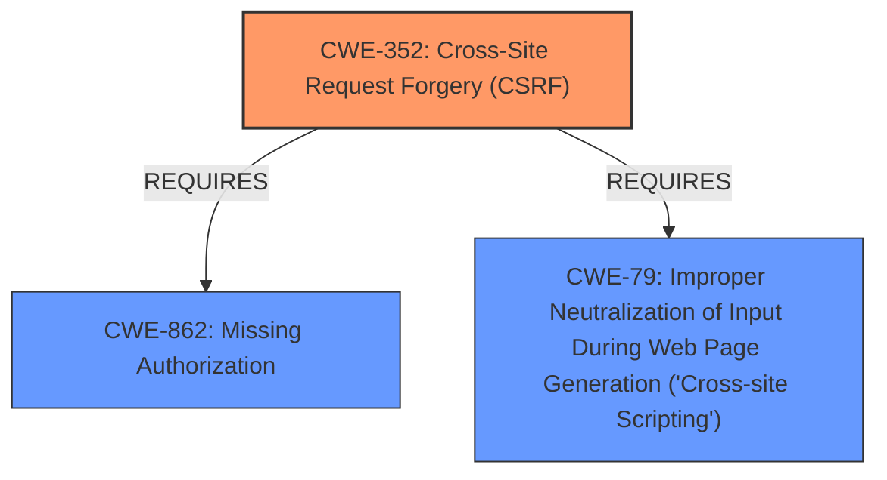

# Analysis Report for CVE-2022-2846

# Vulnerability Analysis Report: CVE-2022-2846

## Description


## Analysis (with Relationship Data)

# Summary
| CWE ID | CWE Name | Confidence | CWE Abstraction Level | CWE Vulnerability Mapping Label | CWE-Vulnerability Mapping Notes |
|---|---|---|---|---|---|
| CWE-352 | Cross-Site Request Forgery (CSRF) | 0.9 | Compound | Allowed | Primary CWE. The application lacks CSRF checks, allowing attackers to forge requests on behalf of users. |
| CWE-862 | Missing Authorization | 0.9 | Class | Allowed-with-Review | Secondary CWE. Unauthenticated users can create arbitrary events due to the lack of authorization checks. |
| CWE-79 | Improper Neutralization of Input During Web Page Generation ('Cross-site Scripting') | 0.9 | Base | Allowed | Secondary CWE. The plugin fails to sanitize and properly escape input in event fields, allowing attackers to inject malicious JavaScript code. |

## Evidence and Confidence

*   **Confidence Score:** 0.9
*   **Evidence Strength:** HIGH

## Relationship Analysis
The primary CWE is CWE-352, representing the lack of CSRF protection. CWE-862 (Missing Authorization) and CWE-79 (Improper Neutralization of Input During Web Page Generation) are secondary CWEs, contributing to the overall vulnerability. CWE-352 requires other weaknesses to be present, such as **missing authorization** and **improper neutralization** which are represented by CWE-862 and CWE-79 respectively. All three are related to web application security.



## Vulnerability Chain
The vulnerability chain starts with **missing authorization** (CWE-862) and lack of CSRF protection (CWE-352), allowing unauthenticated users to create arbitrary events. These events can contain malicious JavaScript payloads due to **improper neutralization** (CWE-79), leading to stored XSS.

## Summary of Analysis
The analysis identifies three CWEs that accurately represent the vulnerability in the Calendar Event Multi View WordPress plugin. The vulnerability description clearly states that the plugin is **lacking authorisation and CSRF checks as well as escaping**. The CVE Reference Links Content Summary confirms the **missing authorization**, the lack of CSRF protection, and the **improper neutralization** of input.

CWE-352 is selected as the primary CWE because the vulnerability allows attackers to forge requests on behalf of users due to the absence of CSRF checks. This aligns directly with the description of CWE-352, which states that the web application does not sufficiently verify whether a request was intentionally provided by the user.

CWE-862 is selected as a secondary CWE because the vulnerability allows unauthenticated users to create arbitrary events due to the **missing authorization** checks. This aligns with the description of CWE-862, which states that the product does not perform an authorization check when an actor attempts to access a resource or perform an action.

CWE-79 is selected as a secondary CWE because the plugin fails to sanitize and properly escape input in event fields, allowing attackers to inject malicious JavaScript code. This aligns with the description of CWE-79, which states that the product does not neutralize or incorrectly neutralizes user-controllable input before it is placed in output that is used as a web page.

The selected CWEs are at the appropriate level of specificity, with CWE-352 being a Compound weakness and CWE-862 and CWE-79 being Class and Base weaknesses, respectively. The selection is based on the evidence provided in the vulnerability description and the CVE Reference Links Content Summary.

Other CWEs considered but not used:

*   CWE-116 (Improper Encoding or Escaping of Output): While related to CWE-79, it is a class-level CWE, and CWE-79 is a more specific base-level CWE that accurately describes the vulnerability.
*   CWE-863 (Incorrect Authorization): While related to authorization, CWE-862 (Missing Authorization) is more precise because it specifically describes the absence of authorization checks, rather than an incorrect implementation.
*   CWE-434 (Unrestricted Upload of File with Dangerous Type): Not applicable as the vulnerability doesn't involve file uploads.


## CWE Relationship Analysis

Current CWEs represent these abstraction levels: .


### Vulnerability Chain Analysis

**Chain starting from CWE-862:**
- 862 (Missing Authorization) - ROOT


**Chain starting from CWE-434:**
- 434 (Unrestricted Upload of File with Dangerous Type) - ROOT


### CWE Relationship Diagram

```mermaid
graph TD
    classDef primary fill:#f96,stroke:#333,stroke-width:2px
    classDef secondary fill:#69f,stroke:#333
    classDef tertiary fill:#9e9,stroke:#333
```


*Report generated on 2025-03-31 01:18:56*
