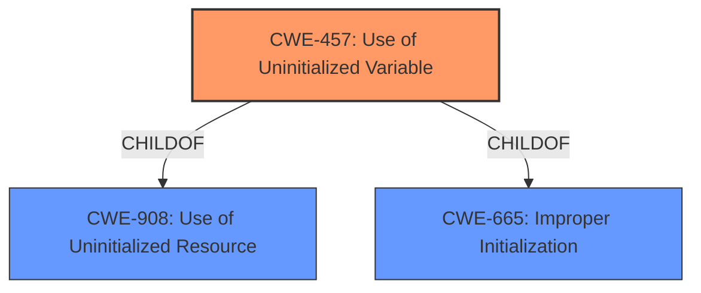

# Enhanced Analysis for CVE-2022-28488

# Summary
| CWE ID | CWE Name | Confidence | CWE Abstraction Level | CWE Vulnerability Mapping Label | CWE-Vulnerability Mapping Notes |
|---|---|---|---|---|---|
| CWE-457 | Use of Uninitialized Variable | 1.0 | Variant | Allowed | Primary CWE |

## Evidence and Confidence

*   **Confidence Score:** 1.0
*   **Evidence Strength:** HIGH

## Relationship Analysis
The primary CWE selected is CWE-457, which is a Variant-level CWE. This choice aligns with the explicit mention of "**Use of Uninitialized Variable**" in both the vulnerability description and the CVE Reference Links Content Summary, making it a direct and specific match. CWE-457 is a child of CWE-908 and CWE-665, but these parent classes are less specific than the direct root cause.



## Vulnerability Chain
The vulnerability chain involves a single step: the direct **use of an uninitialized variable**.

## Summary of Analysis
The analysis is based directly on the vulnerability description and the CVE Reference Links Content Summary, which explicitly mentions "**Use of Uninitialized Variable**".

> The function wav_format_write in libwav.c in libwav through 2017-04-20 has an **Use of Uninitialized Variable** vulnerability.

> The root cause of the vulnerability is the **use of an uninitialized variable** `format` within the `wav_format_write` function in `libwav.c`. This variable of type `wav_format` is directly written to a file stream using `fwrite` without being initialized, resulting in the potential exposure of uninitialized memory.

The relationship graph was considered, but the direct match to CWE-457 made higher-level (parent) CWEs unnecessary. CWE-457 is at the optimal level of specificity as a Variant-level CWE, directly addressing the root cause.

Relevant CWE Information:

# Enhanced Context (25 CWEs)
The following CWEs were identified as potentially relevant to this vulnerability:

## CWE-457: Use of Uninitialized Variable
**Abstraction Level**: Variant
**Similarity Score**: 0.80
**Source**: dense

**Description**:
The code uses a variable that has not been initialized, leading to unpredictable or unintended results.

**Mapping Guidance**:
- Usage: Allowed
- Rationale: This CWE entry is at the Variant level of abstraction, which is a preferred level of abstraction for mapping to the root causes of vulnerabilities.
INSERT the assigned CWEs in a table format with the following columns: CWE ID, CWE Name, Confidence, CWE Abstraction Level, CWE Vulnerability Mapping Label, CWE-Vulnerability Mapping Notes
  - The Primary CWE should be first and noted as the Primary CWEs
  - The secondary candidate CWEs should be next and noted as secondary candidates.
  - The confidence is a confidence score 0 to 1 to rate your confidence in your assessment for that CWE.
  - The CWE Abstraction Level as one of these values: Base, Variant, Pillar, Class, Compound
  - The Mapping Notes Usage as one of these values: Allowed, Allowed-with-Review, Prohibited, Discouraged


## CWE Relationship Analysis

Current CWEs represent these abstraction levels: .


### Vulnerability Chain Analysis

**Chain starting from CWE-908:**
- 908 (Use of Uninitialized Resource) - ROOT


**Chain starting from CWE-457:**
- 457 (Use of Uninitialized Variable) - ROOT


### CWE Relationship Diagram

```mermaid
graph TD
    classDef primary fill:#f96,stroke:#333,stroke-width:2px
    classDef secondary fill:#69f,stroke:#333
    classDef tertiary fill:#9e9,stroke:#333
```