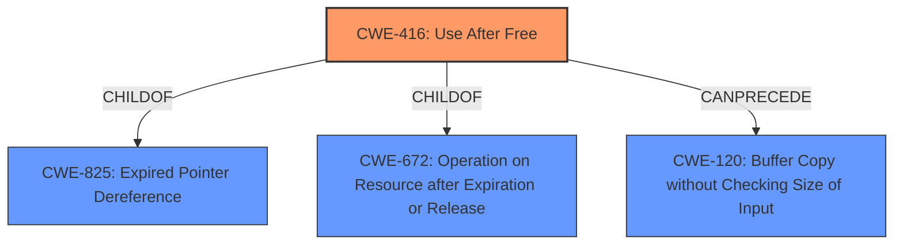

# Raw Analyzer Response for CVE-2022-2854

# Summary
| CWE ID | CWE Name | Confidence | CWE Abstraction Level | CWE Vulnerability Mapping Label | CWE-Vulnerability Mapping Notes |
|---|---|---|---|---|---|
| CWE-416 | Use After Free | 1.0 | Variant | Primary | Allowed |

## Evidence and Confidence

*   **Confidence Score:** 1.0
*   **Evidence Strength:** HIGH

## Relationship Analysis
The primary CWE identified is CWE-416 (Use After Free), which is a variant. It can be part of a chain with CWE-120 (Buffer Copy without Checking Size of Input). CWE-416 is a child of CWE-825 (Expired Pointer Dereference) and CWE-672 (Operation on Resource after Expiration or Release). These relationships show a clear path from resource expiration to potential memory corruption.

## Vulnerability Chain
The vulnerability chain starts with a **use after free** condition leading to heap corruption. This means memory is accessed after it has been freed, which can lead to unpredictable behavior, including crashes or arbitrary code execution.
  - Root Cause: **Use After Free**
  - Impact: Heap corruption

## Summary of Analysis
The vulnerability is a **use after free** in SwiftShader in Google Chrome. The root cause and weakness are explicitly identified as **use after free**. The impact is heap corruption, which could allow a remote attacker to potentially exploit the system via a crafted HTML page.

The primary CWE match from similar CVE descriptions is CWE-416, and it also has the highest count. The retriever results also list CWE-416 as a strong candidate.

The evidence is strong because the description explicitly states "**use after free**" as the vulnerability. CWE-416 (Use After Free) is at the Variant level of abstraction, which is a preferred level. The mapping guidance for CWE-416 allows it.

CWE-787 (Out-of-bounds Write) was considered but not selected because the root cause is **use after free**, not an out-of-bounds write. Similarly, CWE-362 (Concurrent Execution using Shared Resource with Improper Synchronization ('Race Condition')) was also considered because **use after free** conditions can sometimes arise from race conditions, but there is no evidence of concurrency issues in the description.