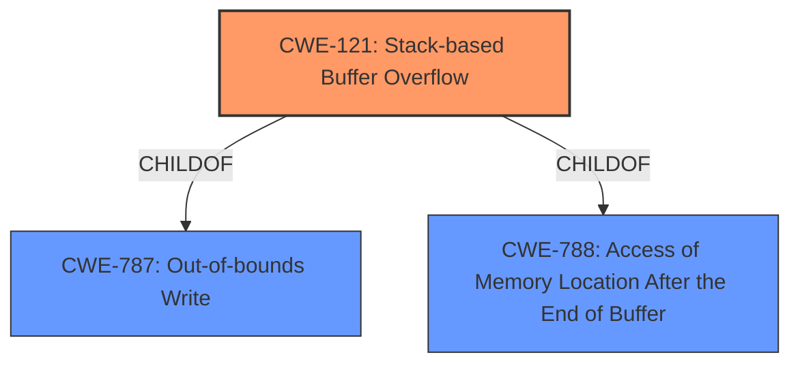

# Analysis Report for CVE-2022-28556

# Vulnerability Analysis Report: CVE-2022-28556

## Description


## Analysis (with Relationship Data)

# Summary
| CWE ID | CWE Name | Confidence | CWE Abstraction Level | CWE Vulnerability Mapping Label | CWE-Vulnerability Mapping Notes |
|---|---|---|---|---|---|
| CWE-121 | Stack-based Buffer Overflow | 1.0 | Variant | Allowed | Primary CWE |

## Evidence and Confidence

*   **Confidence Score:** 1.0
*   **Evidence Strength:** HIGH

## Relationship Analysis
The primary relationship that influenced my decision was the ChildOf relationship between CWE-121 and CWE-787 (which represents buffer overflows in general) and CWE-788. CWE-121 is a variant that is specific to stack-based overflows. This specificity makes it the most appropriate choice given the vulnerability description.



## Vulnerability Chain
The chain of events is as follows:
1.  The application receives post data via the `/goform/setpptpservercfg` interface.
2.  The `startip` and `endip` parameters within this data are copied to a stack buffer using the `sanf` function.
3.  Due to a lack of size validation, this copy operation results in a **stack overflow** (CWE-121) when the size of the input exceeds the buffer's capacity.

## Summary of Analysis
The vulnerability description clearly states that a **stack overflow** occurs due to copying the `startip` and `endip` parameters to the stack without proper size checks. The phrase "resulting in **stack overflow**" provides direct evidence for this classification.

The Retriever Results also list CWE-121 as the top match with a score of 1.0. This high score, combined with the explicit description of the **stack overflow**, confirms that CWE-121 is the most appropriate choice.

The other CWEs were considered, but were not as direct a match:
*   CWE-190 (Integer Overflow or Wraparound): While integer overflows can sometimes lead to buffer overflows, there's no evidence to suggest that an integer overflow is involved in this specific vulnerability.
*   CWE-120 (Buffer Copy without Checking Size of Input): This CWE is broader and applies to buffer overflows in general. CWE-121 is a more specific variant that applies to **stack-based buffer overflows**, which is the exact type of vulnerability described.
*   CWE-78 (Improper Neutralization of Special Elements used in an OS Command): This CWE relates to command injection, and there is no evidence of command injection in this vulnerability description.

Relevant CWE Information:

# Enhanced Context (25 CWEs)

## CWE-121: Stack-based Buffer Overflow
**Abstraction:** Variant
**Status:** Draft

### Description
A stack-based buffer overflow condition is a condition where the buffer being overwritten is allocated on the stack (i.e., is a local variable or, rarely, a parameter to a function).

### Extended Description
Not provided

### Alternative Terms
Stack Overflow: "Stack Overflow" is often used to mean the same thing as stack-based buffer overflow, however it is also used on occasion to mean stack exhaustion, usually a result from an excessively recursive function call. Due to the ambiguity of the term, use of stack overflow to describe either circumstance is discouraged.

### Relationships
ChildOf -> CWE-788
ChildOf -> CWE-787

### Mapping Guidance
**Usage:** Allowed
**Rationale:** This CWE entry is at the Variant level of abstraction, which is a preferred level of abstraction for mapping to the root causes of vulnerabilities.
**Comments:** Carefully read both the name and description to ensure that this mapping is an appropriate fit. Do not try to 'force' a mapping to a lower-level Base/Variant simply to comply with this preferred level of abstraction.
**Reasons:**
- Acceptable-Use

### Additional Notes
**[Other]** Stack-based buffer overflows can instantiate in return address overwrites, stack pointer overwrites or frame pointer overwrites. They can also be considered function pointer overwrites, array indexer overwrites or write-what-where condition, etc.

### Observed Examples
- **CVE-2021-35395:** Stack-based buffer overflows in SFK for wifi chipset used for IoT/embedded devices, as exploited in the wild per CISA KEV.


## CWE Relationship Analysis

Current CWEs represent these abstraction levels: .


### Vulnerability Chain Analysis

**Chain starting from CWE-190:**
- 190 (Integer Overflow or Wraparound) - ROOT


**Chain starting from CWE-121:**
- 121 (Stack-based Buffer Overflow) - ROOT


### CWE Relationship Diagram

```mermaid
graph TD
    classDef primary fill:#f96,stroke:#333,stroke-width:2px
    classDef secondary fill:#69f,stroke:#333
    classDef tertiary fill:#9e9,stroke:#333
```


*Report generated on 2025-03-31 00:40:36*
