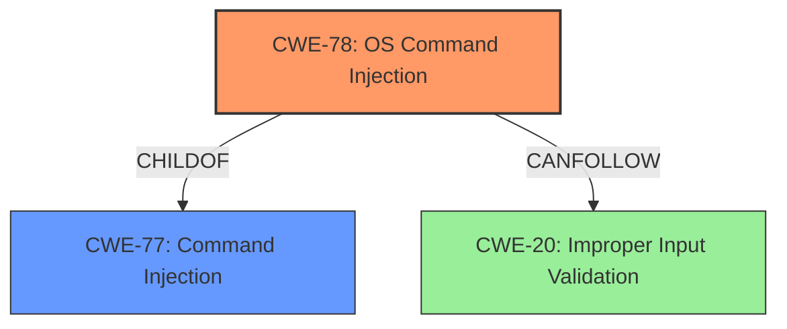

# Analysis for CVE-2022-28557

# Summary
| CWE ID | CWE Name | Confidence | CWE Abstraction Level | CWE Vulnerability Mapping Label | CWE-Vulnerability Mapping Notes |
|---|---|---|---|---|---|
| CWE-78 | Improper Neutralization of Special Elements used in an OS Command ('OS Command Injection') | 1.0 | Base | Allowed | Primary CWE - Matches the root cause of command injection. |
| CWE-77 | Improper Neutralization of Special Elements used in a Command ('Command Injection') | 0.7 | Class | Allowed-with-Review | Secondary CWE - Considered because CWE-78 is a child of CWE-77, but CWE-78 is more specific. |
| CWE-20 | Improper Input Validation | 0.5 | Class | Discouraged | Secondary CWE - Considered as a high-level weakness due to lack of input validation, but not specific enough. |

## Evidence and Confidence

*   **Confidence Score:** 1.0
*   **Evidence Strength:** HIGH

## Relationship Analysis
The primary relationship influencing the decision is the parent-child relationship between CWE-77 and CWE-78. CWE-78 is a "ChildOf" CWE-77, meaning it's a more specific type of command injection. Since the description explicitly mentions "OS command injection" and the vulnerability involves injecting OS commands, CWE-78 is the more appropriate choice. CWE-20 was considered due to the **lack of proper input sanitization**, which is a form of improper input validation. However, it's too high-level and doesn't directly describe the command injection.

## Vulnerability Chain
The vulnerability chain starts with **lack of input sanitization** at the `/goform/setsambacfg` interface, leading to the **command injection** vulnerability and ultimately resulting in arbitrary command execution.

`Improper Input Validation` -> `Command Injection` -> `Arbitrary Command Execution`

## Summary of Analysis
The initial assessment focused on identifying the root cause of the vulnerability, which is the ability to inject and execute arbitrary OS commands. The vulnerability description clearly states "**command injection** vulnerability at the /goform/setsambacfg interface". The CVE Reference Links Content Summary further supports this, stating: "**Root Cause:** Command injection vulnerability in the `/goform/setsambacfg` interface" and "**Weaknesses**: The web interface does not properly sanitize input, allowing an attacker to inject system commands through the POST data." This evidence strongly points towards CWE-78 as the most appropriate classification.

The retriever results also support this, with CWE-77 and CWE-78 being the top candidates. While CWE-77 (Improper Neutralization of Special Elements used in a Command) is a valid consideration, CWE-78 (Improper Neutralization of Special Elements used in an OS Command) is more specific and accurately reflects the vulnerability's nature.

CWE-20 (Improper Input Validation) was considered but deemed too general. While the **lack of input sanitization** contributes to the vulnerability, it doesn't fully capture the specific weakness of command injection.

Therefore, based on the vulnerability description, CVE Reference Links Content Summary, retriever results, and relationship analysis, CWE-78 is the most appropriate and specific classification for this vulnerability.

# Relevant CWE Information:

## CWE-77: Improper Neutralization of Special Elements used in a Command ('Command Injection')
**Abstraction:** Class
The product constructs all or part of a command using externally-influenced input from an upstream component, but it does not neutralize or incorrectly neutralizes special elements that could modify the intended command when it is sent to a downstream component. This CWE was considered but not selected as the primary CWE, because it's less specific than CWE-78. It is being considered as a secondary CWE because CWE-78 is a child of CWE-77.

## CWE-78: Improper Neutralization of Special Elements used in an OS Command ('OS Command Injection')
**Abstraction:** Base
The product constructs all or part of an OS command using externally-influenced input from an upstream component, but it does not neutralize or incorrectly neutralizes special elements that could modify the intended OS command when it is sent to a downstream component. This is the selected CWE because the vulnerability allows injection of OS commands.

## CWE-20: Improper Input Validation
**Abstraction:** Class
The product receives input or data, but it does not validate or incorrectly validates that the input has the properties that are required to process the data safely and correctly. This CWE was considered because the **lack of input sanitization** is a contributing factor, but it's too high-level and doesn't specifically address command injection.