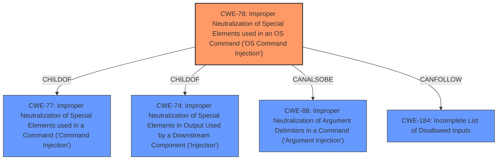

# Raw Analyzer Response for CVE-2022-28577

# Summary
| CWE ID | CWE Name | Confidence | CWE Abstraction Level | CWE Vulnerability Mapping Label | CWE-Vulnerability Mapping Notes |
|---|---|---|---|---|---|
| CWE-78 | Improper Neutralization of Special Elements used in an OS Command ('OS Command Injection') | 1.0 | Base | Allowed | Primary CWE |

## Evidence and Confidence

*   **Confidence Score:** 1.0
*   **Evidence Strength:** HIGH

## Relationship Analysis
The primary relationship that influenced the decision was the ChildOf relationship where CWE-78 is a child of CWE-77. This helped in selecting the more specific CWE-78 over CWE-77. The graph also shows that CWE-78 can be followed by CWE-184 which indicates a possible chain of vulnerabilities where an incomplete list of disallowed inputs could lead to OS command injection.

## Vulnerability Chain
The vulnerability chain starts with the **command injection** weakness in the `delParentalRules` interface. This allows an attacker to execute arbitrary commands via a crafted payload.
  - Root Cause: **command injection** due to **improper neutralization**
  - Impact: Arbitrary command execution

## Summary of Analysis
The analysis is based on the provided vulnerability description and the associated CWE information. The description clearly states a **command injection** vulnerability, which aligns with CWE-78. The primary CWE match from similar CVE descriptions is also CWE-78, which supports this assessment.

The vulnerability description explicitly mentions a **command injection** vulnerability in the `delParentalRules` interface, allowing an attacker to execute arbitrary commands. This perfectly matches the description of CWE-78, which involves constructing an OS command using externally influenced input without proper neutralization of special elements. The graph relationships confirm that CWE-78 is a specific type of command injection, making it more appropriate than the more general CWE-77.

The selection of CWE-78 is at the optimal level of specificity because it accurately represents the vulnerability as an OS command injection, distinguishing it from other types of command injection. The evidence directly supports this classification, and the relationship analysis reinforces the decision. The retriever results also list CWE-78 as a highly relevant candidate, further validating the choice.