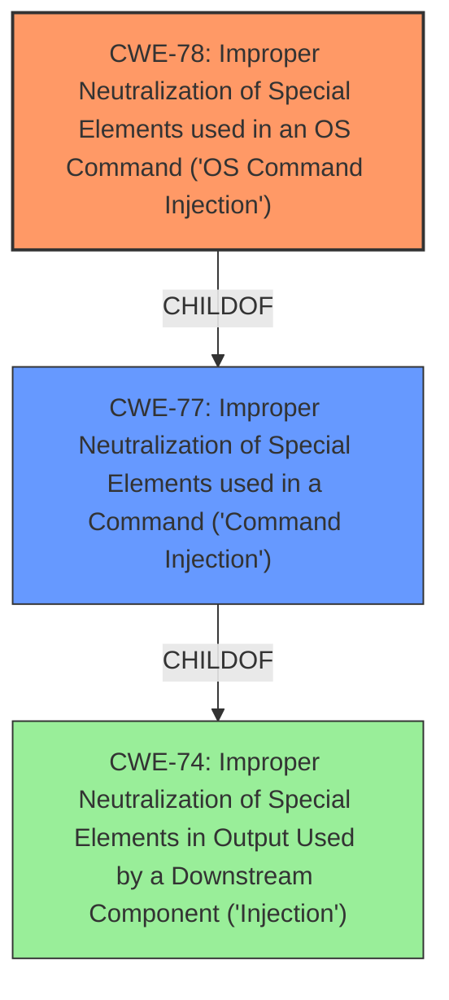

# Raw Analyzer Response for CVE-2022-28579

# Summary
| CWE ID | CWE Name | Confidence | CWE Abstraction Level | CWE Vulnerability Mapping Label | CWE-Vulnerability Mapping Notes |
|---|---|---|---|---|---|
| CWE-78 | Improper Neutralization of Special Elements used in an OS Command ('OS Command Injection') | 1.0 | Base | Allowed | Primary CWE. The vulnerability description clearly states a **command injection** vulnerability, and the CWE description aligns perfectly with the details provided. |
| CWE-77 | Improper Neutralization of Special Elements used in a Command ('Command Injection') | 0.7 | Class | Allowed-with-Review | Secondary CWE. Considered as a more general form of CWE-78, but the provided evidence specifies OS commands, making CWE-78 a more precise fit. |

## Evidence and Confidence

*   **Confidence Score:** 1.0
*   **Evidence Strength:** HIGH

## Relationship Analysis
The primary relationship impacting the decision is the ChildOf relationship between CWE-78 and CWE-77. CWE-78 is a specific type of CWE-77, focusing on OS commands. Given that the vulnerability description explicitly mentions **command injection** leading to the execution of arbitrary commands, and explicitly mentions the router, mapping to the more specific CWE-78 is justified.

## Vulnerability Chain
The vulnerability chain starts with the **improper neutralization** of special elements, leading to **OS Command Injection**, which allows an attacker to execute arbitrary commands.

## Summary of Analysis
The analysis strongly supports the selection of CWE-78 as the primary CWE. The vulnerability description explicitly mentions **command injection** in the "setParentalRules interface" of a router, which aligns directly with the description of CWE-78. While CWE-77 is a parent CWE and could be considered, the specificity of OS commands in the vulnerability makes CWE-78 the more appropriate choice.

The decision is based on the provided evidence: "It is found that there is a **command injection** vulnerability in the setParentalRules interface in TOTOlink A7100RU (v7.4cu.2313_b20191024) router, which allows an attacker to execute arbitrary commands through a carefully constructed payload."

The hierarchical relationship between CWE-78 and CWE-77 influenced the selection, favoring the more specific CWE-78 due to the context of OS commands.

The selected CWE is at the optimal level of specificity, as it accurately captures the nature of the vulnerability without being overly generic (like CWE-77) or delving into implementation-specific details.

Relevant CWE Information:

# Enhanced Context (25 CWEs)

## CWE-77: Improper Neutralization of Special Elements used in a Command ('Command Injection')
**Abstraction Level**: Class
**Similarity Score**: 1.0
**Source**: alternate_terms

**Description**:
The product constructs all or part of a command using externally-influenced input from an upstream component, but it does not neutralize or incorrectly neutralizes special elements that could modify the intended command when it is sent to a downstream component.

**Mapping Guidance**:
- Usage: Allowed-with-Review
- Rationale: CWE-77 is often misused when OS command injection (CWE-78) was intended instead [REF-1287].
- Comments: Ensure that the analysis focuses on the root-cause error that allows the execution of commands, as there are many weaknesses that can lead to this consequence. See Terminology Notes. If the weakness involves a command language besides OS shell invocation, then CWE-77 could be used.

## CWE-78: Improper Neutralization of Special Elements used in an OS Command ('OS Command Injection')
**Abstraction Level**: Base
**Similarity Score**: 0.7
**Source**: alternate_terms

**Description**:
The product constructs all or part of an OS command using externally-influenced input from an upstream component, but it does not neutralize or incorrectly neutralizes special elements that could modify the intended OS command when it is sent to a downstream component.

**Mapping Guidance**:
- Usage: Allowed
- Rationale: This CWE entry is at the Base level of abstraction, which is a preferred level of abstraction for mapping to the root causes of vulnerabilities.
- Comments: Carefully read both the name and description to ensure that this mapping is an appropriate fit. Do not try to 'force' a mapping to a lower-level Base/Variant simply to comply with this preferred level of abstraction.

## CWE-94: Improper Control of Generation of Code ('Code Injection')
**Abstraction Level**: Base
**Similarity Score**: 0.217
**Source**: sparse

**Description**:
The product constructs all or part of a code segment using externally-influenced input from an upstream component, but it does not neutralize or incorrectly neutralizes special elements that could modify the syntax or behavior of the intended code segment.

**Mapping Guidance**:
- Usage: Allowed-with-Review
- Rationale: This entry is frequently misused for vulnerabilities with a technical impact of "code execution," which does not by itself indicate a root cause weakness, since dozens of weaknesses can enable code execution.
- Comments: This weakness only applies when the product's functionality intentionally constructs all or part of a code segment. It could be that executing code could be the result of other weaknesses that do not involve the construction of code segments.

CWE-94 was considered, but it is less specific than CWE-78. CWE-94 refers to code injection in general, whereas CWE-78 specifically addresses OS command injection. Since the vulnerability description explicitly mentions **command injection** and the ability to execute arbitrary commands, CWE-78 is a more accurate fit.