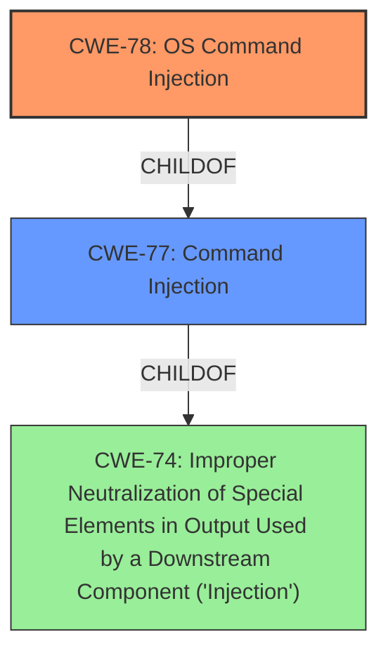

# Analysis for CVE-2022-28580

# Summary
| CWE ID | CWE Name | Confidence | CWE Abstraction Level | CWE Vulnerability Mapping Label | CWE-Vulnerability Mapping Notes |
|---|---|---|---|---|---|
| CWE-78 | Improper Neutralization of Special Elements used in an OS Command ('OS Command Injection') | 1.0 | Base | Allowed | Primary CWE |
| CWE-77 | Improper Neutralization of Special Elements used in a Command ('Command Injection') | 0.7 | Class | Allowed-with-Review | Secondary Candidate |

## Evidence and Confidence

*   **Confidence Score:** 0.9
*   **Evidence Strength:** HIGH

## Relationship Analysis
The primary relationship influencing the decision is the ChildOf relationship, where CWE-78 is a child of CWE-77. This means CWE-78 is a more specific case of command injection, specifically related to OS commands. Since the vulnerability description explicitly mentions command execution within the operating system context, CWE-78 is the more precise choice. The abstraction levels also support this, as CWE-78 is a Base level CWE, while CWE-77 is a Class level, indicating CWE-78 provides more specific details.

## Vulnerability Chain
The vulnerability chain starts with the **improper neutralization** of special elements in the crafted payload, leading to the ability to execute arbitrary OS commands.

## Summary of Analysis
The initial analysis strongly pointed towards CWE-78, which aligns with the vulnerability's description of **command injection** in the context of OS commands. The vulnerability description explicitly mentions the ability to "execute arbitrary commands," indicating the impact of the injection. The phrase "**command injection** vulnerability" directly corresponds to the weakness described in CWE-78.

The Retriever Results also listed CWE-78 as a strong candidate.

The final decision to prioritize CWE-78 is based on its precise match to the vulnerability, its Base level abstraction, and the explicit mention of OS command execution.

Relevant CWE Information:

# Enhanced Context (25 CWEs)

## CWE-77: Improper Neutralization of Special Elements used in a Command ('Command Injection')
**Abstraction Level**: Class
**Similarity Score**: 1.00
**Source**: alternate_terms

**Description**:
The product constructs all or part of a command using externally-influenced input from an upstream component, but it does not neutralize or incorrectly neutralizes special elements that could modify the intended command when it is sent to a downstream component.
## CWE-78: Improper Neutralization of Special Elements used in an OS Command ('OS Command Injection')
**Abstraction Level**: Base
**Similarity Score**: 0.70
**Source**: alternate_terms

**Description**:
The product constructs all or part of an OS command using externally-influenced input from an upstream component, but it does not neutralize or incorrectly neutralizes special elements that could modify the intended OS command when it is sent to a downstream component.

## CWE-78: Improper Neutralization of Special Elements used in an OS Command ('OS Command Injection')
**Abstraction Level**: base
**Similarity Score**: 5.03
**Source**: graph

**Description**:
CWE-78: Improper Neutralization of Special Elements used in an OS Command ('OS Command Injection')

**Mapping Guidance**:
- Usage: Allowed
- Rationale: This CWE entry is at the Base level of abstraction, which is a preferred level of abstraction for mapping to the root causes of vulnerabilities.

**Relationships**:
- CANFOLLOW -> CWE-184
- CANALSOBE -> CWE-88
- CHILDOF -> CWE-77
- CHILDOF -> CWE-77
- CHILDOF -> CWE-74

## CWE-78 Explanation:

The vulnerability description clearly states that the issue is a **command injection** vulnerability, and the impact is the ability to "execute arbitrary commands." This aligns directly with the description of CWE-78, which focuses on **improper neutralization** of special elements used in an OS command. The "**command injection**" allows modification of the intended OS command, leading to arbitrary command execution. The fact that the payload is "carefully constructed" suggests that special elements are being used to inject commands.

## CWE-77 Explanation

CWE-77 is a more general case of command injection. While it is a valid consideration, CWE-78 is more specific because the vulnerability occurs in a router's `setL2tpServerCfg` interface, implying that the commands being injected are OS-level commands. The description and alternate terms are very similar to CWE-78.

## CWEs Considered But Not Used:

*   **CWE-74: Improper Neutralization of Special Elements in Output Used by a Downstream Component ('Injection')**: This CWE is a higher-level class that is too broad. While it's technically related, it doesn't capture the specific nature of OS command injection. The mapping guidance discourages its use when lower-level weaknesses are more appropriate.
*   **CWE-88: Improper Neutralization of Argument Delimiters in a Command ('Argument Injection')**: This CWE focuses on the injection of argument delimiters, which is a specific type of command injection. While it could be a contributing factor, the primary weakness is the ability to inject and execute arbitrary OS commands, making CWE-78 the more accurate classification.
*   **CWE-94: Improper Control of Generation of Code ('Code Injection')**: This CWE is about the generation of code segments, which is not explicitly mentioned in the vulnerability description. The vulnerability focuses on injecting commands, not generating new code.
*   **CWE-184: Incomplete List of Disallowed Inputs**: This CWE might be relevant if the router uses a blacklist to filter dangerous commands. However, the description doesn't provide enough information to confirm this, so it's not a primary CWE.
*   **CWE-79: Improper Neutralization of Input During Web Page Generation ('Cross-site Scripting')**: This CWE is not related to the vulnerability description, which focuses on command injection rather than cross-site scripting.
*   **CWE-89: Improper Neutralization of Special Elements used in an SQL Command ('SQL Injection')**: This CWE is not relevant because the vulnerability involves OS commands, not SQL commands.
*   **CWE-121: Stack-based Buffer Overflow**: There is no evidence in the description of a stack-based buffer overflow.
*   **CWE-93: Improper Neutralization of CRLF Sequences ('CRLF Injection')**: There is no evidence in the description of CRLF injection.
*   **CWE-790: Improper Filtering of Special Elements**: This is a class-level CWE and it is too generic. There are more specific children.
*   **CWE-259: Use of Hard-coded Password**: This is unrelated to command injection.
*   **CWE-434: Unrestricted Upload of File with Dangerous Type**: This is unrelated to command injection.
*   **CWE-117: Improper Output Neutralization for Logs**: This is unrelated to command injection.
*   **CWE-22: Improper Limitation of a Pathname to a Restricted Directory ('Path Traversal')**: This is unrelated to command injection.
*   **CWE-321: Use of Hard-coded Cryptographic Key**: This is unrelated to command injection.
*   **CWE-98: Improper Control of Filename for Include/Require Statement in PHP Program ('PHP Remote File Inclusion')**: This is unrelated to command injection.
*   **CWE-113: Improper Neutralization of CRLF Sequences in HTTP Headers ('HTTP Request/Response Splitting')**: This is unrelated to command injection.
*   **CWE-74: Improper Neutralization of Special Elements in Output Used by a Downstream Component ('Injection')**: This is too general.
*   **CWE-93: Improper Neutralization of CRLF Sequences ('CRLF Injection')**: This is unrelated to command injection.
*   **CWE-184: Incomplete List of Disallowed Inputs**: This is unrelated to command injection.
*   **CWE-41: Improper Resolution of Path Equivalence**: This is unrelated to command injection.
*   **CWE-138: Improper Neutralization of Special Elements**: This is too general.
*   **CWE-134: Use of Externally-Controlled Format String**: This is unrelated to command injection.
*   **CWE-1289: Improper Validation of Unsafe Equivalence in Input**: This is unrelated to command injection.
*   **CWE-73: External Control of File Name or