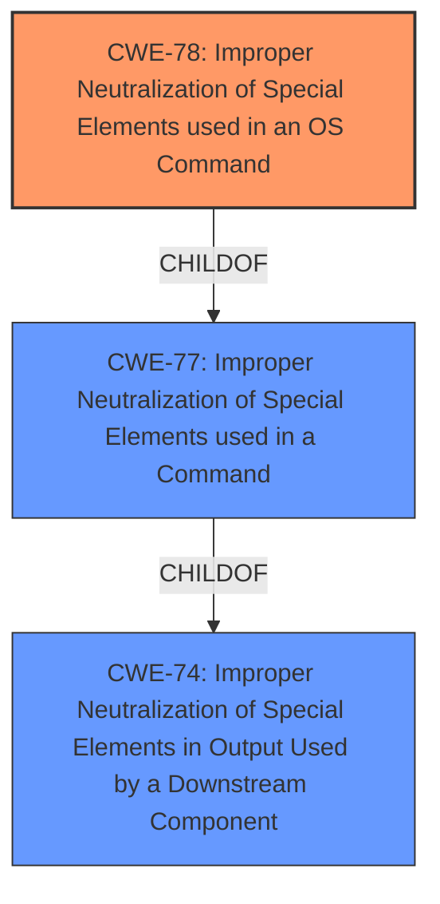

# Analysis Report for CVE-2022-28582

# Vulnerability Analysis Report: CVE-2022-28582

## Description


## Analysis (with Relationship Data)

# Summary
| CWE ID | CWE Name | Confidence | CWE Abstraction Level | CWE Vulnerability Mapping Label | CWE-Vulnerability Mapping Notes |
|---|---|---|---|---|---|
| CWE-78 | Improper Neutralization of Special Elements used in an OS Command ('OS Command Injection') | 1.0 | Base | Allowed | Primary CWE |

## Evidence and Confidence

*   **Confidence Score:** 1.0
*   **Evidence Strength:** HIGH

## Relationship Analysis
The primary relationship that influenced the decision was the ChildOf relationship between CWE-78 and CWE-77, as well as the base level of CWE-78. The description explicitly states "**command injection**" which could lead to misclassification of CWE-77; however, the additional context of operating system commands makes CWE-78 a more precise fit. The relationship CANALSOBE to CWE-88 was considered, however the description did not indicate that the argument delimeters were the issue.



## Vulnerability Chain
The vulnerability chain starts with the **improper neutralization** of special elements within the `setWiFiSignalCfg` interface, leading to the ability to execute arbitrary commands.

## Summary of Analysis
The initial analysis strongly pointed towards CWE-78 due to the explicit mention of "**command injection**" and the capability to execute arbitrary commands. The description states: "It is found that there is a **command injection** vulnerability in the setWiFiSignalCfg interface in TOTOlink A7100RU (v7.4cu.2313_b20191024) router, which allows an attacker to execute arbitrary commands through a carefully constructed payload." The phrase "**command injection**" vulnerability indicates that an attacker can inject commands into the system. The phrase "execute arbitrary commands" confirms the impact of the vulnerability.

CWE-78 is at the Base level of abstraction, which is a preferred level. It is the most specific and accurate representation of the vulnerability based on the provided information.


## CWE Relationship Analysis

Current CWEs represent these abstraction levels: .


### Vulnerability Chain Analysis

**Chain starting from CWE-78:**
- 78 (Improper Neutralization of Special Elements used in an OS Command ('OS Command Injection')) - ROOT


**Chain starting from CWE-77:**
- 77 (Improper Neutralization of Special Elements used in a Command ('Command Injection')) - ROOT


### CWE Relationship Diagram

```mermaid
graph TD
    classDef primary fill:#f96,stroke:#333,stroke-width:2px
    classDef secondary fill:#69f,stroke:#333
    classDef tertiary fill:#9e9,stroke:#333
```


*Report generated on 2025-03-31 01:51:26*
