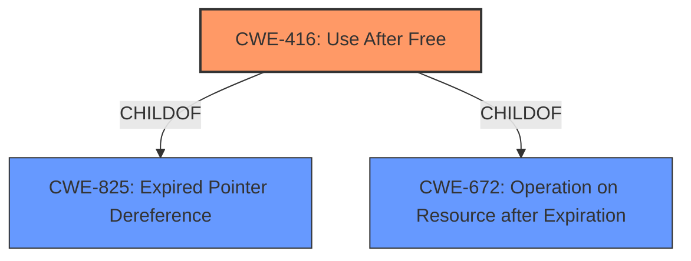

# Raw Analyzer Response for CVE-2022-2859

# Summary
| CWE ID | CWE Name | Confidence | CWE Abstraction Level | CWE Vulnerability Mapping Label | CWE-Vulnerability Mapping Notes |
|---|---|---|---|---|---|
| CWE-416 | Use After Free | 1.0 | Variant | Allowed | Primary CWE |

## Evidence and Confidence

*   **Confidence Score:** 1.0
*   **Evidence Strength:** HIGH

## Relationship Analysis
The primary relationship that influenced the decision was the direct match of the vulnerability description to the CWE-416 definition. CWE-416 is a variant-level CWE, providing a specific categorization for this type of memory corruption issue.

## Vulnerability Chain
The vulnerability chain is straightforward: a **use after free** condition leads to **heap corruption**.

## Summary of Analysis
The vulnerability description clearly states a **"use after free"** condition in Chrome OS Shell leading to potential **heap corruption**. The "CVE Reference Links Content Summary" also confirms the **"use after free"** as the root cause.

The Retriever Results listed CWE-416 as a top candidate.

CWE-416 "Use After Free" is a Variant level CWE. The description of CWE-416 perfectly matches the vulnerability: "The product reuses or references memory after it has been freed." The mapping guidance for CWE-416 indicates that it is ALLOWED and that the CWE entry is at the Variant level of abstraction, which is a preferred level of abstraction for mapping to the root causes of vulnerabilities.

I considered other CWEs from the Retriever Results, specifically CWE-366 "Race Condition within a Thread", however, there is no clear evidence of a race condition in the vulnerability description. The description focuses solely on the **use after free** condition.

Therefore, CWE-416 is the most appropriate and specific CWE for this vulnerability. It accurately reflects the root cause and potential impact, and it aligns with the MITRE mapping guidance.