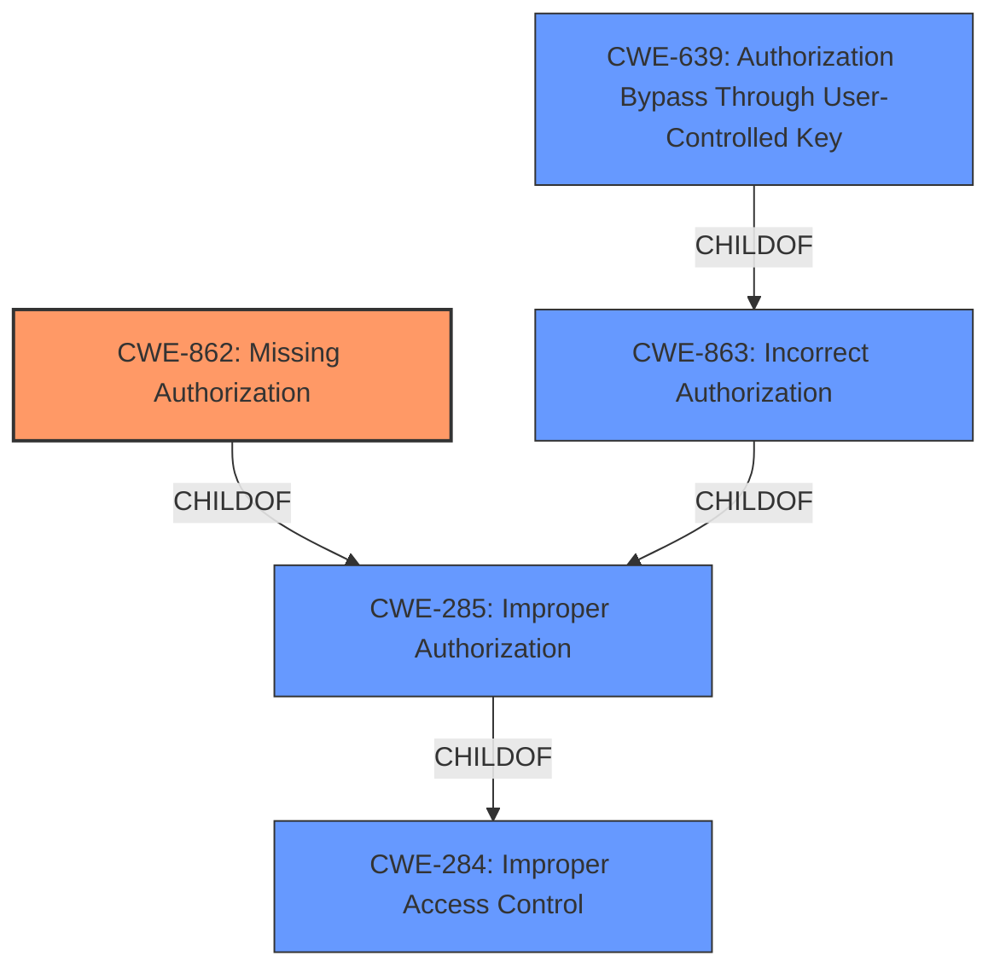

# Analysis Report for CVE-2022-28666

# Vulnerability Analysis Report: CVE-2022-28666

## Description


## Analysis (with Relationship Data)

# Summary
| CWE ID | CWE Name | Confidence | CWE Abstraction Level | CWE Vulnerability Mapping Label | CWE-Vulnerability Mapping Notes |
|---|---|---|---|---|---|
| CWE-862 | Missing Authorization | 0.85 | Class | Allowed-with-Review | Primary CWE |
| CWE-639 | Authorization Bypass Through User-Controlled Key | 0.75 | Base | Allowed | Secondary Candidate |
| CWE-863 | Incorrect Authorization | 0.60 | Class | Allowed-with-Review | Secondary Candidate |

## Evidence and Confidence

*   **Confidence Score:** 0.80
*   **Evidence Strength:** HIGH

## Relationship Analysis
The primary CWE is CWE-862 [Missing Authorization], which falls under the broader category of CWE-285 [Improper Authorization], which in turn is a child of CWE-284 [Improper Access Control]. CWE-639 [Authorization Bypass Through User-Controlled Key] is a child of CWE-863 [Incorrect Authorization]. While CWE-639 [Authorization Bypass Through User-Controlled Key] offers more specificity, the description centers on the plugin **missing** an authorization check, making CWE-862 [Missing Authorization] the more direct fit. The relationship analysis confirms that the vulnerability stems from the absence of an authorization mechanism, rather than an incorrect implementation, guiding the selection of CWE-862 [Missing Authorization] as the primary classification.



## Vulnerability Chain
The vulnerability chain begins with the **missing authorization** check (CWE-862 [Missing Authorization]), leading to the **ability to update** the `&yikes-the-content-toggle` option, an action that should be restricted. The root cause is the **lack of access control**, resulting in the impact of unauthorized option updates.

## Summary of Analysis
The initial assessment, supported by the vulnerability description, CVE reference content, and retriever results, points to a **Broken Access Control** issue. The vulnerability description specifically mentions "**Broken Access Control**" and the CVE reference summary indicates a "**flaw in how it verifies the identity of users or applications, allowing unauthorized access**". The key aspect is that the plugin **does not perform** an authorization check, which is the definition of CWE-862 [Missing Authorization]. While CWE-639 [Authorization Bypass Through User-Controlled Key] and CWE-863 [Incorrect Authorization] were considered, the evidence strongly suggests the **absence of authorization** rather than a flawed implementation or bypass via user-controlled keys. Therefore, CWE-862 [Missing Authorization] is chosen as the most accurate and specific classification.

Relevant CWE Information:

# Enhanced Context (25 CWEs)
The following CWEs were identified as potentially relevant to this vulnerability:

## CWE-639: Authorization Bypass Through User-Controlled Key
**Abstraction Level**: Base
**Similarity Score**: 0.77
**Source**: dense

**Description**:
The system's authorization functionality does not prevent one user from gaining access to another user's data or record by modifying the key value identifying the data.

**Mapping Guidance**:
- Usage: Allowed
- Rationale: This CWE entry is at the Base level of abstraction, which is a preferred level of abstraction for mapping to the root causes of vulnerabilities.

## CWE-863: Incorrect Authorization
**Abstraction Level**: Class
**Similarity Score**: 6469.71
**Source**: sparse

**Description**:
The product performs an authorization check when an actor attempts to access a resource or perform an action, but it does not correctly perform the check.

**Mapping Guidance**:
- Usage: Allowed-with-Review
- Rationale: This CWE entry is a Class and might have Base-level children that would be more appropriate

## CWE-862: Missing Authorization
**Abstraction Level**: Class
**Similarity Score**: 0.146
**Source**: sparse

**Description**:
The product does not perform an authorization check when an actor attempts to access a resource or perform an action.

### Technical Explanation for CWE-862 [Missing Authorization]:
The plugin lacks an authorization check, allowing unauthorized users to update the `&yikes-the-content-toggle` option. This directly matches the description of CWE-862 [Missing Authorization], where a product "**does not perform an authorization check when an actor attempts to access a resource or perform an action**".

### Security Implications and Potential Impact:
The security implication is that anyone can modify the plugin's settings, potentially leading to arbitrary code execution or other malicious activities. The impact is significant, as it can compromise the entire WordPress site.

### Parent-Child Relationships and Chain Patterns:
CWE-862 [Missing Authorization] is a child of CWE-285 [Improper Authorization] and CWE-284 [Improper Access Control], highlighting a hierarchical relationship. The chain pattern involves the **missing authorization** check (CWE-862 [Missing Authorization]) leading to unauthorized access and modification of settings.

### Primary or Secondary Weakness:
CWE-862 [Missing Authorization] is the primary weakness.

### MITRE Mapping Guidance Influence:
The MITRE mapping guidance for CWE-862 [Missing Authorization] suggests it is a Class-level CWE and encourages examining child CWEs for a better fit. However, in this case, the description directly aligns with the **absence of an authorization check**, making CWE-862 [Missing Authorization] the most appropriate choice.

### Technical Explanation for CWE-639 [Authorization Bypass Through User-Controlled Key]:
CWE-639 [Authorization Bypass Through User-Controlled Key] was considered because the vulnerability involves updating an option, which could potentially be controlled through a user-modifiable key. However, the primary issue is the **lack of an authorization check** before the update, making CWE-862 [Missing Authorization] a better fit.

### Security Implications and Potential Impact:
The security implication of CWE-639 [Authorization Bypass Through User-Controlled Key] is that an attacker can manipulate keys to access or modify data they are not authorized to.

### Parent-Child Relationships and Chain Patterns:
CWE-639 [Authorization Bypass Through User-Controlled Key] is a child of CWE-863 [Incorrect Authorization] and CWE-284 [Improper Access Control].

### Primary or Secondary Weakness:
CWE-639 [Authorization Bypass Through User-Controlled Key] is a secondary candidate.

### MITRE Mapping Guidance Influence:
The MITRE mapping guidance for CWE-639 [Authorization Bypass Through User-Controlled Key] suggests it is a base-level CWE, but in this case, the **missing authorization** is the more fundamental issue.

### Technical Explanation for CWE-863 [Incorrect Authorization]:
CWE-863 [Incorrect Authorization] was considered because it addresses scenarios where authorization checks are performed incorrectly. However, the core of the vulnerability lies in the **complete absence of an authorization check**, making CWE-862 [Missing Authorization] more appropriate.

### Security Implications and Potential Impact:
The security implication of CWE-863 [Incorrect Authorization] is that an attacker can bypass the flawed authorization logic to gain unauthorized access.

### Parent-Child Relationships and Chain Patterns:
CWE-863 [Incorrect Authorization] is a child of CWE-285 [Improper Authorization] and CWE-284 [Improper Access Control].

### Primary or Secondary Weakness:
CWE-863 [Incorrect Authorization] is a secondary candidate.

### MITRE Mapping Guidance Influence:
The MITRE mapping guidance for CWE-863 [Incorrect Authorization] suggests it is a Class-level CWE, and a more specific child might be a better fit.

### Other CWEs Considered but Not Used:
- CWE-284 [Improper Access Control]: While relevant as a high-level category, it is too general. The vulnerability is more specifically related to **missing authorization**.
- CWE-285 [Improper Authorization]: Similar to CWE-284 [Improper Access Control], it is too high-level. The focus is on the **absence** of authorization checks.
- CWE-1390 [Weak Authentication]: The vulnerability is


## CWE Relationship Analysis

Current CWEs represent these abstraction levels: .


### Vulnerability Chain Analysis

**Chain starting from CWE-862:**
- 862 (Missing Authorization) - ROOT


**Chain starting from CWE-1390:**
- 1390 (Weak Authentication) - ROOT


### CWE Relationship Diagram

```mermaid
graph TD
    classDef primary fill:#f96,stroke:#333,stroke-width:2px
    classDef secondary fill:#69f,stroke:#333
    classDef tertiary fill:#9e9,stroke:#333
```


*Report generated on 2025-03-31 04:13:53*
