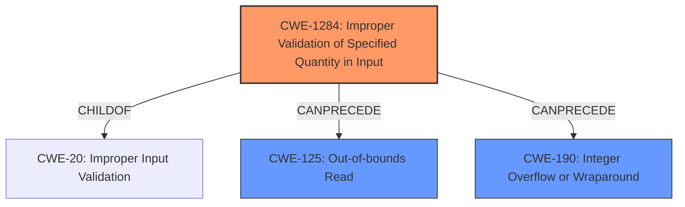

# Analysis for CVE-2022-2868

# Summary
| CWE ID  | CWE Name  | Confidence | CWE Abstraction Level | CWE Vulnerability Mapping Label | CWE-Vulnerability Mapping Notes |
|---|---|---|---|---|---|
| CWE-1284 | Improper Validation of Specified Quantity in Input | 0.9 | Base | Allowed | Primary CWE |
| CWE-125 | Out-of-bounds Read | 0.7 | Base | Allowed | Secondary Candidate |
| CWE-190 | Integer Overflow or Wraparound | 0.6 | Base | Allowed | Secondary Candidate |

## Evidence and Confidence

*   **Confidence Score:** 0.8
*   **Evidence Strength:** HIGH

## Relationship Analysis
The primary CWE, CWE-1284, is related to the **improper validation** of input, which is the root cause. CWE-125 (Out-of-bounds Read) represents the direct consequence of this **improper validation**, while CWE-190 (Integer Overflow or Wraparound) is a possible contributing factor due to calculations performed on the **improperly validated** input. The hierarchical relationship shows that CWE-1284 is a specific type of CWE-20 (Improper Input Validation), but CWE-1284 is more specific and applies directly to the description.

## Vulnerability Chain
The vulnerability chain starts with **improper input validation** (CWE-1284) of the `crop_width` and `crop_length` values. This can lead to an integer underflow (part of CWE-190) when calculating offsets, resulting in an out-of-bounds read (CWE-125) in the `reverseSamples16bits()` function, which ultimately causes a crash.

## Summary of Analysis
The initial assessment identified **improper input validation** as the root cause, leading to an out-of-bounds read and potential crash. The retriever results and CVE Reference Links Content Summary strongly support this assessment.

*   The CVE Reference Links Content Summary states: "The vulnerability stems from an **improper input validation flaw** within the `tiffcrop` utility of the `libtiff` library. Specifically, the `crop_width` and/or `crop_length` values are not properly validated before being used, which could lead to out-of-bounds memory access."
*   It also mentions: "The issue is triggered by an integer underflow when calculating `(uint32_t)(0 - 1)`. This results in very large offsets which cause an out of bounds read."

Based on the evidence, CWE-1284 (Improper Validation of Specified Quantity in Input) is the most accurate primary CWE because it directly addresses the root cause: the **lack of validation** for `crop_width` and `crop_length`. CWE-125 is a direct consequence of this **improper validation**. The integer underflow can be classified under CWE-190.

The selected CWEs are at the optimal level of specificity. While CWE-20 (Improper Input Validation) is a broader category, CWE-1284 is a more precise classification because it specifically focuses on the validation of quantities.

Relevant CWE Information:

# Enhanced Context (25 CWEs)
The following CWEs were identified as potentially relevant to this vulnerability:

## CWE-191: Integer Underflow (Wrap or Wraparound)
**Abstraction Level**: Base
**Similarity Score**: 0.77
**Source**: dense

**Description**:
The product subtracts one value from another, such that the result is less than the minimum allowable integer value, which produces a value that is not equal to the correct result.

**Mapping Guidance**:
- Usage: Allowed
- Rationale: This CWE entry is at the Base level of abstraction, which is a preferred level of abstraction for mapping to the root causes of vulnerabilities.

## CWE-197: Numeric Truncation Error
**Abstraction Level**: Base
**Similarity Score**: 0.76
**Source**: dense

**Description**:
Truncation errors occur when a primitive is cast to a primitive of a smaller size and data is lost in the conversion.

## CWE-681: Incorrect Conversion between Numeric Types
**Abstraction Level**: Base
**Similarity Score**: 0.75
**Source**: dense

**Description**:
When converting from one data type to another, such as long to integer, data can be omitted or translated in a way that produces unexpected values.

## CWE-131: Incorrect Calculation of Buffer Size
**Abstraction Level**: Base
**Similarity Score**: 0.75
**Source**: dense

**Description**:
The product does not correctly calculate the size to be used when allocating a buffer, which could lead to a buffer overflow.

## CWE-680: Integer Overflow to Buffer Overflow
**Abstraction Level**: Compound
**Similarity Score**: 0.75
**Source**: dense

**Description**:
The product performs a calculation to determine how much memory to allocate, but an integer overflow can occur that causes less memory to be allocated than expected, leading to a buffer overflow.

## CWE-190: Integer Overflow or Wraparound
**Abstraction Level**: Base
**Similarity Score**: 0.75
**Source**: dense

**Description**:
The product performs a calculation that can
         produce an integer overflow or wraparound when the logic
         assumes that the resulting value will always be larger than
         the original value.

## CWE-125: Out-of-bounds Read
**Abstraction Level**: Base
**Similarity Score**: 0.74
**Source**: dense

**Description**:
The product reads data past the end, or before the beginning, of the intended buffer.

## CWE-129: Improper Validation of Array Index
**Abstraction Level**: Variant
**Similarity Score**: 0.74
**Source**: dense

**Description**:
The product uses untrusted input when calculating or using an array index, but the product does not validate or incorrectly validates the index to ensure the index references a valid position within the array.

## CWE-193: Off-by-one Error
**Abstraction Level**: Base
**Similarity Score**: 0.74
**Source**: dense

**Description**:
A product calculates or uses an incorrect maximum or minimum value that is 1 more, or 1 less, than the correct value.

## CWE-124: Buffer Underwrite ('Buffer Underflow')
**Abstraction Level**: Base
**Similarity Score**: 0.74
**Source**: dense

**Description**:
The product writes to a buffer using an index or pointer that references a memory location prior to the beginning of the buffer.

## CWE-190: Integer Overflow or Wraparound
**Abstraction Level**: Base
**Similarity Score**: 8222.72
**Source**: sparse

**Description**:
The product performs a calculation that can
         produce an integer overflow or wraparound when the logic
         assumes that the resulting value will always be larger than
         the original value.

## CWE-125: Out-of-bounds Read
**Abstraction Level**: Base
**Similarity Score**: 7891.28
**Source**: sparse

**Description**:
The product reads data past the end, or before the beginning, of the intended buffer.

## CWE-1284: Improper Validation of Specified Quantity in Input
**Abstraction Level**: Base
**Similarity Score**: 7863.95
**Source**: sparse

**Description**:
The product receives input that is expected to specify a quantity (such as size or length), but it does not validate or incorrectly validates that the quantity has the required properties.

## CWE-193: Off-by-one Error
**Abstraction Level**: Base
**Similarity Score**: 7674.75
**Source**: sparse

**Description**:
A product calculates or uses an incorrect maximum or minimum value that is 1 more, or 1 less, than the correct value.

## CWE-197: Numeric Truncation Error
**Abstraction Level**: Base
**Similarity Score**: 7337.55
**Source**: sparse

**Description**:
Truncation errors occur when a primitive is cast to a primitive of a smaller size and data is lost in the conversion.

## CWE-41: Improper Resolution of Path Equivalence
**Abstraction Level**: base